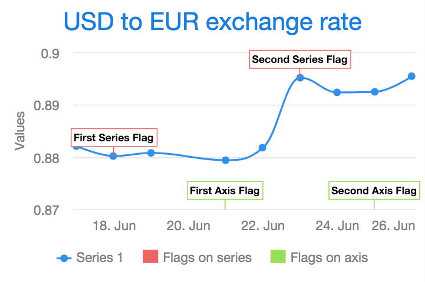

[[charts.charttypes.flags]]
= Flags

_Flags_ is a special chart type for annotating a series or the X axis with call-out labels.
Flags denote interesting points or events on the series or axis. The flags are defined as items in a data series separate from the annotated series or axis.

[[figure.charts.charttypes.flags]]
.Flags Placed on an Axis and a Series
[.fill.white]

Flags are normally used in a chart that has one or more normal data series.

[[charts.charttypes.flags.plotoptions]]
== Plot Options

Flags are defined in a series that has its chart type specified by setting its plot options as [classname]`PlotOptionsFlags`. In addition to the common plot options properties, flag charts also have the following properties:

[parameter]`shape`:: defines the shape of the marker. This can be one of `FLAG`, `CIRCLEPIN`, `SQUAREPIN`, or `CALLOUT`.
[parameter]`stackDistance`:: defines the vertical offset between flags on the same value in the same series. Defaults to 12.
[parameter]`onSeries`:: defines the ID of the series that the flags should be drawn on. If no ID is given, the flags are drawn on the X axis.
[parameter]`onKey`:: in chart types that have multiple keys (Y values) for a data point, the property defines on which key the flag is placed. Line and column series have only one key, `y`. In range, Open-High-Low-Close (OHLC), and candlestick series, the flag can be placed on the `open`, `high`, `low`, or `close` key. Defaults to `y`.

[[charts.charttypes.flags.data]]
== Data

The data for flag series require [propertyname]`x` and [propertyname]`title` properties, but can also have a [propertyname]`text` property indicating the tooltip text. The easiest way to set these properties is to use [classname]`FlagItem`.

ifdef::web[]
[[charts.charttypes.flags.example]]
== Example

The following annotates a time series as well as the axis with flags:

[source,java]
----
Chart chart = new Chart(ChartType.SPLINE);

Configuration configuration = chart.getConfiguration();
configuration.getTitle().setText("USD to EUR exchange rate");
configuration.getxAxis().setType(AxisType.DATETIME);

// A data series to annotate with flags
DataSeries dataSeries = new DataSeries();
dataSeries.setId("dataseries");
dataSeries.addData(new Number[][] { { 1434499200000l, 0.8821 },
        { 1434585600000l, 0.8802 }, { 1434672000000l, 0.8808 },
        { 1434844800000l, 0.8794 }, { 1434931200000l, 0.8818 },
        { 1435017600000l, 0.8952 }, { 1435104000000l, 0.8924 },
        { 1435190400000l, 0.8925 }, { 1435276800000l, 0.8955 } });

// Flags on the data series
DataSeries flagsOnSeries = new DataSeries();
flagsOnSeries.setName("Flags on series");
PlotOptionsFlags plotOptionsFlags = new PlotOptionsFlags();
plotOptionsFlags.setShape(FlagShape.SQUAREPIN);
plotOptionsFlags.setOnSeries("dataseries");
flagsOnSeries.setPlotOptions(plotOptionsFlags);
flagsOnSeries.add(new FlagItem(1434585600000l, "First Series Flag",
        "First Series Flag Tooltip Text"));
flagsOnSeries.add(new FlagItem(1435017600000l, "Second Series Flag"));

// Flags on the X axis
DataSeries flagsOnAxis = new DataSeries();
flagsOnAxis.setPlotOptions(new PlotOptionsFlags());
flagsOnAxis.setName("Flags on axis");
flagsOnAxis.add(new FlagItem(1434844800000l, "First Axis Flag",
        "First Axis Flag Tooltip Text"));
flagsOnAxis.add(new FlagItem(1435190400000l, "Second Axis Flag"));

configuration.setSeries(dataSeries, flagsOnSeries, flagsOnAxis);

----
endif::web[]

== Flags Example

[.example]
--
[source,typescript]
----
include::{root}/frontend/demo/component/charts/charttypes/chart-type-libraries.ts[preimport,hidden]
----

ifdef::flow[]
[source,java]
----
include::{root}/src/main/java/com/vaadin/demo/component/charts/charttypes/ChartTypeFlags.java[render,tags=snippet,indent=0,group=Flow]
----
endif::[]
--
