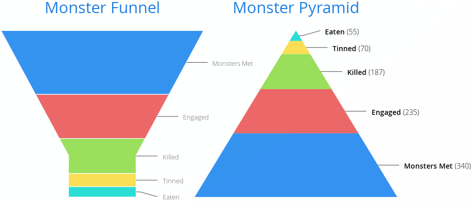

[[charts.charttypes.funnel]]
= Funnel & Pyramid Charts

Funnel and pyramid charts are typically used to visualize stages in a sales process, and for other purposes to visualize subsets of diminishing size. A funnel or pyramid chart has layers much like a stacked column: in funnel, from top to bottom and, in pyramid, from bottom to top. The top of the funnel has the width of the drawing area of the chart, and diminishes in size down to a funnel "neck" that continues as a column to the bottom. A pyramid diminishes from bottom to top and doesn't have a neck.

[[figure.charts.charttypes.funnel]]
.Funnel & Pyramid Charts
[.fill.white]

Funnels have chart type [parameter]`FUNNEL`, pyramids have [parameter]`PYRAMID`.

The labels of the funnel blocks are by default placed on the right side of the blocks, together with a connector.
ifdef::web[]
See the following example.
[source,java]
----
Chart chart = new Chart(ChartType.FUNNEL);
chart.setWidth("500px");
chart.setHeight("350px");

// Modify the default configuration a bit
Configuration conf = chart.getConfiguration();
conf.setTitle("Monster Utilization");
conf.getLegend().setEnabled(false);

// Give more room for the labels
conf.getChart().setSpacingRight(120);

// Configure the funnel neck shape
PlotOptionsFunnel options = new PlotOptionsFunnel();
options.setNeckHeight(20, Sizeable.Unit.PERCENTAGE);
options.setNeckWidth(20, Sizeable.Unit.PERCENTAGE);

// Style the data labels
DataLabelsFunnel dataLabels = new DataLabelsFunnel();
dataLabels.setFormat("<b>{point.name}</b> ({point.y:,.0f})");
dataLabels.setSoftConnector(false);
dataLabels.setColor(SolidColor.BLACK);
options.setDataLabels(dataLabels);

conf.setPlotOptions(options);

// Create the range series
DataSeries series = new DataSeries();
series.add(new DataSeriesItem("Monsters Met", 340));
series.add(new DataSeriesItem("Engaged", 235));
series.add(new DataSeriesItem("Killed", 187));
series.add(new DataSeriesItem("Tinned", 70));
series.add(new DataSeriesItem("Eaten", 55));
conf.addSeries(series);
----
endif::web[]

ifdef::web[]
[[charts.charttypes.funnel.plotoptions]]
== Plot Options

The funnel and pyramid options are configured with [classname]`PlotOptionsFunnel` and [classname]`PlotOptionsFunnel`, respectively.

On top of the common chart options, the chart types support the following shared options: [parameter]`width`, [parameter]`height`, [parameter]`depth`, [parameter]`allowPointSelect`, [parameter]`borderColor`, [parameter]`borderWidth`, [parameter]`center`, [parameter]`slicedOffset`, and [parameter]`visible`. See <<../configuration#charts.configuration.plotoptions,"Plot Options">> for detailed descriptions.

They have the following chart-type-specific properties:

[parameter]`neckHeight`or[parameter]`neckHeightPercentage` (only funnel):: Height of the neck part of the funnel, either as pixels or as a percentage of the entire funnel height.
[parameter]`neckWidth`or[parameter]`neckWidthPercentage` (only funnel):: Width of the neck part of the funnel, either as pixels or as percentage of the top of the funnel.
[parameter]`reversed`:: Whether the chart is inverted from the normal direction, diminishing from the top to bottom. The default is _false_ for funnel and _true_ for pyramid.

endif::web[]

== Funnel Example

[.example]
--
[source,typescript]
----
include::{root}/frontend/demo/component/charts/charttypes/chart-type-libraries.ts[preimport,hidden]
----

ifdef::flow[]
[source,java]
----
include::{root}/src/main/java/com/vaadin/demo/component/charts/charttypes/ChartTypeFunnel.java[render,tags=snippet,indent=0,group=Flow]
----
endif::[]
--

== Pyramid Example

[.example]
--
[source,typescript]
----
include::{root}/frontend/demo/component/charts/charttypes/chart-type-libraries.ts[preimport,hidden]
----

ifdef::flow[]
[source,java]
----
include::{root}/src/main/java/com/vaadin/demo/component/charts/charttypes/ChartTypePyramid.java[render,tags=snippet,indent=0,group=Flow]
----
endif::[]
--
