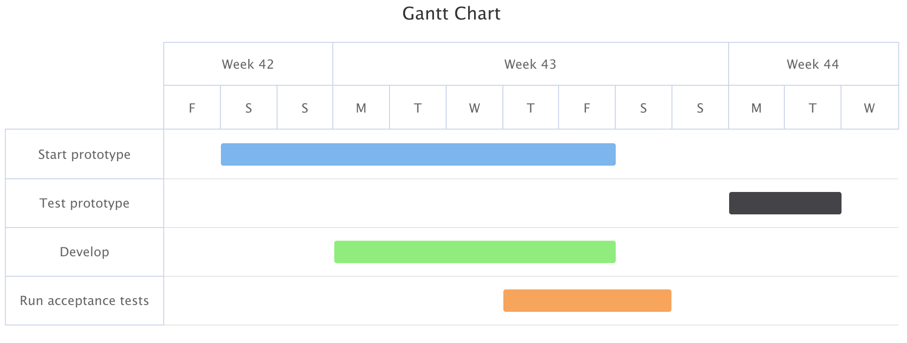

[[charts.charttypes.gantt]]
= Gantt Charts

A Gantt chart is a type of bar chart that visualizes a project schedule. It displays the start and finish dates of the various elements of a project and helps in visualizing the project timeline, task dependencies, and progress.

The Gantt chart requires [classname]`GanttSeriesItem` instances to represent tasks. Each [classname]`GanttSeriesItem` can optionally have a completed status to indicate the progress of the task (property [propertyname]`completed`) and dependencies on other items (property [property]`dependency`).

A ready Gantt chart is shown in <<figure.charts.charttypes.gantt>>.

[[figure.charts.charttypes.gantt]]
.Gantt Chart Example
[.fill.white]

A Gantt chart is enabled with [parameter]`ChartType.GANTT`. You can make type-specific settings in the [classname]`PlotOptionsGantt` object. For more detailed information about the Gantt chart configuration see xref:../gantt.adoc[Gantt Chart].

ifdef::web[]
[source,java]
----
  // Create a Gantt chart
Chart chart = new Chart(ChartType.GANTT);

// Modify the default configuration
final Configuration configuration = chart.getConfiguration();
configuration.setTitle("Gantt Chart with Progress Indicators");

// Configure the axes - set timeline boundaries
XAxis xAxis = configuration.getxAxis();
xAxis.setMin(Instant.parse("2014-10-17T00:00:00Z"));
xAxis.setMax(Instant.parse("2014-10-30T00:00:00Z"));
PlotOptionsGantt plotOptionsGantt = new PlotOptionsGantt();
configuration.setPlotOptions(plotOptionsGantt);

// Add data
GanttSeries series = new GanttSeries();
series.setName("Project 1");
final GanttSeriesItem startPrototype = new GanttSeriesItem(
        "Start prototype",
        Instant.parse("2014-10-18T00:00:00Z"),
        Instant.parse("2014-10-25T00:00:00Z"));
startPrototype.setCompleted(0.25);
series.add(startPrototype);

series.add(new GanttSeriesItem(
        "Test prototype",
        Instant.parse("2014-10-27T00:00:00Z"),
        Instant.parse("2014-10-29T00:00:00Z")));

final GanttSeriesItem develop = new GanttSeriesItem(
        "Develop",
        Instant.parse("2014-10-20T00:00:00Z"),
        Instant.parse("2014-10-25T00:00:00Z"));
develop.setCompleted(new Completed(0.12, SolidColor.ORANGE));
series.add(develop);

series.add(new GanttSeriesItem(
        "Run acceptance tests",
        Instant.parse("2014-10-23T00:00:00Z"),
        Instant.parse("2014-10-26T00:00:00Z")));
configuration.addSeries(series);
----
endif::web[]

== Gantt Example

[.example]
--
[source,typescript]
----
include::{root}/frontend/demo/component/charts/charttypes/chart-type-libraries.ts[preimport,hidden]
----

ifdef::flow[]
[source,java]
----
include::{root}/src/main/java/com/vaadin/demo/component/charts/charttypes/ChartTypeGantt.java[render,tags=snippet,indent=0,group=Flow]
----
endif::[]
--
