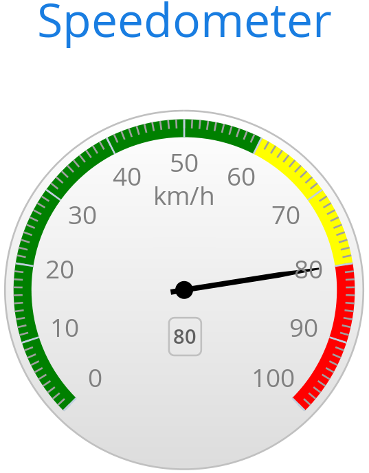

[[charts.charttypes.gauge]]
= Gauges

A gauge is a one-dimensional chart with a circular Y-axis, with a rotating pointer that points to a value on the axis. A gauge can, in fact, have multiple Y-axes to display multiple scales.

A <<solid-gauge#charts.charttypes.solidgauge,_solid gauge_>> is like a regular gauge, except that a solid-color arc is used to show the current value, instead of a pointer. The color of the indicator arc can be configured to change according to color stops.

NOTE: Gauge and solid gauge series shouldn't be combined with series of other types.

NOTE: A bar series inverts the entire chart; combine with care.

Consider the following gauge:

[source,java]
----
Chart chart = new Chart(ChartType.GAUGE);
----

With the settings shown in the following sections, it is displayed as in <<figure.charts.charttypes.gauge>>.

[[figure.charts.charttypes.gauge]]
.A Gauge
[.fill.white]

[[charts.charttypes.gauge.conf]]
== Gauge Configuration

The start and end angles of the gauge can be configured in the [classname]`Pane` object of the chart configuration. The angles can be given as -360 to 360 degrees, with 0 at the top of the circle.

[source,java]
----
Configuration conf = chart.getConfiguration();
conf.setTitle("Speedometer");
conf.getPane().setStartAngle(-135);
conf.getPane().setEndAngle(135);
----

[[charts.charttypes.gauge.axis]]
== Axis Configuration

A gauge has only a Y-axis. You need to provide both a minimum and a maximum value for this.

[source,java]
----
YAxis yaxis = new YAxis();
yaxis.setTitle("km/h");

// The limits are mandatory
yaxis.setMin(0);
yaxis.setMax(100);

// Other configuration
yaxis.getLabels().setStep(1);
yaxis.setTickInterval(10);
yaxis.setTickLength(10);
yaxis.setTickWidth(1);
yaxis.setMinorTickInterval("1");
yaxis.setMinorTickLength(5);
yaxis.setMinorTickWidth(1);

PlotBand green = new PlotBand(0, 60, null);
green.setClassName("green");

PlotBand yellow = new PlotBand(60, 80, null);
yellow.setClassName("yellow");

PlotBand red = new PlotBand(80, 100, null);
red.setClassName("red");

yaxis.setPlotBands(green, yellow, red);

conf.addyAxis(yaxis);
----

You can make all kinds of other configuration settings to the axis. See the API documentation for all the available parameters.

[[charts.charttypes.gauge.data]]
== Setting & Updating Gauge Data

A gauge displays only a single value, which you can define as a data series of length 1, for example as follows:

[source,java]
----
ListSeries series = new ListSeries("Speed", 80);
conf.addSeries(series);
----

Gauges are especially meaningful for displaying changing values. You can use the [methodname]`updatePoint()` method in the data series to update the single value.

[source,java]
----
final TextField tf = new TextField("Enter a new value");
layout.add(tf);

Button update = new Button("Update", (e) -> {
    Integer newValue = new Integer(tf.getValue());
    series.updatePoint(0, newValue);
});
layout.add(update);
----

== Gauge Example

[.example]
--
[source,typescript]
----
include::{root}/frontend/demo/component/charts/charttypes/chart-type-libraries.ts[preimport,hidden]
----

ifdef::flow[]
[source,java]
----
include::{root}/src/main/java/com/vaadin/demo/component/charts/charttypes/ChartTypeGauge.java[render,tags=snippet,indent=0,group=Flow]
----
endif::[]
--
