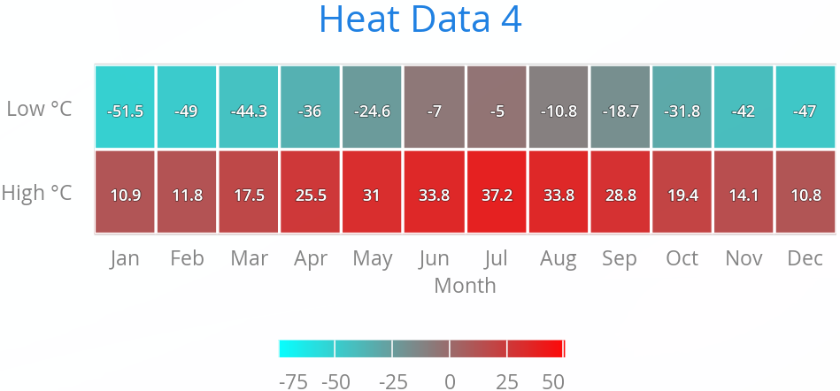

[[charts.charttypes.heatmap]]
= Heat Maps

A heat map is a two-dimensional grid, where the color of a grid cell reflects a value.

[[figure.charts.charttypes.heatmap]]
.Heat Maps
[.fill.white]

Heat maps have chart type [literal]`++HEATMAP++`.

ifdef::web[For example:]

ifdef::web[]
[source,java]
----

Chart chart = new Chart(ChartType.HEATMAP);
chart.setWidth("600px");
chart.setHeight("300px");

Configuration conf = chart.getConfiguration();
conf.setTitle("Heat Data");

// Set colors for the extremes
conf.getColorAxis().setMinColor(SolidColor.AQUA);
conf.getColorAxis().setMaxColor(SolidColor.RED);

// Set up border and data labels
PlotOptionsHeatmap plotOptions = new PlotOptionsHeatmap();
plotOptions.setBorderColor(SolidColor.WHITE);
plotOptions.setBorderWidth(2);
plotOptions.setDataLabels(new DataLabels(true));
conf.setPlotOptions(plotOptions);

// Create some data
HeatSeries series = new HeatSeries();
series.addHeatPoint( 0, 0,  10.9); // Jan High
series.addHeatPoint( 0, 1, -51.5); // Jan Low
series.addHeatPoint( 1, 0,  11.8); // Feb High
...
series.addHeatPoint(11, 1, -47.0); // Dec Low
conf.addSeries(series);

// Set the category labels on the X axis
XAxis xaxis = new XAxis();
xaxis.setTitle("Month");
xaxis.setCategories("Jan", "Feb", "Mar",
    "Apr", "May", "Jun", "Jul", "Aug", "Sep",
    "Oct", "Nov", "Dec");
conf.addxAxis(xaxis);

// Set the category labels on the Y axis
YAxis yaxis = new YAxis();
yaxis.setTitle("");
yaxis.setCategories("High C", "Low C");
conf.addyAxis(yaxis);
----
endif::web[]

ifdef::web[]
[[charts.charttypes.heatmap.dataseries]]
== Heat Map Data Series

Heat maps require two-dimensional tabular data. The easiest way is to use [classname]`HeatSeries`, as was done in the earlier example. You can add data points with the [methodname]`addHeatPoint()` method, or give all the data at once in an array with [methodname]`setData()` or in the constructor.

If you need to use another data series type for a heat map, the semantics of the heat map data points are currently not supported by the general-purpose series types, such as [classname]`DataSeries`. You can work around this semantic limitation by specifying the [propertyname]`X` (column), [propertyname]`Y` (row), and [propertyname]`heatScore` by using the respective [propertyname]`X`, [propertyname]`low`, and [propertyname]`high` properties of the general-purpose data series.

While some other data series types allow updating the values one by one, updating all the values in a heat map is very inefficient; it's faster to replace the data series and then call [methodname]`chart.drawChart()`.

endif::web[]

== Heat Map Example

[.example]
--
[source,typescript]
----
include::{root}/frontend/demo/component/charts/charttypes/chart-type-libraries.ts[preimport,hidden]
----

ifdef::flow[]
[source,java]
----
include::{root}/src/main/java/com/vaadin/demo/component/charts/charttypes/ChartTypeHeatMap.java[render,tags=snippet,indent=0,group=Flow]
----
endif::[]
--
