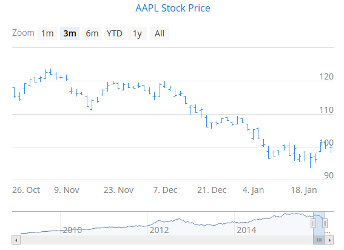
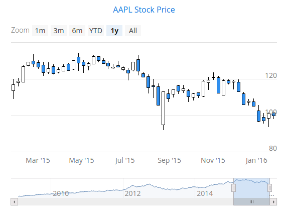

[[charts.charttypes.ohlc]]
= OHLC & Candlestick Charts

// Allow 'time period'
pass:[<!-- vale Vaadin.Wordiness = NO -->]

An Open-High-Low-Close (OHLC) chart displays the change in price over a period of time.
The OHLC charts have chart type [literal]`++OHLC++`. An OHLC chart consists of vertical lines, each having a horizontal tick mark both on the left and the right side. The top and bottom ends of the vertical line show the highest and lowest prices during the time period. The tick mark on the left side of the vertical line shows the opening price, and the tick mark on the right side the closing price.

pass:[<!-- vale Vaadin.Wordiness = YES -->]

[[figure.charts.charttypes.ohlc]]
.OHLC Chart.
[.fill.white]

A candlestick chart is another way to visualize OHLC data. A candlestick has a body and two vertical lines, called _wicks_. The body represents the opening and closing prices.
If the body is filled, the top edge of the body shows the opening price, and the bottom edge shows the closing price. If the body is unfilled, the top edge shows the closing price and the bottom edge the opening price. In other words, if the body is filled, the opening price is higher than the closing price, and if not, lower. The upper wick represents the highest price during the time period, and the lower wick represents the lowest price. A candlestick chart has chart type [literal]`++CANDLESTICK++`.

[[figure.charts.charttypes.candlestick]]
.Candlestick Chart.
[.fill.white]

To attach data to an OHLC or a candlestick chart, you need to use a [classname]`DataSeries` or a [classname]`ContainerSeries`. See <<../data#charts.data, "Chart Data">> for more details.

A data series for an OHLC chart must contain [classname]`OhlcItem` objects. An [classname]`OhlcItem` contains a date and the open, highest, lowest, and close price on that date.

[source,java]
----
Chart chart = new Chart(ChartType.OHLC);
chart.setTimeline(true);

Configuration configuration = chart.getConfiguration();
configuration.getTitle().setText("AAPL Stock Price");
DataSeries dataSeries = new DataSeries();
for (StockPrices.OhlcData data : StockPrices.fetchAaplOhlcPrice()) {
    OhlcItem item = new OhlcItem();
    item.setX(data.getDate());
    item.setLow(data.getLow());
    item.setHigh(data.getHigh());
    item.setClose(data.getClose());
    item.setOpen(data.getOpen());
    dataSeries.add(item);
}
configuration.setSeries(dataSeries);
chart.drawChart();

----

When using [classname]`DataProviderSeries`, you need to specify the functions used to retrieve OHLC properties: [methodName]`setX()`, [methodName]`setOpen()`; [methodName]`setHigh()` [methodname]`setLow()`; and [methodName]`setClose()`.

[source,java]
----
Chart chart = new Chart(ChartType.OHLC);
Configuration configuration = chart.getConfiguration();

// Create a DataProvider filled with stock price data
DataProvider<OhlcData, ?> dataProvider = initDataProvider();
// Wrap the container in a data series
DataProviderSeries<OhlcData> dataSeries = new DataProviderSeries<>(dataProvider);
dataSeries.setX(OhlcData::getDate);
dataSeries.setLow(OhlcData::getLow);
dataSeries.setHigh(OhlcData::getHigh);
dataSeries.setClose(OhlcData::getClose);
dataSeries.setOpen(OhlcData::getOpen);

PlotOptionsOhlc plotOptionsOhlc = new PlotOptionsOhlc();
plotOptionsOhlc.setTurboThreshold(0);
dataSeries.setPlotOptions(plotOptionsOhlc);

configuration.setSeries(dataSeries);
----

Typically, OHLC and candlestick charts contain a lot of data, so it's useful to use them with the timeline feature enabled. The timeline feature is described in <<../timeline#charts.timeline,"Timeline">>.

[[charts.charttypes.ohlc.plotoptions]]
== Plot Options

You can use a [classname]`DataGrouping` object to configure data grouping properties. You set it in the plot options with [methodname]`setDataGrouping()`. If the data points in a series are so dense that the spacing between two or more points is less than the value of the [propertyname]`groupPixelWidth` property in the [classname]`DataGrouping`, the points are grouped into appropriate groups so that each group is around two pixels wide.

The [propertyname]`approximation` property in [classname]`DataGrouping` specifies which data point value should represent the group. The possible values are: [literal]`average`, [literal]`open`, [literal]`high`, [literal]`low`, [literal]`close`, and [literal]`sum`.

Using [methodName]`setUpColor()` and [methodName]`setUpLineColor()` allows you to set the fill and border colors of the candlestick that show a rise in the values. The default colors are white.

== OHLC Example

[.example]
--
[source,typescript]
----
include::{root}/frontend/demo/component/charts/charttypes/chart-type-libraries.ts[preimport,hidden]
----

ifdef::flow[]
[source,java]
----
include::{root}/src/main/java/com/vaadin/demo/component/charts/charttypes/ChartTypeOhlc.java[render,tags=snippet,indent=0,group=Flow]
----
endif::[]
--

== Candlestick Example

[.example]
--
[source,typescript]
----
include::{root}/frontend/demo/component/charts/charttypes/chart-type-libraries.ts[preimport,hidden]
----

ifdef::flow[]
[source,java]
----
include::{root}/src/main/java/com/vaadin/demo/component/charts/charttypes/ChartTypeCandlestick.java[render,tags=snippet,indent=0,group=Flow]
----
endif::[]
--
