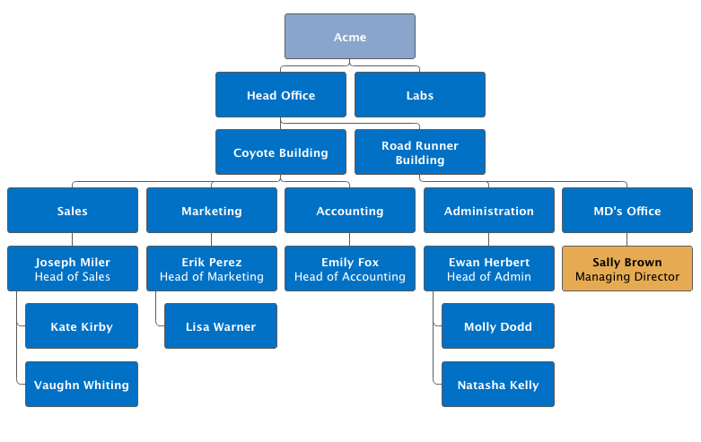

[[charts.charttypes.organization]]
= Organization Charts

Organization charts are used to visualize parent/child relationships between nodes. They require the use of [classname]`NodeSeries` to add nodes and the hierarchical links between them.

The organization chart is enabled with [parameter]`ChartType.ORGANIZATION` and you can make type-specific settings in the [classname]`PlotOptionsOrganization` object, as described later.

[source,java]
----
Chart chart = new Chart(ChartType.ORGANIZATION);
Configuration conf = chart.getConfiguration();
conf.getChart().setInverted(true);
conf.getChart().setHeight("500px");
conf.getTooltip().setOutside(true);
conf.setTitle("Acme organization chart");
...
----

<<figure.charts.charttypes.organization>> shows a configured organization chart.

[[figure.charts.charttypes.organization]]
.Organization Chart
[.fill.white]

[[charts.charttypes.organization.plotoptions]]
== Plot Options

The chart-specific options of an organization chart are configured with a [classname]`PlotOptionsOrganization`.

[source,java]
----
PlotOptionsOrganization plotOptions = new PlotOptionsOrganization();
plotOptions.setColorByPoint(false);
plotOptions.setColor(new SolidColor("#007ad0"));

//Special color for first level
Level level0 = new Level();
level0.setLevel(0);
level0.setColor(new SolidColor("#99AED3"));
plotOptions.addLevel(level0);
conf.setPlotOptions(plotOptions);
----

Colors can be defined for all the nodes in the chart, for each level or individually in each node, as described later.

[[charts.charttypes.organization.data]]
== Data Model

To visualize the nodes and the hierarchy between them, you need to create a [classname]`NodeSeries`, create all the [classname]`Node` instances, then add them as [classname]`NodeSeriesItem`.

[classname]`NodeSeries` provides a method [methodname]`NodeSeries.add(nodeFrom, nodeTo)` that adds the node to the list and adds a link between `nodeFrom` and `nodeTo`.

[source,java]
----
NodeSeries series = new NodeSeries();
series.setName("Acme");
Node acme = new Node("Acme");
Node headOffice = new Node("Head Office");
Node labs = new Node("Labs");
Node coyoteBuilding = new Node("Coyote Building");
Node roadRunnerBuilding = new Node("Road Runner Building");
Node sales = new Node("Sales");
Node marketing = new Node("Marketing");
Node accounting = new Node("Accounting");
Node administration = new Node("Administration");
Node mdsOffice = new Node("MD's Office");

Node josephMiler = new Node("Joseph Miler");
josephMiler.setTitle("Head of Sales");
josephMiler.setLayout(NodeLayout.HANGING);

Node erikPerez = new Node("Erik Perez");
erikPerez.setTitle("Head of Marketing");
erikPerez.setLayout(NodeLayout.HANGING);

Node emilyFox = new Node("Emily Fox");
emilyFox.setTitle("Head of Accounting");

Node ewanHerbert = new Node("Ewan Herbert");
ewanHerbert.setTitle("Head of Admin");
ewanHerbert.setLayout(NodeLayout.HANGING);

Node kateKirby = new Node("Kate Kirby");
Node vaughnWhiting = new Node("Vaughn Whiting");
Node lisaWarner = new Node("Lisa Warner");
Node mollyDodd = new Node("Molly Dodd");
Node natashaKelly = new Node("Natasha Kelly");

//Set color for a specific Node
Node managingDirector = new Node("Sally Brown", "Sally Brown",
        "Managing Director");
managingDirector.setColor(new SolidColor("#E4B651"));

series.add(acme, headOffice);
series.add(acme, labs);
series.add(headOffice, coyoteBuilding);
series.add(headOffice, roadRunnerBuilding);
series.add(coyoteBuilding, sales);
series.add(coyoteBuilding, marketing);
series.add(coyoteBuilding, accounting);
series.add(roadRunnerBuilding, administration);
series.add(roadRunnerBuilding, mdsOffice);
series.add(sales, josephMiler);
series.add(marketing, erikPerez);
series.add(accounting, emilyFox);
series.add(administration, ewanHerbert);
series.add(josephMiler, kateKirby);
series.add(josephMiler, vaughnWhiting);
series.add(erikPerez, lisaWarner);
series.add(ewanHerbert, mollyDodd);
series.add(ewanHerbert, natashaKelly);
series.add(mdsOffice, managingDirector);
conf.addSeries(series);
----

== Organization Example

[.example]
--
[source,typescript]
----
include::{root}/frontend/demo/component/charts/charttypes/chart-type-libraries.ts[preimport,hidden]
----

ifdef::flow[]
[source,java]
----
include::{root}/src/main/java/com/vaadin/demo/component/charts/charttypes/ChartTypeOrganization.java[render,tags=snippet,indent=0,group=Flow]
----
endif::[]
--
