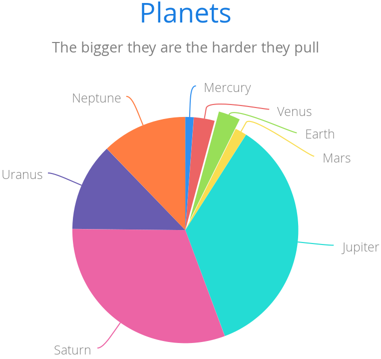
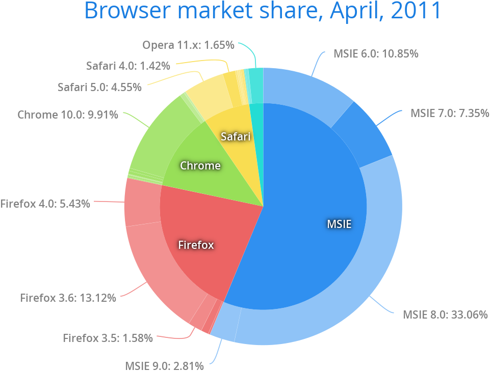

[[charts.charttypes.pie]]
= Pie Charts

A pie chart illustrates data values as sectors whose size is proportional to the sum of all the values. A pie chart is enabled with [parameter]`ChartType.PIE`. You can make type-specific settings in the [classname]`PlotOptionsPie` object, as described later.

[source,java]
----
Chart chart = new Chart(ChartType.PIE);
Configuration conf = chart.getConfiguration();
...
----

<<figure.charts.charttypes.pie>> shows a configured pie chart.

[[figure.charts.charttypes.pie]]
.Pie Chart
[.fill.white]

[[charts.charttypes.pie.plotoptions]]
== Plot Options

The chart-specific options of a pie chart are configured with a [classname]`PlotOptionsPie`.

[source,java]
----
PlotOptionsPie options = new PlotOptionsPie();
options.setInnerSize("0");
options.setSize("75%");  // Default
options.setCenter("50%", "50%"); // Default
conf.setPlotOptions(options);
----

[parameter]`innerSize`:: A pie with an inner size greater than zero is a "doughnut".
The inner size can be expressed either as pixels or as a relative percentage of the chart area with a string (such as "60%"). See the later section on doughnuts.
[parameter]`size`:: The size of the pie can be expressed either as pixels or a relative percentage of the chart area with a string (such as "80%"). The default size is 75%, to leave space for the labels.
[parameter]`center`:: The X and Y coordinates of the center of the pie can be expressed as either numbers of pixels or a relative percentage of the chart sizes with a string. The default is "50%", "50%".

[[charts.charttypes.pie.data]]
== Data Model

The labels for the pie sectors are determined from the labels of the data points. [classname]`DataSeries` or [classname]`ContainerSeries`, which allow the data points to be labeled, should be used for pie charts.

[source,java]
----
DataSeries series = new DataSeries();
series.add(new DataSeriesItem("Mercury", 4900));
series.add(new DataSeriesItem("Venus", 12100));
...
conf.addSeries(series);
----

If a data point, as defined as a [classname]`DataSeriesItem` in a [classname]`DataSeries`, has the _sliced_ property enabled, it's shown as slightly cut away from the pie.

[source,java]
----
// Slice one sector out
DataSeriesItem earth = new DataSeriesItem("Earth", 12800);
earth.setSliced(true);
series.add(earth);
----

== Pie Example

[.example]
--
[source,typescript]
----
include::{root}/frontend/demo/component/charts/charttypes/chart-type-libraries.ts[preimport,hidden]
----

ifdef::flow[]
[source,java]
----
include::{root}/src/main/java/com/vaadin/demo/component/charts/charttypes/ChartTypePie.java[render,tags=snippet,indent=0,group=Flow]
----
endif::[]
--

[[charts.charttypes.pie.donut]]
== Doughnut Charts

Setting the [parameter]`innerSize` of the plot options of a pie chart to a value larger than zero results in an empty hole at the center of the pie.

[source,java]
----
PlotOptionsPie options = new PlotOptionsPie();
options.setInnerSize("60%");
conf.setPlotOptions(options);
----

Because you can also set the plot options for each data series, you can put two pie charts on top of each other, with the smaller one fitted in the "hole" of the doughnut. This way, you can make pie charts with more details on the outer rim, as shown in the following example:

[source,java]
----
// The inner pie
DataSeries innerSeries = new DataSeries();
innerSeries.setName("Browsers");
PlotOptionsPie innerPieOptions = new PlotOptionsPie();
innerPieOptions.setSize("60%");
innerSeries.setPlotOptions(innerPieOptions);
...

DataSeries outerSeries = new DataSeries();
outerSeries.setName("Versions");
PlotOptionsPie outerSeriesOptions = new PlotOptionsPie();
outerSeriesOptions.setInnerSize("60%");
outerSeries.setPlotOptions(outerSeriesOptions);
...
----

The result is illustrated in <<figure.charts.charttypes.pie.donut>>.

[[figure.charts.charttypes.pie.donut]]
.Overlaid Pie and Doughnut Chart
[.fill.white]

