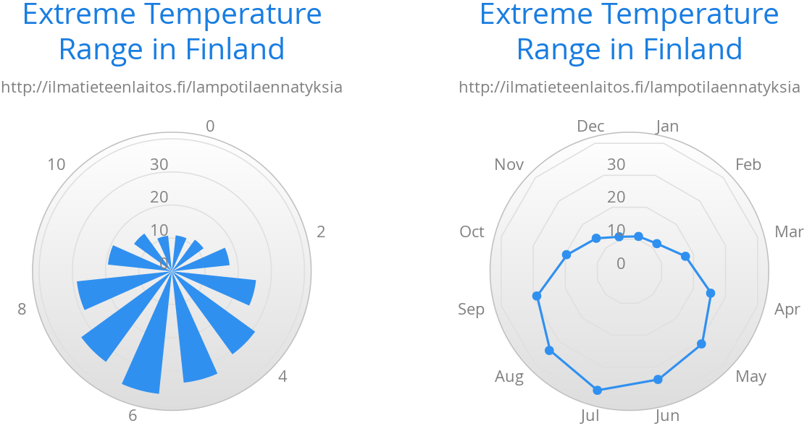

[[charts.charttypes.polar]]
= Polar, Wind Rose, & Spiderweb Charts

Most chart types having two axes can be displayed in _polar_ coordinates, where the X axis is curved on a circle and the Y axis from the center of the circle to its rim. Polar chart isn't a chart type in itself, but can be enabled for most chart types with [methodname]`setPolar(true)` in the chart model parameters. All chart-type-specific features are usable with polar charts.

Charts allow many sorts of typical polar chart types, such as _wind rose_, a polar column graph, or _spiderweb_, a polar chart with categorical data and a more polygonal visual style.

[source,java]
----
// Create a chart of some type
Chart chart = new Chart(ChartType.LINE);

// Enable the polar projection
Configuration conf = chart.getConfiguration();
conf.getChart().setPolar(true);
----

You need to define the sector of the polar projection with a [classname]`Pane` object in the configuration. The sector is defined as degrees from the north direction. You also need to define the value range for the X axis with [methodname]`setMin()` and [methodname]`setMax()`.

[source,java]
----
// Define the sector of the polar projection
Pane pane = new Pane(0, 360); // Full circle
conf.addPane(pane);

// Define the X axis and set its value range
XAxis axis = new XAxis();
axis.setMin(0);
axis.setMax(360);
----

The polar and spiderweb charts are illustrated in <<figure.charts.charttypes.polar>>.

[[figure.charts.charttypes.polar]]
.Wind Rose & Spiderweb Charts
[.fill.white]

[[charts.charttypes.polar.spiderweb]]
== Spiderweb Charts

A _spiderweb_ chart is a commonly used visual style of a polar chart with a polygonal shape rather than a circle. The data and the X axis should be categorical to make the polygonal interpolation meaningful. The sector is assumed to be a full circle, so no angles for the pane need to be specified.

ifdef::web[Note the style settings made in the axis in the following example:]

ifdef::web[]
[source,java]
----
Chart chart = new Chart(ChartType.LINE);
...

// Modify the default configuration a bit
Configuration conf = chart.getConfiguration();
conf.getChart().setPolar(true);
...

// Create the range series
// Source: https://ilmatieteenlaitos.fi/lampotilaennatyksia
ListSeries series = new ListSeries("Temperature Extremes",
    10.9, 11.8, 17.5, 25.5, 31.0, 33.8,
    37.2, 33.8, 28.8, 19.4, 14.1, 10.8);
conf.addSeries(series);

// Set the category labels on the X axis correspondingly
XAxis xaxis = new XAxis();
xaxis.setCategories("Jan", "Feb", "Mar",
    "Apr", "May", "Jun", "Jul", "Aug", "Sep",
    "Oct", "Nov", "Dec");
xaxis.setTickmarkPlacement(TickmarkPlacement.ON);
xaxis.setLineWidth(0);
conf.addxAxis(xaxis);

// Configure the Y axis
YAxis yaxis = new YAxis();
yaxis.setGridLineInterpolation("polygon"); // Webby look
yaxis.setMin(0);
yaxis.setTickInterval(10);
yaxis.getLabels().setStep(1);
conf.addyAxis(yaxis);
----
endif::web[]

== Polar Example

[.example]
--
[source,typescript]
----
include::{root}/frontend/demo/component/charts/charttypes/chart-type-libraries.ts[preimport,hidden]
----

ifdef::flow[]
[source,java]
----
include::{root}/src/main/java/com/vaadin/demo/component/charts/charttypes/ChartTypePolar.java[render,tags=snippet,indent=0,group=Flow]
----
endif::[]
--
