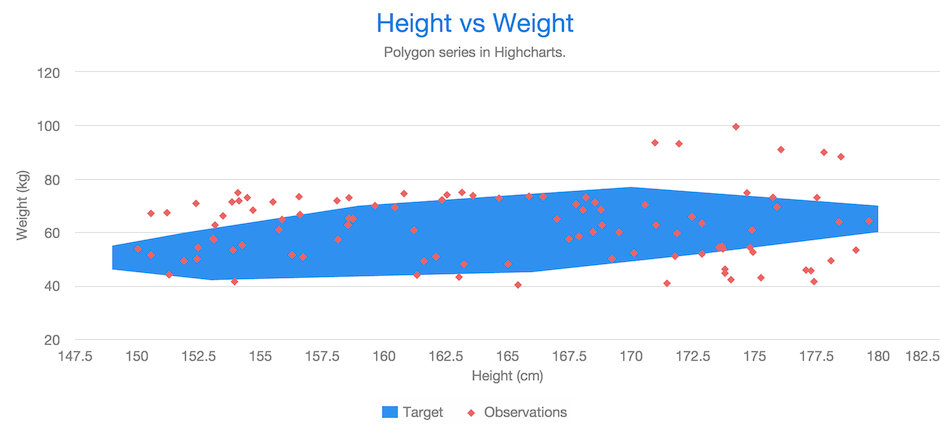

[[charts.charttypes.polygon]]
= Polygons

A polygon can be used to draw any freeform filled or stroked shape in the Cartesian plane.

Polygons consist of connected data points. [classname]`DataSeries` or [classname]`ContainerSeries` are usually the most meaningful data series types for polygon charts. In both cases, the [parameter]`x` and [parameter]`y` properties should be set.

[[figure.charts.charttypes.polygon]]
.Polygon Combined with Scatter
[.fill.white]

Polygons have chart type [literal]`++POLYGON++`.

ifdef::web[For example:]

ifdef::web[]
[source,java]
----
Chart chart = new Chart();
Configuration conf = chart.getConfiguration();
conf.setTitle("Height vs Weight");

XAxis xAxis = conf.getxAxis();
xAxis.setStartOnTick(true);
xAxis.setEndOnTick(true);
xAxis.setShowLastLabel(true);
xAxis.setTitle("Height (cm)");

YAxis yAxis = conf.getyAxis();
yAxis.setTitle("Weight (kg)");

PlotOptionsScatter optionsScatter = new PlotOptionsScatter();
DataSeries scatter = new DataSeries();
scatter.setPlotOptions(optionsScatter);
scatter.setName("Observations");

scatter.add(new DataSeriesItem(160, 67));
...
scatter.add(new DataSeriesItem(180, 75));
conf.addSeries(scatter);

DataSeries polygon = new DataSeries();
PlotOptionsPolygon optionsPolygon = new PlotOptionsPolygon();
optionsPolygon.setEnableMouseTracking(false);
polygon.setPlotOptions(optionsPolygon);
polygon.setName("Target");

polygon.add(new DataSeriesItem(153, 42));
polygon.add(new DataSeriesItem(149, 46));
...
polygon.add(new DataSeriesItem(173, 52));
polygon.add(new DataSeriesItem(166, 45));
conf.addSeries(polygon);
----
endif::web[]

ifdef::web[]
[[charts.charttypes.polygon.plotoptions]]
== Plot Options

Polygon chart options can be configured in a [classname]`PlotOptionsPolygon` object, although it doesn't have any chart-type-specific options.

endif::web[]

== Polygon Example

[.example]
--
[source,typescript]
----
include::{root}/frontend/demo/component/charts/charttypes/chart-type-libraries.ts[preimport,hidden]
----

ifdef::flow[]
[source,java]
----
include::{root}/src/main/java/com/vaadin/demo/component/charts/charttypes/ChartTypePolygon.java[render,tags=snippet,indent=0,group=Flow]
----
endif::[]
--
