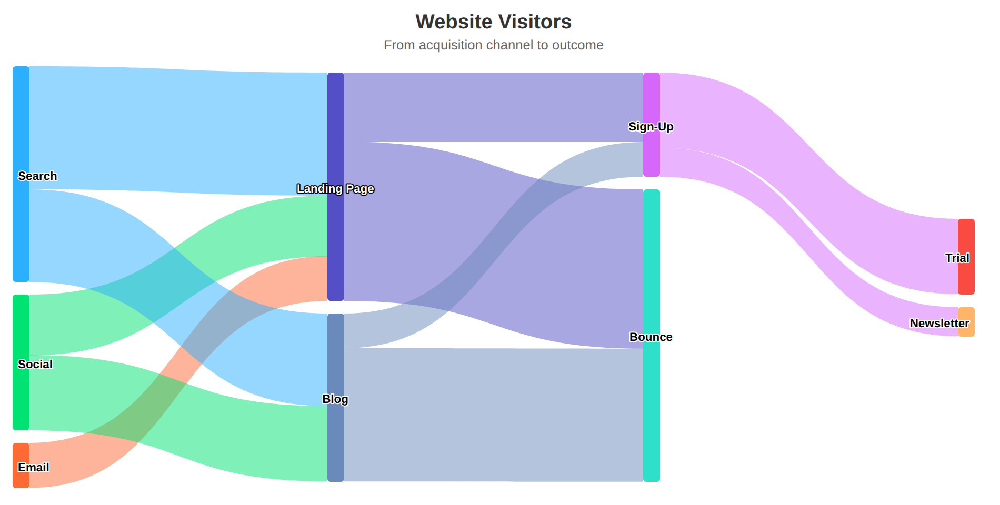

[[charts.charttypes.sankey]]
= Sankey Charts

Sankey charts visualize how quantities flow from one set of nodes to another. Each link between two nodes is drawn with a width proportional to its weight, which makes it easy to see where the volume in a process is concentrated and where it's lost.

A Sankey chart is enabled with [parameter]`ChartType.SANKEY`. You can make type-specific settings in the [classname]`PlotOptionsSankey` object, as described later.

[source,java]
----
Chart chart = new Chart(ChartType.SANKEY);
Configuration conf = chart.getConfiguration();
conf.setTitle("Website Visitors");
...
----

<<figure.charts.charttypes.sankey>> shows a configured Sankey chart.

[[figure.charts.charttypes.sankey]]
.Sankey Chart
[.fill.white]

[[charts.charttypes.sankey.data]]
== Data Model

The links of a Sankey chart are defined with [classname]`DataSeriesItemSankey` items added to a regular [classname]`DataSeries`. Each item has a [propertyname]`from` node, a [propertyname]`to` node, and a [propertyname]`weight`. The nodes themselves aren't declared separately: they are created from the names used in the links.

[source,java]
----
DataSeries series = new DataSeries("Visitors");
series.add(new DataSeriesItemSankey("Search", "Landing Page", 850));
series.add(new DataSeriesItemSankey("Social", "Landing Page", 420));
series.add(new DataSeriesItemSankey("Landing Page", "Sign-Up", 480));
series.add(new DataSeriesItemSankey("Landing Page", "Bounce", 1100));
conf.addSeries(series);
----

The nodes are laid out in columns based on the links: a node is placed in the column following the nodes that link to it. The links must not form a loop, since the nodes couldn't then be arranged into columns.

Since [classname]`DataSeriesItemSankey` extends [classname]`DataSeriesItem`, you can also configure a single link -- for example, its color or its data labels:

[source,java]
----
DataSeriesItemSankey item = new DataSeriesItemSankey("Search", "Blog", 640);
item.setColor(new SolidColor("#007ad0"));
series.add(item);
----

If you need to configure the nodes rather than the links -- to set the color of a node or to place it in a specific column, for instance -- use a [classname]`NodeSeries` instead. Add [classname]`Node` instances to it with [methodname]`NodeSeries.add(nodeFrom, nodeTo)`, and set the weight on the returned [classname]`NodeSeriesItem`.

[source,java]
----
NodeSeries series = new NodeSeries();
Node search = new Node("Search");
Node landingPage = new Node("Landing Page");
landingPage.setColor(new SolidColor("#007ad0"));

series.add(search, landingPage).setWeight(850);
conf.addSeries(series);
----

[[charts.charttypes.sankey.plotoptions]]
== Plot Options

The chart-specific options of a Sankey chart are configured with a [classname]`PlotOptionsSankey`.

[source,java]
----
PlotOptionsSankey plotOptions = new PlotOptionsSankey();
plotOptions.setCurveFactor(0.5);
plotOptions.setNodeWidth(16);
plotOptions.setNodePadding(12);
plotOptions.setLinkOpacity(0.3);
conf.setPlotOptions(plotOptions);
----

On top of the common chart options, a Sankey chart supports the following chart-type-specific properties:

[parameter]`curveFactor`:: How curved the links are. A value of _0_ draws them as straight lines. The default is _0.33_.
[parameter]`nodeWidth`:: The width of each node in pixels, or its height if the chart is inverted. The default is _20_.
[parameter]`nodePadding`:: The vertical padding between the nodes of a column, in pixels. If the nodes don't fit in the plot area with the given padding, a smaller padding is used instead.
[parameter]`linkOpacity`:: The opacity of the links between the nodes. The default is _0.5_.
[parameter]`minLinkWidth`:: The minimum width of a link, in pixels. By default, links with a weight of _0_ aren't shown.

Data labels show the names of the nodes. Configure them through the plot options for the whole series, or on an individual [classname]`DataSeriesItemSankey` to label a single link:

[source,java]
----
DataLabels dataLabels = new DataLabels();
dataLabels.setEnabled(true);
plotOptions.setDataLabels(dataLabels);
----

== Sankey Example

[.example]
--
[source,typescript]
----
include::{root}/frontend/demo/component/charts/charttypes/chart-type-libraries.ts[preimport,hidden]
----

ifdef::flow[]
[source,java]
----
include::{root}/src/main/java/com/vaadin/demo/component/charts/charttypes/ChartTypeSankey.java[render,tags=snippet,indent=0,group=Flow]
----
endif::[]
--
