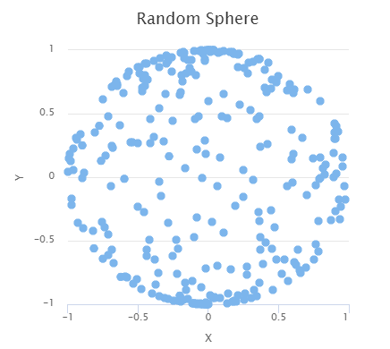

[[charts.charttypes.scatter]]
= Scatter Charts

Scatter charts display a set of unconnected data points. The name refers to given X and Y coordinates, so the [classname]`DataSeries` or [classname]`DataProviderSeries` are usually the most meaningful data series types for scatter charts.

[[figure.charts.charttypes.scatter]]
.Scatter Chart
[.fill.white]

The chart type of a scatter chart is [parameter]`ChartType.SCATTER`. Its options can be configured in a [classname]`PlotOptionsScatter` object, although it doesn't have any chart-type-specific options.

[source,java]
----
Chart chart = new Chart(ChartType.SCATTER);

// Modify the default configuration a bit
Configuration conf = chart.getConfiguration();
conf.setTitle("Random Sphere");
conf.getLegend().setEnabled(false); // Disable legend
conf.getxAxis().setTitle("X");
conf.getyAxis().setTitle("Y");
conf.getxAxis().setMax(1);
conf.getxAxis().setMin(-1);
conf.getyAxis().setMax(1);
conf.getyAxis().setMin(-1);

PlotOptionsScatter options = new PlotOptionsScatter();
// ... Give general plot options here ...
conf.setPlotOptions(options);

DataSeries series = new DataSeries();
for (int i=0; i<300; i++) {
    double lng = Math.random() * 2 * Math.PI;
    double lat = Math.random() * Math.PI - Math.PI/2;
    double x   = Math.cos(lat) * Math.sin(lng);
    double y   = Math.sin(lat);

    DataSeriesItem point = new DataSeriesItem(x,y);
    series.add(point);
}
conf.addSeries(series);
----

The result is shown in <<figure.charts.charttypes.scatter>>.

== Scatter Example

[.example]
--
[source,typescript]
----
include::{root}/frontend/demo/component/charts/charttypes/chart-type-libraries.ts[preimport,hidden]
----

ifdef::flow[]
[source,java]
----
include::{root}/src/main/java/com/vaadin/demo/component/charts/charttypes/ChartTypeScatter.java[render,tags=snippet,indent=0,group=Flow]
----
endif::[]
--
