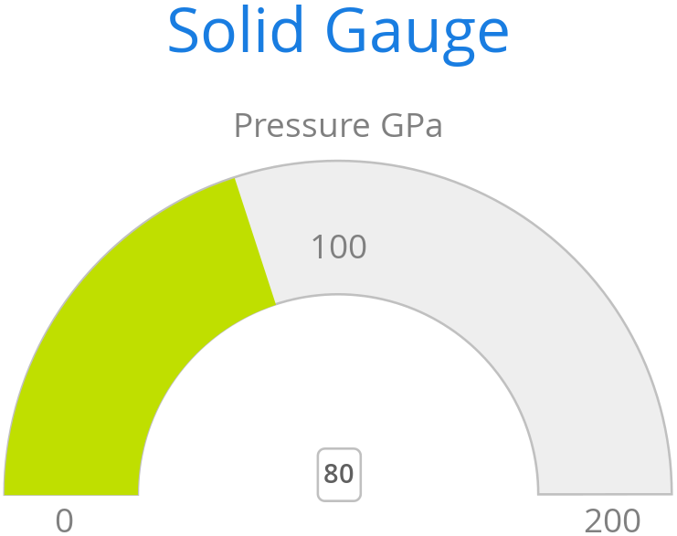

[[charts.charttypes.solidgauge]]
= Solid Gauges

A solid gauge is much like a <<gauge#charts.charttypes.gauge,regular gauge>> &ndash; a one-dimensional chart with a circular Y-axis. However, instead of a rotating pointer, the value is shown by a rotating arc with a solid color. The color of the indicator arc can be configured to change according to the value, using color stops.

Consider the following gauge:

[source,java]
----
Chart chart = new Chart(ChartType.SOLIDGAUGE);
----

With the settings shown in the following sections, it is displayed as in <<figure.charts.charttypes.solidgauge>>.

[[figure.charts.charttypes.solidgauge]]
.A Solid Gauge
[.fill.white]

Although solid gauge is much like a regular gauge, the configuration differs.

[[charts.charttypes.solidgauge.conf]]
== Configuration

The solid gauge must be configured in the drawing [classname]`Pane` of the chart configuration. The gauge arc spans an angle which is specified as -360 to 360 degrees, with 0 degrees at the top of the arc. Typically, a semi-arc is used, where you use -90 and 90 for the angles, and move the center lower than you would have with a full circle. You can also adjust the size of the gauge pane; enlarging it allows better positioning of the tick labels.

[source,java]
----
Configuration conf = chart.getConfiguration();
conf.setTitle("Solid Gauge");

Pane pane = conf.getPane();
pane.setSize("125%");           // For positioning tick labels
pane.setCenter("50%", "70%"); // Move center lower
pane.setStartAngle(-90);        // Make semi-circle
pane.setEndAngle(90);           // Make semi-circle
----

The shape of the gauge display is defined as the background of the pane. As a minimum, you need to set the shape as either " [literal]`++arc++`" or "[literal]`++solid++`". You also typically want to set background color and inner and outer radius.

[source,java]
----
Background bkg = new Background();
bkg.setInnerRadius("60%");  // To make it an arc and not circle
bkg.setOuterRadius("100%"); // Default - not necessary
bkg.setShape(BackgroundShape.ARC);        // solid or arc
pane.setBackground(bkg);
----

[[charts.charttypes.solidgauge.axis]]
== Axis Configuration

A gauge has only a Y-axis. You must define the value range ( _min_ and _max_).

[source,java]
----
YAxis yaxis = new YAxis();
yaxis.setTitle("Pressure GPa");
yaxis.getTitle().setY(-80); // Move 70 px upwards from center

// The limits are mandatory
yaxis.setMin(0);
yaxis.setMax(200);

// Configure ticks and labels
yaxis.setTickInterval(100);  // At 0, 100, and 200
yaxis.getLabels().setY(-16); // Move 16 px upwards
yaxis.setGridLineWidth(0); // Disable grid
----

Calling [methodname]`yaxis.getLabels().setRotationPerpendicular()` makes gauge labels rotate perpendicular to the center.

You can make all kinds of other configuration settings on the axis. See the API documentation for all the available parameters.

[[charts.charttypes.solidgauge.plotoptions]]
== Plot Options

Solid gauges don't currently have any chart-type-specific plot options. See <<../configuration#charts.configuration.plotoptions,"Plot Options">> for common options.

[source,java]
----
PlotOptionsSolidgauge options = new PlotOptionsSolidgauge();

// Move the value display box at the center a bit higher
Labels dataLabels = new Labels();
dataLabels.setY(-20);
options.setDataLabels(dataLabels);

conf.setPlotOptions(options);
----

[[charts.charttypes.solidgauge.data]]
== Setting & Updating Gauge Data

A gauge displays only a single value, which you can define as a data series of length 1, as in the following example:

[source,java]
----
ListSeries series = new ListSeries("Pressure MPa", 80);
conf.addSeries(series);
----

Gauges are especially meaningful for displaying changing values. You can use the [methodname]`updatePoint()` method in the data series to update the single value.

[source,java]
----
final TextField tf = new TextField("Enter a new value");
layout.add(tf);

Button update = new Button("Update", (e) -> {
    Integer newValue = new Integer(tf.getValue());
    series.updatePoint(0, newValue);
});
layout.add(update);
----

== Solid Gauge Example

[.example]
--
[source,typescript]
----
include::{root}/frontend/demo/component/charts/charttypes/chart-type-libraries.ts[preimport,hidden]
----

ifdef::flow[]
[source,java]
----
include::{root}/src/main/java/com/vaadin/demo/component/charts/charttypes/ChartTypeSolidGauge.java[render,tags=snippet,indent=0,group=Flow]
----
endif::[]
--
