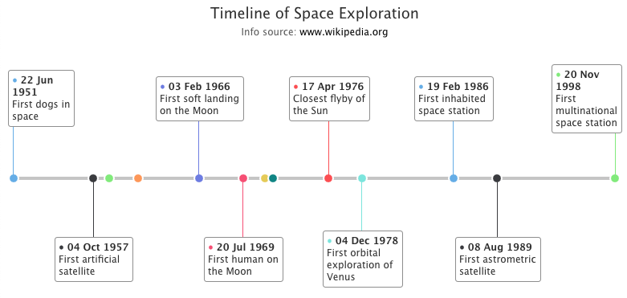

[[charts.charttypes.timeline]]
= Timeline Charts

Timeline charts are used to visualize events on a time axis. They require the use of [classname]`DataSeriesItemTimeline` to set an X value, together with name, label and description for the event.

NOTE: A timeline chart isn't the same as the <<../timeline#charts.timeline,chart timeline>>, which lets the user select the time range to display in a chart of almost any type.

A ready Timeline chart is shown in <<figure.charts.charttypes.timeline>>.

[[figure.charts.charttypes.timeline]]
.Timeline Chart
[.fill.white]

The chart type of a timeline chart is [parameter]`ChartType.TIMELINE`. Its options can be configured in a [classname]`PlotOptionsTimeline` object.

ifdef::web[]
[source,java]
----
// Create a timeline chart
Chart chart = new Chart(ChartType.TIMELINE);

// Modify the default configuration
Configuration conf = chart.getConfiguration();
conf.setTitle("Timeline of Space Exploration");
conf.setSubTitle(
        "Info source: <a href=\"https://en.wikipedia.org/wiki/Timeline_of_space_exploration\">www.wikipedia.org</a>");
conf.getTooltip().setEnabled(true);

// Add data
DataSeries series = new DataSeries();
series.add(new DataSeriesItemTimeline(getInstant(1951, 6, 22),
        "First dogs in space", "First dogs in space",
        "Dezik and Tsygan were the first dogs to make a sub-orbital flight on 22 July 1951. Both dogs were recovered unharmed after travelling to a maximum altitude of 110 km."));
series.add(new DataSeriesItemTimeline(getInstant(1957, 10, 4),
        "First artificial satellite", "First artificial satellite",
        "Sputnik 1 was the first artificial Earth satellite. The Soviet Union launched it into an elliptical low Earth orbit on 4 October 1957, orbiting for three weeks before its batteries died, then silently for two more months before falling back into the atmosphere."));
series.add(new DataSeriesItemTimeline(getInstant(1959, 1, 4),
        "First artificial satellite to reach the Moon",
        "First artificial satellite to reach the Moon",
        "Luna 1 was the first artificial satellite to reach the Moon vicinity and first artificial satellite in heliocentric orbit."));
series.add(new DataSeriesItemTimeline(getInstant(1961, 4, 12),
        "First human spaceflight", "First human spaceflight",
        "Yuri Gagarin was a Soviet pilot and cosmonaut. He became the first human to journey into outer space when his Vostok spacecraft completed one orbit of the Earth on 12 April 1961."));
series.add(new DataSeriesItemTimeline(getInstant(1966, 2, 3),
        "First soft landing on the Moon",
        "First soft landing on the Moon",
        "Yuri Gagarin was a Soviet pilot and cosmonaut. He became the first human to journey into outer space when his Vostok spacecraft completed one orbit of the Earth on 12 April 1961."));
series.add(new DataSeriesItemTimeline(getInstant(1969, 7, 20),
        "First human on the Moon", "First human on the Moon",
        "Apollo 11 was the spaceflight that landed the first two people on the Moon. Commander Neil Armstrong and lunar module pilot Buzz Aldrin, both American, landed the Apollo Lunar Module Eagle on July 20, 1969, at 20:17 UTC."));
series.add(new DataSeriesItemTimeline(getInstant(1971, 4, 19),
        "First space station", "First space station",
        "Salyut 1 was the first space station of any kind, launched into low Earth orbit by the Soviet Union on April 19, 1971. The Salyut program followed this with five more successful launches out of seven more stations."));
series.add(new DataSeriesItemTimeline(getInstant(1971, 12, 2),
        "First soft Mars landing", "First soft Mars landing",
        "Mars 3 was an unmanned space probe of the Soviet Mars program which spanned the years between 1960 and 1973. Mars 3 was launched May 28, 1971, nine days after its twin spacecraft Mars 2. The probes were identical robotic spacecraft launched by Proton-K rockets with a Blok D upper stage, each consisting of an orbiter and an attached lander."));
series.add(new DataSeriesItemTimeline(getInstant(1976, 4, 17),
        "Closest flyby of the Sun", "Closest flyby of the Sun",
        "Helios-A and Helios-B (also known as Helios 1 and Helios 2) are a pair of probes launched into heliocentric orbit for the purpose of studying solar processes. A joint venture of West Germany's space agency DFVLR (70 percent share) and NASA (30 percent), the probes were launched from Cape Canaveral Air Force Station, Florida."));
series.add(new DataSeriesItemTimeline(getInstant(1978, 12, 4),
        "First orbital exploration of Venus",
        "First orbital exploration of Venus",
        "The Pioneer Venus Orbiter entered orbit around Venus on December 4, 1978, and performed observations to characterize the atmosphere and surface of Venus. It continued to transmit data until October 1992."));
series.add(new DataSeriesItemTimeline(getInstant(1986, 2, 19),
        "First inhabited space station",
        "First inhabited space station",
        "Mir was a space station that operated in low Earth orbit from 1986 to 2001, operated by the Soviet Union and later by Russia. Mir was the first modular space station and was assembled in orbit from 1986 to 1996. It had a greater mass than any previous spacecraft."));
series.add(new DataSeriesItemTimeline(getInstant(1989, 8, 8),
        "First astrometric satellite", "First astrometric satellite",
        "Hipparcos was a scientific satellite of the European Space Agency (ESA), launched in 1989 and operated until 1993. It was the first space experiment devoted to precision astrometry, the accurate measurement of the positions of celestial objects on the sky."));
series.add(new DataSeriesItemTimeline(getInstant(1998, 11, 20),
        "First multinational space station",
        "First multinational space station",
        "The International Space Station (ISS) is a space station, or a habitable artificial satellite, in low Earth orbit. Its first component was launched into orbit in 1998, with the first long-term residents arriving in November 2000.[7] It has been inhabited continuously since that date."));

PlotOptionsTimeline options = new PlotOptionsTimeline();
options.getMarker().setSymbol(MarkerSymbolEnum.CIRCLE);
DataLabels labels = options.getDataLabels();
labels.setAllowOverlap(false);
labels.setFormat(
        "●  {point.x:%d %b %Y} {point.label}");
series.setPlotOptions(options);
conf.addSeries(series);

// Configure the axes
conf.getxAxis().setVisible(false);
conf.getxAxis().setType(AxisType.DATETIME);
conf.getyAxis().setVisible(false);

----
endif::web[]

ifdef::web[]
[source,java]
----
// Helper method to create an Instant from year, month and day
private Instant getInstant(int year, int month, int dayOfMonth) {
    return LocalDate.of(year, month, dayOfMonth).atStartOfDay().toInstant(ZoneOffset.UTC);
}
----
endif::web[]

== Timeline Example

[.example]
--
[source,typescript]
----
include::{root}/frontend/demo/component/charts/charttypes/chart-type-libraries.ts[preimport,hidden]
----

ifdef::flow[]
[source,java]
----
include::{root}/src/main/java/com/vaadin/demo/component/charts/charttypes/ChartTypeTimeline.java[render,tags=snippet,indent=0,group=Flow]
----
endif::[]
--
