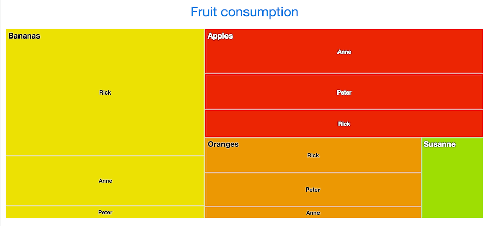

[[charts.charttypes.treemap]]
= Tree Maps

A tree map is used to display hierarchical data. It consists of a group of rectangles that contains other rectangles, where the size of a rectangle represents the item value.

// This image is way too big and labels too small.
[[figure.charts.charttypes.treemap]]
.Tree Maps
[.fill.white]

Tree maps have chart type [literal]`++TREEMAP++`.

To create a Tree Map chart, you need to create a class that extends [classname]`TreeSeriesItem` and add a [propertyname]`colorIndex` property:

[source,java]
----
public static class MapTreeSeriesItem extends TreeSeriesItem {
    private Number colorIndex;

    public Number getColorIndex() {
        return colorIndex;
    }

    public void setColorIndex(Number colorIndex) {
        this.colorIndex = colorIndex;
    }
}
----

You then need to specify a color index for each of the top-level series items:

[source,java]
----
TreeSeries series = new TreeSeries();

MapTreeSeriesItem apples = new MapTreeSeriesItem();
apples.setId("A");
apples.setName("Apples");
apples.setColorIndex(0);

...

TreeSeriesItem anneA = new TreeSeriesItem("Anne", apples, 5);
TreeSeriesItem rickA = new TreeSeriesItem("Rick", apples, 3);
TreeSeriesItem peterA = new TreeSeriesItem("Peter", apples, 4);

...

series.addAll(apples, anneA, rickA, peterA);
----

ifdef::web[For example:]

ifdef::web[]
[source,java]
----
Chart chart = new Chart();

PlotOptionsTreemap plotOptions = new PlotOptionsTreemap();
plotOptions.setLayoutAlgorithm(TreeMapLayoutAlgorithm.STRIPES);
plotOptions.setAlternateStartingDirection(true);

Level level = new Level();
level.setLevel(1);
level.setLayoutAlgorithm(TreeMapLayoutAlgorithm.SLICEANDDICE);

DataLabels dataLabels = new DataLabels();
dataLabels.setEnabled(true);
dataLabels.setAlign(HorizontalAlign.LEFT);
dataLabels.setVerticalAlign(VerticalAlign.TOP);

Style style = new Style();
style.setFontSize("15px");
style.setFontWeight(FontWeight.BOLD);

dataLabels.setStyle(style);
level.setDataLabels(dataLabels);
plotOptions.setLevels(level);

TreeSeries series = new TreeSeries();

TreeSeriesItem apples = new TreeSeriesItem("A", "Apples");
apples.setColor(new SolidColor("#EC2500"));

TreeSeriesItem bananas = new TreeSeriesItem("B", "Bananas");
bananas.setColor(new SolidColor("#ECE100"));

TreeSeriesItem oranges = new TreeSeriesItem("O", "Oranges");
oranges.setColor(new SolidColor("#EC9800"));

TreeSeriesItem anneA = new TreeSeriesItem("Anne", apples, 5);
TreeSeriesItem rickA = new TreeSeriesItem("Rick", apples, 3);
TreeSeriesItem paulA = new TreeSeriesItem("Paul", apples, 4);

TreeSeriesItem anneB = new TreeSeriesItem("Anne", bananas, 4);
TreeSeriesItem rickB = new TreeSeriesItem("Rick", bananas, 10);
TreeSeriesItem paulB = new TreeSeriesItem("Paul", bananas, 1);

TreeSeriesItem anneO = new TreeSeriesItem("Anne", oranges, 1);
TreeSeriesItem rickO = new TreeSeriesItem("Rick", oranges, 3);
TreeSeriesItem paulO = new TreeSeriesItem("Paul", oranges, 3);

TreeSeriesItem susanne = new TreeSeriesItem("Susanne", 2);
susanne.setParent("Kiwi");
susanne.setColor(new SolidColor("#9EDE00"));

series.addAll(apples, bananas, oranges, anneA, rickA, paulA,
        anneB, rickB, paulB, anneO, rickO, paulO, susanne);

series.setPlotOptions(plotOptions);

chart.getConfiguration().addSeries(series);

chart.getConfiguration().setTitle("Fruit consumption");
----
endif::web[]

ifdef::web[]
[[charts.charttypes.treemap.plotoptions]]
== Plot Options

Tree map charts have plot options type [classname]`PlotOptionsTreeMap`, which extends the more general options defined in [classname]`AbstractCommonOptionsColumn`. It has the following chart-type-specific properties:

[parameter]`allowDrillToNode`:: When enabled, the user can click on a point which is a parent and zoom in on its children. Defaults to false.
[parameter]`alternateStartingDirection`:: Enabling this option makes the tree map alternate the drawing direction between vertical and horizontal. The next level's starting direction is always the opposite of the previous. The default value is [literal]`++false++`.
[parameter]`layoutAlgorithm`:: This option specifies which algorithm is used for setting the position and dimensions of the points. Available algorithms are defined in [classname]`TreeMapLayoutAlgorithm` enum: [literal]`++SLICEANDDICE++`, [literal]`++STRIPES++`, [literal]`++SQUARIFIED++` and [literal]`++STRIP++`. The default value is [literal]`++SLICEANDDICE++`.
[parameter]`layoutStartingDirection`:: Defines which direction the layout algorithm starts drawing. Possible values are defined in [classname]`TreeMapLayoutStartingDirection` enum: [literal]`++HORIZONTAL++` and [literal]`++VERTICAL++`. The default value is [literal]`++VERTICAL++`.
[parameter]`levelIsConstant`:: Used together with the [methodname]`setLevels()` and [methodname]`setAllowDrillToNode()` options. When set to [literal]`++false++`, the first level visible when drilling is considered to be level one. Otherwise, the level is the same as the tree structure. The default value is [literal]`++true++`.
[parameter]`levels`:: Set options on specific levels. Takes precedence over series options, but not point options.

endif::web[]

ifdef::web[]
[[charts.charttypes.treemap.dataseries]]
== Tree Map Data Series

Tree maps require hierarchical data. The easiest way is to use [classname]`TreeSeries` and [classname]`TreeSeriesItem`, as was done in the earlier example. You can add data points with the [methodname]`add()` method, or give all the data at once in a [classname]`Collection` with [methodname]`setData()` or in the constructor.

The item hierarchy is defined with the [methodname]`setParent()` method in the [classname]`TreeSeriesItem` instance or in the constructor. The parent argument can be either a [classname]`String` identifier or a [classname]`TreeSeriesItem` with a non-null ID. If no [classname]`TreeSeriesItem` with matching ID is found or if value is null, the parent is rendered as a root item.
endif::web[]

== Tree Map Example

[.example]
--
[source,typescript]
----
include::{root}/frontend/demo/component/charts/charttypes/chart-type-libraries.ts[preimport,hidden]
----

ifdef::flow[]
[source,java]
----
include::{root}/src/main/java/com/vaadin/demo/component/charts/charttypes/ChartTypeTreeMap.java[render,tags=snippet,indent=0,group=Flow]
----
endif::[]
--
