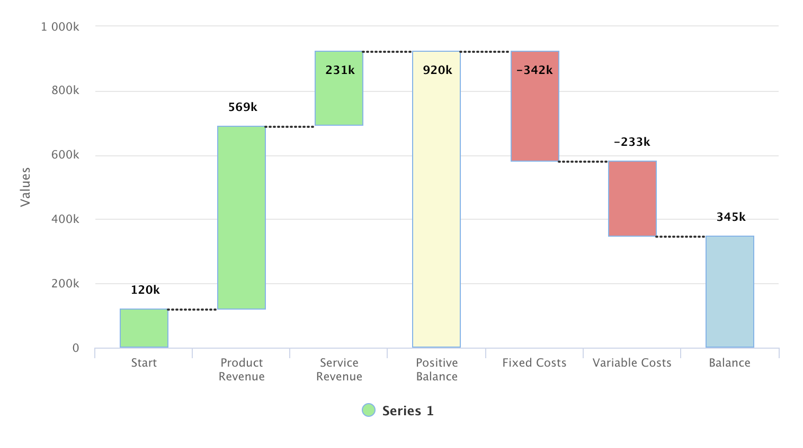

[[charts.charttypes.waterfall]]
= Waterfall Charts

Waterfall charts are used for visualizing level changes from an initial level to a final level through changes in the level. The changes are given as delta values, and you can have many intermediate totals, which are calculated automatically.

[[figure.charts.charttypes.waterfall]]
.Waterfall Charts
[.fill.white]

Waterfall charts have chart type [literal]`++WATERFALL++`.

ifdef::web[For example:]

ifdef::web[]
[source,java]
----
Chart chart = new Chart(ChartType.WATERFALL);

DataSeries dataSeries = new DataSeries();

dataSeries.add(new DataSeriesItem("Start", 120000));
dataSeries.add(new DataSeriesItem("Product Revenue", 569000));
dataSeries.add(new DataSeriesItem("Service Revenue", 231000));
WaterFallSum positiveBalance = new WaterFallSum("Positive Balance");
positiveBalance.setIntermediate(true);
dataSeries.add(positiveBalance);

dataSeries.add(new DataSeriesItem("Fixed Costs", -342000));
dataSeries.add(new DataSeriesItem("Variable Costs", -233000));
WaterFallSum balance = new WaterFallSum("Balance");
dataSeries.add(balance);

PlotOptionsWaterfall opts = new PlotOptionsWaterfall();
DataLabels dataLabels = new DataLabels(true);
dataLabels.setVerticalAlign(VerticalAlign.TOP);
dataLabels.setY(-30);
dataLabels.setFormatter("function() { return this.y / 1000 + 'k'; }");
opts.setDataLabels(dataLabels);

dataSeries.setPlotOptions(opts);

Configuration configuration = chart.getConfiguration();
configuration.addSeries(dataSeries);
configuration.getxAxis().setType(AxisType.CATEGORY);
...
----
endif::web[]
Waterfall charts can be <<../styling#css.styling,styled by CSS>> using the following classes: [literal]`.highcharts-waterfall-series`, [literal]`.highcharts-point`, [literal]`.highcharts-negative`, [literal]`.highcharts-sum`, [literal]`.highcharts-intermediate-sum`.

ifdef::web[]
The example continues in the following subsections.
endif::web[]

ifdef::web[]
[[charts.charttypes.waterfall.plotoptions]]
== Plot Options

Waterfall charts have plot options type [classname]`PlotOptionsWaterfall`, which extends the more general options defined in [classname]`PlotOptionsColumn`. It has the following chart type specific properties:

[parameter]`upColor`:: Color for positive values.
[parameter]`color`:: Default color for all points. If [propertyname]`upColor` is defined, [propertyname]`color` is used only for negative values.

The following defines the colors, as well as the style and placement, of
the labels for the columns:

ifdef::web[]
[source,java]
----
// Define the colors
final Color balanceColor = SolidColor.BLACK;
final Color positiveColor = SolidColor.BLUE;
final Color negativeColor = SolidColor.RED;

// Configure the colors
PlotOptionsWaterfall options = new PlotOptionsWaterfall();
options.setUpColor(positiveColor);
options.setColor(negativeColor);

// Configure the labels
Labels labels = new Labels(true);
labels.setVerticalAlign(VerticalAlign.TOP);
labels.setY(-20);
labels.setFormatter("Math.floor(this.y/1000) + 'k'");
Style style = new Style();
style.setColor(SolidColor.BLACK);
style.setFontWeight(FontWeight.BOLD);
labels.setStyle(style);
options.setDataLabels(labels);
options.setPointPadding(0);
conf.setPlotOptions(options);
----
endif::web[]

endif::web[]

ifdef::web[]
[[charts.charttypes.waterfall.datamodel]]
== Data Series

The data series for waterfall charts consist of changes (deltas) starting from an initial value and one or more cumulative sums. There should be at least a final sum, and optionally intermediate sums. The sums are represented as [classname]`WaterFallSum` data items, and no value is needed for them, as they are calculated automatically. For intermediate sums, you should set the [parameter]`intermediate` property to [literal]`++true++`.

ifdef::web[]
[source,java]
----
// The data
DataSeries series = new DataSeries();

// The beginning balance
DataSeriesItem start = new DataSeriesItem("Start", 306503);
start.setColor(balanceColor);
series.add(start);

// Deltas
series.add(new DataSeriesItem("Predators", -3330));
series.add(new DataSeriesItem("Slaughter", -103332));
series.add(new DataSeriesItem("Reproduction", +104052));

WaterFallSum end = new WaterFallSum("End");
end.setColor(balanceColor);
end.setIntermediate(false); // Not intermediate (default)
series.add(end);

conf.addSeries(series);
----
endif::web[]

endif::web[]

== Waterfall Example

[.example]
--
[source,typescript]
----
include::{root}/frontend/demo/component/charts/charttypes/chart-type-libraries.ts[preimport,hidden]
----

ifdef::flow[]
[source,java]
----
include::{root}/src/main/java/com/vaadin/demo/component/charts/charttypes/ChartTypeWaterfall.java[render,tags=snippet,indent=0,group=Flow]
----
endif::[]
--
