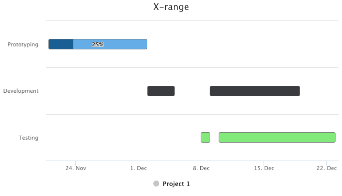

[[charts.charttypes.xrange]]
= X-Range Charts

X-Range charts are used to visualize a range on the X axis. They require the use of [classname]`DataSeriesItemXrange` to set an initial X value and a final X2 value. Additionally, [propertyname]`partialFillAmount` can be set to show the percentage of the point to be filled.

A ready X-Range chart is shown in <<figure.charts.charttypes.xrange>>.

[[figure.charts.charttypes.xrange]]
.X-Range Chart
[.fill.white]

The chart type of an X-Range chart is [parameter]`ChartType.XRANGE`. Its options can be configured in a [classname]`PlotOptionsXrange` object.

ifdef::web[]
[source,java]
----
// Create a xrange chart
Chart chart = new Chart(ChartType.XRANGE);

// Modify the default configuration
Configuration conf = chart.getConfiguration();
conf.setTitle("X-range");

// Add data
DataSeries series = new DataSeries();
series.setName("Project 1");
series.add(new DataSeriesItemXrange(getInstant(2014, 11, 21),
        getInstant(2014, 12, 2), 0, 0.25));
series.add(new DataSeriesItemXrange(getInstant(2014, 12, 2),
        getInstant(2014, 12, 5), 1));
series.add(new DataSeriesItemXrange(getInstant(2014, 12, 8),
        getInstant(2014, 12, 9), 2));
series.add(new DataSeriesItemXrange(getInstant(2014, 12, 9),
        getInstant(2014, 12, 19), 1));
series.add(new DataSeriesItemXrange(getInstant(2014, 12, 10),
        getInstant(2014, 12, 23), 2));
PlotOptionsXrange options = new PlotOptionsXrange();
options.setBorderColor(SolidColor.GRAY);
options.setPointWidth(20);
options.getDataLabels().setEnabled(true);
series.setPlotOptions(options);
conf.addSeries(series);

// Configure the axes
conf.getxAxis().setType(AxisType.DATETIME);
conf.getyAxis().setTitle("");
conf.getyAxis().setCategories("Prototyping", "Development", "Testing");
conf.getyAxis().setReversed(true);
----
endif::web[]

ifdef::web[]
[source,java]
----
// Helper method to create an Instant from year, month and day
private Instant getInstant(int year, int month, int dayOfMonth) {
    return LocalDate.of(year, month, dayOfMonth).atStartOfDay().toInstant(ZoneOffset.UTC);
}
----
endif::web[]

== X-Range Example

[.example]
--
[source,typescript]
----
include::{root}/frontend/demo/component/charts/charttypes/chart-type-libraries.ts[preimport,hidden]
----

ifdef::flow[]
[source,java]
----
include::{root}/src/main/java/com/vaadin/demo/component/charts/charttypes/ChartTypeXrange.java[render,tags=snippet,indent=0,group=Flow]
----
endif::[]
--
