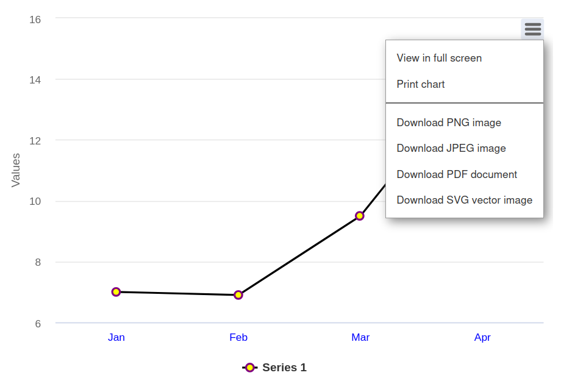

[[charts.remoteexportservice]]
= Exporting Charts using a Remote Export Service

Vaadin Charts has a simple built-in export functionality that does the export in a remote export server. Vaadin Charts provides a default export service, but you can also configure your own.

You can enable the built-in export function by setting `setExporting(true)` in the chart configuration.

[source,java]
----
chart.getConfiguration().setExporting(true);
----

To configure it further, you can provide an `Exporting` object with custom settings.

[source,java]
----
// Create the export configuration
Exporting exporting = new Exporting(true);

// Customize the file name of the download file
exporting.setFilename("mychartfile");

// Use the exporting configuration in the chart
chart.getConfiguration().setExporting(exporting);
----

Once configured, the chart should have a menu with multiple export options visible.

[[figure.charts.remoteexportservice.example]]
.Menu Showing Chart Export Options
[.fill.white]

== Using Custom Export Service

The exporting feature uses a https://export.highcharts.com[Highcharts export service] by default. To use your own, you need to https://www.highcharts.com/docs/export-module/setting-up-the-server[set up an export server] and then configure it in the `Exporting` configuration as follows:

[source,java]
----
exporting.setUrl("https://my.own.server.com");
----