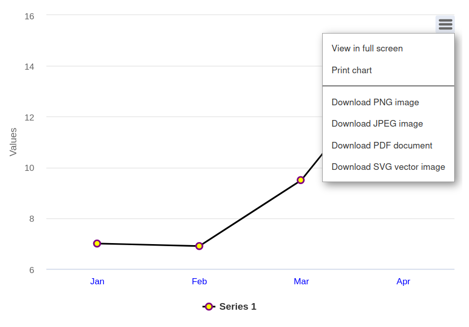

[[charts.remoteexportservice]]
= Exporting Charts Using a Remote Export Service

Vaadin Charts has built-in export functionality that renders the chart to a file on a remote export server. By default, it uses the public https://export.highcharts.com[Highcharts export server], but you can also <<#charts.remoteexportservice.custom,configure your own>>.

.Chart Data Is Sent to the Export Server
[CAUTION]
To render the exported file, the chart's configuration — including its data — is sent to the export server. With the default settings, this means sending the data to a third-party server. If your charts contain sensitive data, set up your own export server instead.

You can enable the built-in export menu by calling [methodname]`setExporting(true)` on the chart configuration.

[source,java]
----
chart.getConfiguration().setExporting(true);
----

To configure it further, you can provide an [classname]`Exporting` object with custom settings.

[source,java]
----
// Create the export configuration
Exporting exporting = new Exporting(true);

// Customize the name of the downloaded file
exporting.setFilename("mychartfile");

// Use the exporting configuration in the chart
chart.getConfiguration().setExporting(exporting);
----

Once exporting is enabled, the chart displays a menu with printing and download options.

[[figure.charts.remoteexportservice.example]]
.Menu Showing Chart Export Options
[.fill.white]

[[charts.remoteexportservice.custom]]
== Using a Custom Export Server

To use your own export server instead of the public one, https://www.highcharts.com/docs/export-module/setting-up-the-server[set up an export server] and configure its URL in the [classname]`Exporting` configuration as follows:

[source,java]
----
exporting.setUrl("https://my.own.server.com");
----
