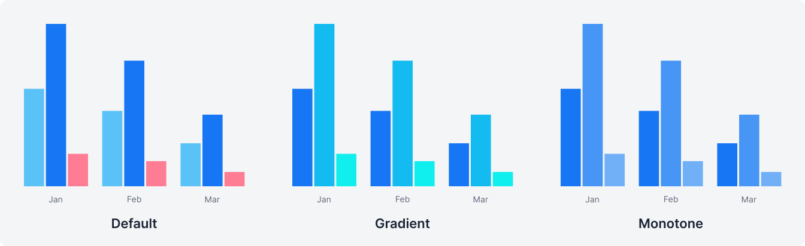
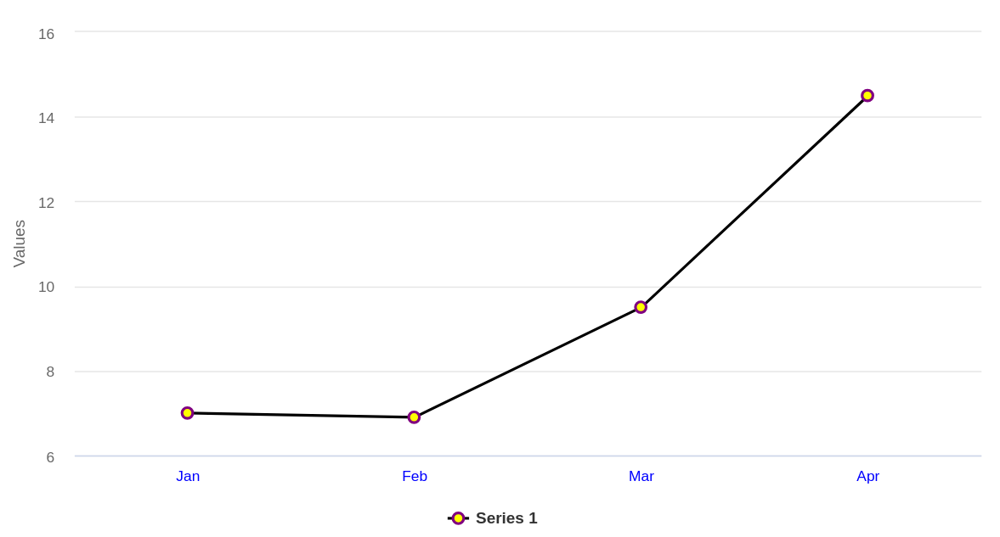
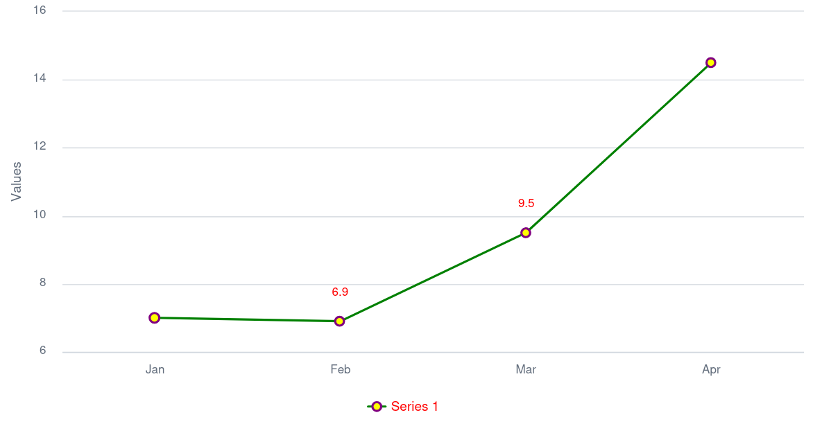
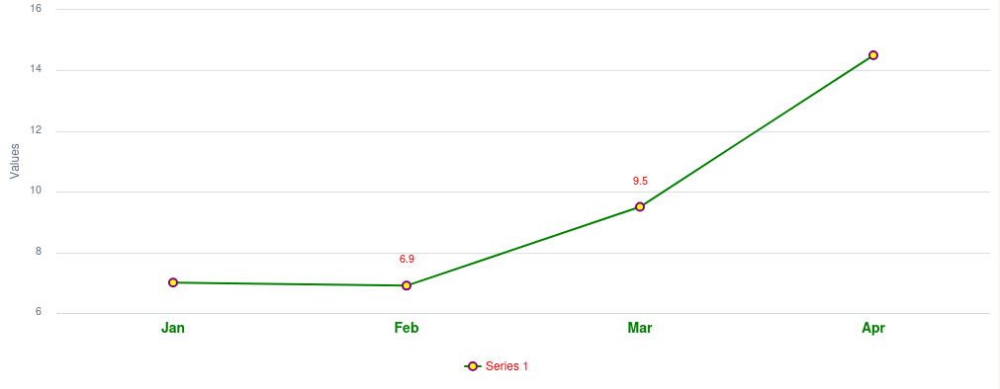

[[charts.styling]]
= Chart Styling

Charts can be styled using CSS, and in Flow applications also through the Java API. Vaadin Charts also has many built-in theme variants.

.CSS and the Java Styling API Can't Be Used in the Same Chart
[CAUTION]
While no error is thrown if different styling methods are used in the same chart, *only one method should be used in any chart*, since having both could lead to unexpected results.

== Theme Variants

[cols="1,3,1"]
|===
| Variant | Description | Supported by

|`gradient`
|Colors varying in hue
|Lumo

|`monotone`
|Colors varying in brightness
|Lumo

|`classic`
|Colors matching those in older versions
|Lumo

|===

== Java Styling API in Flow
The default styling mode in Flow applications uses the Java API.
See the link:https://vaadin.com/api/platform/com/vaadin/flow/component/charts/model/style/package-summary.html[Java API reference] for details.

=== Java API Styling Example

In this example, the Java API is used to change the color of point markers to yellow, their outlines to purple, the X-axis labels to blue, and the line color to black.

.`FlowStyleExample.java`
[source,java]
----
public class FlowStyleExample extends Div {

    public FlowStyleExample() {
        var chart = new Chart();
        var configuration = chart.getConfiguration();

        var ds = new DataSeries();
        ds.setData(7.0, 6.9, 9.5, 14.5);

        var plotOptions = new PlotOptionsLine();
        plotOptions.setColor(SolidColor.BLACK); // Line color

        var marker = new Marker();
        marker.setFillColor(SolidColor.YELLOW); // Point inside color
        marker.setLineWidth(2);
        marker.setLineColor(SolidColor.PURPLE); // Point outline color

        plotOptions.setMarker(marker);

        ds.setPlotOptions(plotOptions);

        configuration.addSeries(ds);

        configuration.getxAxis().setCategories("Jan", "Feb", "Mar", "Apr");
        configuration.getxAxis().getLabels().getStyle().setColor(SolidColor.BLUE); // X-axis label color

        add(chart);
    }
}
----

[[figure.chart.flow.styling.example]]
.Chart styled through the Java API
[.fill.white]

[[css.styling]]
== CSS Styling
Chart colors and fonts can be customized in any regular application stylesheet with the CSS style properties listed in <<{articles}/components/charts/styling/styling#,Style Properties>>.

Styling individual chart elements with Highcharts CSS class names requires the styles to be injected into the chart's shadow DOM: create a [filename]`vaadin-chart.css` file in your theme's [filename]`components` folder, and place the styles there. This mechanism is disabled by default, and must be enabled with the `themeComponentStyles` <<{articles}/flow/configuration/feature-flags#,feature flag>>.
See the link:https://www.highcharts.com/docs/chart-design-and-style/style-by-css[Highcharts styling documentation] for details on the available class names.

=== CSS Styling Mode for Flow
Flow applications can use CSS styling by enabling "styled mode" in the Chart configuration:

[source,java]
----
var chart = new Chart();
var conf = chart.getConfiguration();
conf.getChart().setStyledMode(true);
----

=== CSS Styling Example
In this example, CSS is used to change the color of point markers to yellow, their outlines to purple, data labels to red, and the series colors to shades of green.

.`styles.css`
[source,css]
----
vaadin-chart.first-chart {
    --vaadin-charts-color-0: green;
    --vaadin-charts-color-1: lightgreen;
    --vaadin-charts-color-2: darkgreen;
    --vaadin-charts-data-label: red;
}
----

.`CssStyleExample.java`
[source,java]
----
public class CssStyleExample extends Div {

    public CssStyleExample() {
        var chart = new Chart();
        var configuration = chart.getConfiguration();

        var chartModel = configuration.getChart();
        chartModel.setType(ChartType.LINE);
        chartModel.setStyledMode(true);

        configuration.getxAxis().setCategories("Jan", "Feb", "Mar", "Apr");

        var ds = new DataSeries();
        ds.setData(7.0, 6.9, 9.5, 14.5);

        var callout = new DataLabels(true);
        callout.setShape(Shape.CALLOUT);
        callout.setY(-12);
        ds.get(1).setDataLabels(callout);
        ds.get(2).setDataLabels(callout);
        configuration.addSeries(ds);

        chart.addClassName("first-chart");
        add(chart);
    }
}
----

.`themes/<my-theme>/components/vaadin-chart.css` (requires the `themeComponentStyles` feature flag)
[source,css]
----
:host(.first-chart) .highcharts-color-0 .highcharts-point {
    fill: yellow;
    stroke: purple;
    stroke-width: 2px;
}
----

[[figure.chart.css.styling.example]]
.Chart with Yellow Point Markers, Purple Outlines, Red Labels, and Green Lines
[.fill.white]

=== Adding and Styling a Class Name

CSS class names can be applied to both chart instances and individual chart elements.
In the example below, the `bold-green-axis` class name is applied to the X-axis of a chart to give it a distinct style.

.`CssStyleExample.java`
[source,java]
----
configuration.getxAxis().setClassName("bold-green-axis");
----

.`themes/<my-theme>/components/vaadin-chart.css` (requires the `themeComponentStyles` feature flag)
[source,css]
----
.bold-green-axis {
  font-weight: bold;
  fill: green;
  font-size: 14px;
}
----

[[figure.chart.css.styling.example2]]
.Chart with Bold, Green, and Slightly Larger X-Axis Labels
[.fill.white]

[discussion-id]`3E5B31FB-DF25-4D1E-80EB-7AB485C7B566`
