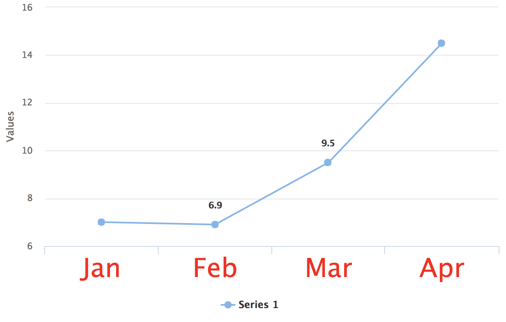

[[charts.styling]]
= Chart Styling

Charts can be styled using CSS, and in Flow applications also through the Java API. Vaadin Charts also has many built-in theme variants.

.Both CSS and Java styling API can't be used in the same chart
[CAUTION]
While no error is thrown if different styling methods are used in the same chart, *only one method should be used in any chart*, since having both could lead to unexpected results.

== Theme Variants
The following theme variants are available for Charts:

* Default colors (based on the Lumo or Material theme)
* Gradient variant with colors varying in hue (`theme="gradient"` / `ChartVariant.LUMO_GRADIENT` / `MATERIAL_GRADIENT`)
* Monotone variant with colors varying in brightness (`theme="monotone"` / `ChartVariant.LUMO_MONOTONE` / `MATERIAL_MONOTONE`)
* Classic variant with colors matching those in older versions (`theme="classic"` / `ChartVariant.LUMO_CLASSIC` / `MATERIAL_CLASSIC`)

See a <<{articles}/components/charts#,live demo of the variants>>.

== Java Styling API in Flow
The default styling mode in Flow applications uses the Java API.
See the link:https://vaadin.com/api/platform/com/vaadin/flow/component/charts/model/style/package-summary.html[Java API reference] for details.

=== Styling Using Java API Example

In this example Java API is used to change the color of point markers to yellow, their outline to purple, x-axis labels to blue, and the line color to black.

[source,java]
.`FlowStyleExample.java`
----
public class FlowStyleExample extends Div {

    public FlowStyleExample() {
        Chart chart = new Chart();
        Configuration configuration = chart.getConfiguration();

        DataSeries ds = new DataSeries();
        ds.setData(7.0, 6.9, 9.5, 14.5);
        ds.setColorAxis(3);

        PlotOptionsLine plotOptions = new PlotOptionsLine();
        plotOptions.setColor(SolidColor.BLACK); // Line color

        Marker marker = new Marker();
        marker.setFillColor(SolidColor.YELLOW); // Point inside color
        marker.setLineWidth(2);
        marker.setLineColor(SolidColor.PURPLE); // Point outline color

        plotOptions.setMarker(marker);

        ds.setPlotOptions(plotOptions);

        configuration.addSeries(ds);

        configuration.getxAxis().setCategories("Jan", "Feb", "Mar", "Apr");
        configuration.getxAxis().getLabels().getStyle().setColor(SolidColor.BLUE); // X axis labels color

        add(chart);
    }
}
----

[[figure.chart.flow.styling.example]]
.Chart styled through Java API
[.fill.white]
image::../img/flow-styling.png[]

[[css.styling]]
== CSS Styling
Styling Charts with CSS works similarly to other Vaadin components: create a [filename]`vaadin-chart.css` file in your theme's [filename]`components` folder, and place the styles there.
It's also possible to use the [annotationname]`@CssImport` annotation to load the style sheet in Flow applications.
See link:https://www.highcharts.com/docs/chart-design-and-style/style-by-css[Highcharts styling documentation] for details on CSS styling of Charts.

=== CSS Styling Mode for Flow
Flow applications can use CSS styling by enabling "styled mode" in the Chart configuration:

[source,java]
----
Chart chart = new Chart();
Configuration conf = chart.getConfiguration();
conf.getChart().setStyledMode(true);
----

=== CSS Styling Example
In this example CSS is used to change the color of point markers to yellow, their outline to purple, data labels to red, and line colors to green.

.`themes/{mytheme}/components/vaadin-chart.css`
[source,css]
----
:host(.first-chart) .highcharts-color-0 .highcharts-point {
    fill: yellow;
    stroke: purple;
    stroke-width: 2px;
}
----

.`themes/{mytheme}/styles.css`
[source,css]
----
vaadin-chart.first-chart {
    --vaadin-charts-color-0: green;
    --vaadin-charts-color-1: lightgreen;
    --vaadin-charts-color-2: darkgreen;
    --vaadin-charts-data-label: red;
}
----

.`CssStyleExample.java`
[source,java]
----
public class CssStyleExample extends Div {

    public CssStyleExample() {
        Chart chart = new Chart();
        Configuration configuration = chart.getConfiguration();

        ChartModel chartModel = configuration.getChart();
        chartModel.setType(ChartType.LINE);
        chartModel.setStyledMode(true);

        configuration.getxAxis().setCategories("Jan", "Feb", "Mar", "Apr");

        DataSeries ds = new DataSeries();
        ds.setData(7.0, 6.9, 9.5, 14.5);

        DataLabels callout = new DataLabels(true);
        callout.setShape(Shape.CALLOUT);
        callout.setY(-12);
        ds.get(1).setDataLabels(callout);
        ds.get(2).setDataLabels(callout);
        configuration.addSeries(ds);

        chart.addClassName("first-chart");
        add(chart);
    }
}
----

[[figure.chart.css.styling.example]]
.Chart with Yellow Point Markers, Purple Point Marker outline, Red Labels, and Green Line color.
[.fill.white]
image::../img/css-styling.png[]

=== Adding and Styling a Class Name.

CSS class names can be applied to both chart instances and individual chart elements.
In the example below, the `bold-green-axis` class name is applied to the X-axis of a chart to give it a distinct style.

.`CssStyleExample.java`
[source,java]
----
configuration.getxAxis().setClassName("bold-green-axis");
----

.`themes/{mytheme}/components/vaadin-chart.css`
[source,css]
----
.bold-green-axis {
  font-weight: bold;
  fill: green;
  font-size: 14px;
}
----

[[figure.chart.css.styling.example]]
.Chart with green, bold, and slightly larger X-axis labels.
[.fill.white]

[discussion-id]`3E5B31FB-DF25-4D1E-80EB-7AB485C7B566`
