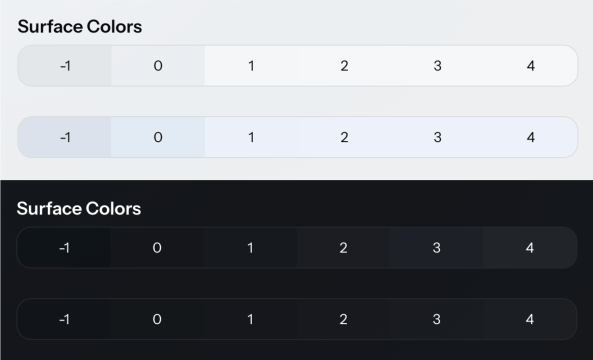
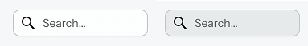
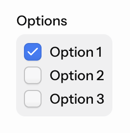

= Aura Color
:toclevels: 2

Aura defines its own color system, which it then maps to the base style color properties. Unless you need absolute control of the exact color values defined for text, borders, or backgrounds, you only need to override a few Aura color properties to get a customized color palette.

.Safari 17 Support
[CAUTION.small]
If you need to support Safari 17, avoid using the `light-dark()` function when overriding color properties, as the CSS relative color syntax – which Aura and base styles use – doesn't work together with the light-dark() function in Safari 17. This is why Aura defines color-scheme-specific light and dark properties.

.Read-Only Properties
[NOTE.small]
Properties which are marked “read-only” aren't technically read-only. While you can override their values, the intention is to use them only to set values of other properties.

== Color Scheme

You can choose between a light or a dark color scheme (i.e., light or dark mode), or configure the app to follow the user’s operating system preference, i.e., “auto” or “system” color scheme. The light color scheme is used by default.

The color properties you can customize in Aura have both a light and dark variant, suffixed with `-light` and `-dark`. If you support both color schemes, remember to redefine both color properties if those are available.

Use the native `color-scheme` property to control the app's global color scheme.

.Allowing the application color scheme to follow the operating system's color scheme.
[example]
====
[source,css]
----
html {
  /* Follow the user's operating system preference, i.e., "auto" or "system" */
  color-scheme: light dark;
}
----

.The global color scheme is either light or dark, depending on the operating system preference.
[.device]

====

In addition to the global color scheme, you can configure the notification and App Layout content area color schemes separately. This allows, for example, to always use the dark color scheme for the main navigation area while allowing the content/view area to follow the user's preference.

`--aura-content-color-scheme`::
Defines the color scheme of the content area of the App Layout component, and is only effective when the App Layout component is used. Follows the global color scheme by default.

`--aura-notification-color-scheme`::
Defines the color scheme of all notifications. Follows the global color scheme by default.

.Use a different color scheme for the navigation and main content areas.
[example]
====
[source,css]
----
html {
  /* Use the dark color scheme for the global navigation areas */
  color-scheme: dark;
  /* Follow the user's OS preference in the content area */
  --aura-content-color-scheme: light dark;
}
----

[.device]
image::_images/content-color-scheme.png[]
====

== Background Color

`--aura-background-color` **Read-only**::
The base background color. Adapts to the color scheme. Don't override this property directly. Use the color-scheme-specific `--aura-background-color-light` and `--aura-background-color-dark` properties instead.

`--aura-background-color-light`::
The base background color for the light color scheme.

`--aura-background-color-dark`::
The base background color for the dark color scheme.

`--aura-app-background`::
The main app background image, used for the `<html>` element and the App Layout content area. By default this is a computed gradient, which becomes more prominent with more saturated backgrounds.

You can also use the <<../base#background,base style background color properties>>.

.Using custom and highly saturated background colors, making the gradient background more prominent.
[example]
====
[source,css]
----
html {
  --aura-background-color-light: #ffd06b;
  --aura-background-color-dark: #1b0f38;
}
----

.Using a dark purple for the dark color scheme (global/navigation areas) and a bright yellow for the light color scheme (content area).
[.device]

====

[[text-and-border-colors]]
== Text & Border Colors

Aura redefines the base style <<../base#text,text color>> and <<../base#border,border color>> properties. These colors are computed based on the background color properties, and automatically adapt to the color scheme.

=== Text & Border Color Contrast

`--aura-contrast-level`::
Increase or decrease the contrast of the computed text border colors with this property.

If you explicitly override any <<#text-and-border-colors, text or border color>> properties, the `--aura-contrast-level` property no longer affects them unless you use ìt in your own computed colors.

.Increase the contrast level to make text and border colors stronger.
[example]
====
[source,css]
----
html {
  --aura-contrast-level: 10;
}
----

[.device]
image::_images/contrast-level.png[]
====

== Palette

The palette consists of seven colors: **neutral**, **red**, **orange**, **yellow**, **green**, **blue**, and **purple**.

.Looking for traditional color scales?
[TIP]
====
Aura doesn't offer traditional color scales that many design systems include, where you have 10 to 12 colors per hue, ranging from almost white to almost black, commonly named from 50/100 to 900.

Aura offers a palette of single color values, from which all necessary variations of that color are computed automatically (the text, border and surface/background variants). If you need more than what Aura and the <<../base#,base styles>> offer out of the box, you can use the native CSS https://developer.mozilla.org/en-US/docs/Web/CSS/Reference/Values/color_value/color-mix[`color-mix()`] and https://developer.mozilla.org/en-US/docs/Web/CSS/Guides/Colors/Using_relative_colors[relative color functions].
====

=== Neutral Color (Grayscale)

The neutral color forms the basis of your theme, as it's used for text and border colors by default. It has light and dark variants, where the light version is a dark gray and the dark version is off-white by default.

`--aura-neutral-light`, `--aura-neutral-dark`.

=== Saturated Colors

The other colors are meant to be used as accent colors. You can override the palette with custom colors, for example, from your brand guidelines.

`--aura-red`,
`--aura-orange`,
`--aura-yellow`,
`--aura-green`,
`--aura-blue`,
`--aura-purple`.

=== Text Colors

Each palette color (excluding neutral, use the <<../base#text, base style text colors>>) has a corresponding text color property which has more contrast against the background color, making it suitable to be used for colored text.

`--aura-red-text`,
`--aura-orange-text`,
`--aura-yellow-text`,
`--aura-green-text`,
`--aura-blue-text`,
`--aura-purple-text`.

== Accent Color

`--aura-accent-color` **Read-only**::
The accent color, used to highlight certain parts of the UI, like some interactive elements and selection states. Adapts to the color scheme. Don't override this property directly. Use the color-scheme-specific `--aura-accent-color-light` and `--aura-accent-color-dark` properties instead.

`--aura-accent-color-light`::
The accent color for the light color scheme.

`--aura-accent-color-dark`::
The accent color for the dark color scheme.

`--aura-accent-text-color` **Read-only**::
A text color derived from the accent color, providing more contrast against the background. Adapts to the color scheme. Don't override this property directly. Use the color-scheme-specific `--aura-accent-text-color-light` and `--aura-accent-text-color-dark` properties instead.

`--aura-accent-text-color-light`::
The accent text color for the light color scheme.

`--aura-accent-text-color-dark`::
The accent text color for the dark color scheme.

.Define accent colors for the light and dark color schemes.
[example]
====
.Provide Enough Contrast
[CAUTION.small]
Choose a color that has at least 3:1 contrast ratio with the background color in your application. The accent color is used as is for the focus outline color, which needs to be visible for all users.

[source,css]
----
/* If you want, you can apply different colors for light and dark color schemes */
html {
  --aura--accent-color-light: var(--aura-orange);
  --aura--accent-color-dark: var(--aura-purple);
}
----

.Using the orange accent color in the light color scheme and the purple accent color in the dark color scheme.
[.device]
image::_images/accent-colors.png[]
====

=== Utility Classes

You can override the default neutral accent color easily with these utility classes. Apply any of the classes on the `<html>` element to apply an accent color to the whole UI, or any element or component within the UI to apply an accent color to only that part of the UI.

`.aura-accent-red`,
`.aura-accent-orange`,
`.aura-accent-yellow`,
`.aura-accent-green`,
`.aura-accent-blue`,
`.aura-accent-purple`.

You can, for example, use one of these classes on the `<html>` element to set the global accent color of your app, without writing any CSS.

.Use the purple palette color as the global accent color.
[source,html]
----
<html class="aura-purple">
----

== Surface Color

The surface color, used as backgrounds, is used to create visual hierarchies in the UI. In general, a lighter color implies more “elevation” – being closer to the user and therefore more important. Aura provides a system for applying surface colors of varying elevation on the built-in components and layouts in your application.

.Regular and accent surface colors for levels from -1 to 4, in both light and dark color schemes.

[NOTE]
If you need a background color that is darker than the base background color in the light color scheme and lighter in the dark color scheme, use the `--vaadin-background-container` and `--vaadin-background-container-strong` colors from the base styles.

`--aura-surface-color` **Read-only**::
A computed color that you can apply to an element to give it elevation. The color is computed based on the `--aura-background-color` property, and adapts to the color scheme. The final value of the computed color depends on the effective values of the  `--aura-surface-level` and `--aura-surface-opacity` properties.

`--aura-surface-level`::
The “elevation level” of the computed surface color. Can be any fractional number, positive, or negative. Default is 1. In light mode, level 3–4 usually results in a white color in the light color scheme. In the dark color scheme, level 8 starts to be an upper limit, after which text colors are likely to not have enough contrast (depending on the surface opacity).

`--aura-surface-opacity`::
The transparency of the computed surface color. Defaults to 0.5. Transparency allows you to nest the same surface color on top of each other to create more sense of elevation.

`--aura-overlay-surface-opacity`::
Surface opacity specifically for overlay elements. You can set this to 1 if you don't like the default semi-transparent overlays.

`--aura-surface-color-solid` **Read-only**::
An opaque version of the effective surface color. Essentially the same as if `--aura-surface-opacity` was 1. Useful for situations when you need an opaque color.

`--aura-accent-surface` **Read-only**::
A surface color that is tinted with the effective accent color.

=== Customizing Surface Level & Opacity

The surface level and opacity can only change on a predefined set of elements.

While you might expect to be able to set the `--aura-surface-level` and `--aura-surface-opacity` property values at any level of the DOM hierarchy, that doesn't work. You can only change the level and opacity on elements that match the hard-coded list of selectors in Aura (https://github.com/vaadin/web-components/blob/4004d14275e2727147bcd085308f7f92481a9cf8/packages/aura/src/color.css#L49-L73[see full list]).

.Change the surface level of an element that matches the supported list of selectors.
[example]
====
The `input-field` part of the Text Field component is one of the supported elements where you can adjust the surface color.

First, apply a unique class name on the Text Field to be able to target it with CSS.

[source,java]
----
var searchField = new TextField();
searchField.addClassNames("search-field");
searchField.setAriaLabel("search");
----

Then, adjust the surface level with CSS, targeting the `input-field` part in the shadow DOM of the Text Field component.

[source,css]
----
.search-field::part(input-field) {
  --aura-surface-level: -1;
}
----

.A comparison of the Text Field component with the default surface color and with an adjusted surface color level.
[.fill.white]

====

=== Utility Classes

This list of supported selectors (see the earlier section), that allow you to customize the surface color level and opacity, include the general-purpose `.aura-surface` and `.aura-surface-solid` class names. You can apply these class names to any element and then adjust the level and opacity on that element.

As a side effect, these class names apply the corresponding semi-transparent or opaque surface color as the background of the element your apply them to. You can override the background to transparent, if you only want to use the newly computed surface color in some nested level of the element, for example, its shadow DOM.

You can only have one computed surface color inside the style scope of the `.aura-surface` and `.aura-surface-solid` class names. A new color can be computed for a nested element if it matches the supported list of selectors.

.Change the surface color of an element that doesn't match the supported list of selectors, in the shadow DOM of a component.
[example]
====
To apply a custom surface color level on the internal `group-field` part of the Checkbox Group component, apply the `.aura-surface` class name on the component. Add another, unique class name to target this component instance specifically.

[source,java]
----
var checkboxGroup = new CheckboxGroup("Options");
checkboxGroup.addClassNames("aura-surface", "my-checkbox-group");
----

Then, adjust the surface level and opacity on the component element, and reset its background to transparent. Finally, apply the recomputed surface color, which is inherited, to the part in the shadow DOM (and a couple more visual adjustments).

[source,css]
----
.my-checkbox-group {
  --aura-surface-level: -1;
  --aura-surface-opacity: 0.4;
  background: transparent;
}

.my-checkbox-group::part(group-field) {
  background: var(--aura-surface-color);
  padding: var(--vaadin-padding-s);
  border-radius: var(--vaadin-radius-m);
}
----

.A Checkbox Group component with a customized surface color applied on an internal part.
[.fill.white]

====
