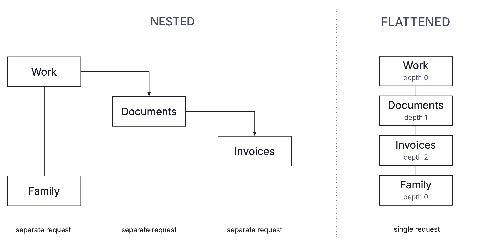

= Binding Data to Tree Grid [badge-flow]#Flow#
:toclevels: 2

Tree Grid supports several ways to bind hierarchical data, depending on where the data lives and how much control you need:

- The <<#setting-items,setItems>> method for quick setup from a collection of root items and their children.
- <<#tree-data-provider,TreeData and TreeDataProvider>> APIs for creating and binding in-memory hierarchies.
- <<#custom-data-providers,Custom hierarchical data providers>> for advanced cases, like connecting to a database.

== Setting Items

The simplest way to populate Tree Grid is to use the [methodname]`setItems(rootItems, childItemProvider)` method. It takes a collection of root items and a callback that returns the children of each item:

[.example]
--
.Example.java
[source,java]
----
Folder invoices = new Folder("Invoices", List.of());
Folder documents = new Folder("Documents", List.of(invoices));
Folder work = new Folder("Work", List.of(documents));
Folder family = new Folder("Family", List.of());

// First argument: root-level folders shown at the top level of the tree.
// Second argument: a callback that returns the children of each folder.
treeGrid.setItems(List.of(work, family), Folder::children);

// Result:
//
// ├── Work
// │   └── Documents
// │       └── Invoices
// └── Family
----

[source,java]
.Folder.java
----
public record Folder(String name, List<Folder> children) {}
----
--

Behind the scenes, the [methodname]`setItems` method creates a [classname]`TreeData` structure by eagerly traversing the root items and their descendants: it calls the child item provider on each root item, then on each returned child, and continues until no more children are returned.

The [classname]`TreeData` structure and its [classname]`TreeDataProvider` are then available via the `TreeGrid#getTreeData` and `TreeGrid#getDataProvider` methods:

[source,java]
----
TreeData<Folder> treeData = treeGrid.getTreeData();
TreeDataProvider<Folder> treeDataProvider = (TreeDataProvider<Folder>) treeGrid.getDataProvider();
----

The next section explains the [classname]`TreeData` and [classname]`TreeDataProvider` concepts in more detail, and how to use them to modify, sort, and filter hierarchical data.

== Tree Data Provider

The [classname]`TreeData` class is a simple, built-in structure for storing and managing hierarchical data in memory. It supports basic operations for manipulating the tree, such as adding items, moving them to a different parent, and removing them.

The [classname]`TreeDataProvider` class is a companion to [classname]`TreeData`. It wraps a [classname]`TreeData` instance and enables it to be used as a data source for a Tree Grid while also providing support for sorting, filtering, and lazy loading.

Both are available out of the box in Flow and can be used with Tree Grid like this:

[.example]
--
[source,java]
.Example.java
----
// Create a TreeData instance with Folder records
TreeData<Folder> treeData = new TreeData<>();

// Create a TreeDataProvider backed by the TreeData instance
TreeDataProvider<Folder> treeDataProvider = new TreeDataProvider<>(
        treeData,
        HierarchicalDataProvider.HierarchyFormat.FLATTENED);

// Set the TreeDataProvider as the data provider for the Tree Grid
treeGrid.setDataProvider(treeDataProvider);
----

[source,java]
.Folder.java
----
public record Folder(String name, List<Folder> children) {}
----
--

[NOTE]
====
Using the [enumname]`HierarchyFormat.FLATTENED` option with [classname]`TreeDataProvider` is recommended to ensure Tree Grid preserves its scroll position after the TreeData's hierarchy is modified. More details about hierarchy formats are provided later in this article in the <<#hierarchy-formats,Hierarchy Formats>> section.
====

=== Adding Items

The [classname]`TreeData` structure provides methods for adding both root-level and child items. In the example below, the [methodname]`TreeData#addRootItems(T... items)` and [methodname]`TreeData#addItem(T parent, T child)` methods are used to construct a simple folder hierarchy:

[source,java]
----
Folder work = new Folder("Work");
Folder documents = new Folder("Documents");
Folder invoices = new Folder("Invoices");
Folder family = new Folder("Family");

treeData.addRootItems(work, family);
treeData.addItem(work, documents);
treeData.addItem(documents, invoices);

// Result:
//
// ├── Work
// │   └── Documents
// │       └── Invoices
// └── Family
----

The resulting tree structure can be navigated using the [methodname]`TreeData#getChildren(T parent)` and [methodname]`TreeData#getParent(T item)` methods:

[source,java]
----
treeData.getChildren(new Folder("Documents")); // => List(Folder("Invoices"))

treeData.getParent(new Folder("Invoices")); // => Folder("Documents")

treeData.getChildren(new Folder("Family")); // => empty List

treeData.getParent(new Folder("Family")); // => null (root item)
----

=== Moving Items within Tree

Once items are added to the [classname]`TreeData`, they can be moved to a different parent within the tree. The next example shows how the [methodname]`TreeData#setParent(item, newParent)` method can be used together with Tree Grid's drag-and-drop events to let users move folders around:

[source,java]
----
// Allow dragging folders
treeGrid.setRowsDraggable(true);
treeGrid.setDropMode(GridDropMode.ON_TOP);

treeGrid.addDragStartListener(event -> {
    // Store the dragged folder for use in the drop listener
    draggedFolder = event.getDraggedItems().getFirst();
});

treeGrid.addDropListener(event -> {
    event.getDropTargetItem().ifPresent((targetFolder) -> {
        // Move the dragged folder under the target folder
        treeData.setParent(draggedFolder, targetFolder);

        // Refresh the Tree Grid to reflect the changes in the UI
        treeDataProvider.refreshAll();
    });

    draggedFolder = null;
});
----

Modifying the [classname]`TreeData` structure doesn't automatically update the Tree Grid UI. To reflect such changes, you should always explicitly call the [methodname]`TreeDataProvider#refreshAll()` method, as shown above.

Alternatively, if the hierarchy remains unchanged and only item properties are updated, you can use a more targeted method like [methodname]`TreeDataProvider#refreshItem(item)` instead.

=== Removing Items

To remove items from the tree, you can use the [methodname]`TreeData#removeItem(item)` method. It removes the given item along with all its children. The following example demonstrates how to delete the selected folder when kbd:[Delete] is pressed:

[source,java]
----
// Allow selecting folders
treeGrid.setSelectionMode(SelectionMode.SINGLE);

// Add a keyboard shortcut listener for the Delete key
Shortcuts.addShortcutListener(treeGrid, () -> {
    Folder selectedFolder = treeGrid.asSingleSelect().getValue();
    if (selectedFolder != null) {
        // Remove the selected folder from the TreeData
        treeData.removeItem(selectedFolder);

        // Refresh the Tree Grid to reflect the changes in the UI
        treeDataProvider.refreshAll();
    }
}, Key.DELETE);
----

As before, make sure to call [methodname]`TreeDataProvider#refreshAll()` to update the Tree Grid UI after making any structural changes to the [classname]`TreeData`.

=== Sorting Items

Tree Data Provider provides built-in support for in-memory sorting. You can enable sorting on Tree Grid columns, and the data provider will automatically sort the items based on the sort order selected by the user:

[source,java]
----
treeGrid.addHierarchyColumn(Folder::name).setHeader("Folder").setSortable(true);
----

[NOTE]
====
More examples of how to configure sortable columns, including multi-column sorting and custom comparators, can be found in the <<../grid/index#sorting,Grid>> documentation.
====

In addition to column-level sorting, you can define a sort comparator directly on the `TreeDataProvider` instance using the `setSortComparator(SerializableComparator<T>)` method. This comparator is applied when no column sorting is used, and it acts as a secondary comparator when combined with column sorting.

In the example below, a Select component is used to let users choose how folders are sorted in the Tree Grid. The `setSortComparator` method is called to apply the corresponding comparator based on the selected value:

[source,java]
----
Select<String> sortBySelect = new Select<>("Sort by", "", "Name (A-Z)", "Name (Z-A)");
sortBySelect.setValue("");
sortBySelect.addValueChangeListener(event -> {
    Comparator<Folder> comparator = switch (event.getValue()) {
        case "Name (A-Z)" -> Comparator.comparing(Folder::name);
        case "Name (Z-A)" -> Comparator.comparing(Folder::name).reversed();
        default -> null;
    };

    if (comparator != null) {
        // The comparator can't be passed directly because it doesn't implement
        // SerializableComparator, which is required by setSortComparator. Using
        // comparator::compare works as a workaround, as long as no serialization
        // is triggered at runtime.
        treeDataProvider.setSortComparator(comparator::compare);
    } else {
        treeDataProvider.setSortComparator(null);
    }
});
----

The `setSortComparator` method re-renders the Tree Grid automatically, so calling `refreshAll` isn't necessary.

[NOTE]
====
Sorting in tree structures is always performed independently at each level to avoid breaking the links between parents and their children.
====

=== Filtering Items

Tree Data Provider also supports in-memory filtering. You can apply filtering by providing a filter predicate via the `TreeDataProvider#setFilter(SerializablePredicate<T>)` method.

The following example demonstrates how this method can be used to filter folders based on a search term entered in a Text Field component. As the user types, the Tree Grid updates in real time to show only folders whose names contain the search term:

[source,java]
----
TextField searchInput = new TextField("Search folders", "Enter folder name");
searchInput.setValueChangeMode(ValueChangeMode.EAGER);
searchInput.addValueChangeListener(event -> {
    String searchTerm = event.getValue();

    treeDataProvider.setFilter((folder) ->
            folder.name().toLowerCase().contains(searchTerm.toLowerCase()));
});
----

The `setFilter` method re-renders the Tree Grid automatically, so calling `refreshAll` isn't necessary.

When a filter is set, Tree Data Provider evaluates it against every item in the tree, including items in collapsed branches. If any item matches, all of its ancestors are included in the result, so the whole path from the root to the matching item is preserved, even if those ancestors don't match themselves. However, setting a filter doesn't expand collapsed items automatically, so only the currently expanded part of the path is displayed in Tree Grid.

== Custom Data Providers

Conceptually, any hierarchical data provider, including [classname]`TreeDataProvider`, is a class that implements the [classname]`HierarchicalDataProvider` interface. It encapsulates the logic needed to fetch hierarchical data from a specific data source, with support for pagination, sorting, and filtering.

For convenience, Flow provides an abstract base class [classname]`AbstractHierarchicalDataProvider`, which you can extend to create a custom hierarchical data provider. This class requires implementing the following methods:

[source,java]
----
public class CustomDataProvider extends AbstractHierarchicalDataProvider<T, F> {
    @Override
    public boolean isInMemory() { // <1>
        // Your implementation here
    }

    @Override
    public boolean hasChildren(T item) { // <2>
        // Your implementation here
    }

    @Override
    public int getChildCount(HierarchicalQuery<T, F> query) { // <3>
        // Your implementation here
    }

    @Override
    public Stream<T> fetchChildren(HierarchicalQuery<T, F> query) { // <4>
        // Your implementation here
    }
}
----
<1> The [methodname]`isInMemory` method indicates whether the data provider uses an in-memory data source. If it returns `true`, Tree Grid may use some additional optimizations.
<2> The [methodname]`hasChildren` method returns whether the given item has child items and can therefore be expanded in the Tree Grid.
<3> The [methodname]`getChildCount` method returns the number of child items based on the query parameters.
<4> The [methodname]`fetchChildren` method returns a stream of child items based on the query parameters.

When Tree Grid needs to load data, it calls the [methodname]`getChildCount` and [methodname]`fetchChildren` methods, passing a [classname]`HierarchicalQuery` object with parameters such as the requested range, the parent item whose children to load and other query details like sorting and filtering. The data provider's implementation is then responsible for querying the data source based on these parameters and returning the results in one of the formats supported by Tree Grid.

The available formats and their trade-offs are described in the next section.

=== Hierarchy Formats

Tree Grid supports data providers that return hierarchical data in one of two formats: [enumname]`HierarchyFormat.NESTED` or [enumname]`HierarchyFormat.FLATTENED`.

Both formats have their advantages and disadvantages. When implementing a custom hierarchical data provider, choose the format that best fits your use case and application requirements.

==== HierarchyFormat.NESTED (default)

The nested hierarchy format refers to a data provider implementation that, in each request, returns only the direct children of the requested parent item.

To fill the viewport, Tree Grid sends separate requests to the data provider for each expanded item within the visible range. Each request includes a [classname]`HierarchicalQuery` object describing what to fetch, with the following fields:

|===
|Method |Description

|`HierarchicalQuery#getParent()`
|The parent item whose direct children should be returned.

|`HierarchicalQuery#getOffset()` and `getLimit()`
|The offset and limit defining the range of direct children to return.
|===

If the returned children include expanded items that also fall within the visible range, Tree Grid sends additional requests to load their children, and so on. This creates a nested loading pattern where the hierarchy structure is discovered and cached progressively as the component is scrolled and more expanded items come into view.

Below is an example of a simple in-memory data provider using the nested hierarchy format and [classname]`TreeData` as the data source:

[.example]
--
[source,java]
.FolderDataProvider.java
----
public class FolderDataProvider extends AbstractHierarchicalDataProvider<Folder, Void> {
    public FolderTreeData folderTreeData = new FolderTreeData();

    @Override
    public boolean isInMemory() {
        // Indicate that this data provider uses an in-memory data source.
        return true;
    }

    @Override
    public HierarchyFormat getHierarchyFormat() {
        // Indicate that this data provider uses the nested hierarchy format.
        // This is also the default value, so this method can be omitted.
        return HierarchyFormat.NESTED;
    }

    @Override
    public boolean hasChildren(Folder folder) {
        // Return whether the given folder has child folders.
        return folderTreeData.getChildren(folder).size() > 0;
    }

    @Override
    public Stream<Folder> fetchChildren(HierarchicalQuery<Folder, Void> query) {
        // Return the direct children of the requested parent folder.
        // The query object also includes parameters for sorting and filtering,
        // which can be applied here if needed.
        return folderTreeData.getChildren(query.getParent()).stream()
                .skip(query.getOffset()).limit(query.getLimit());
    }

    @Override
    public int getChildCount(HierarchicalQuery<Folder, Void> query) {
        // Return the number of direct children of the requested parent folder.
        // The query object also includes parameters for filtering, which can
        // be applied here if needed.
        return folderTreeData.getChildren(query.getParent()).size();
    }
}
----

[source,java]
.FolderTreeData.java
----
public class FolderTreeData extends TreeData<Folder> {
    public FolderTreeData() {
        // Creates a TreeData object with the following folder hierarchy:
        //
        // ├── Work
        // │   └── Documents
        // │       └── Invoices
        // └── Family

        Folder work = new Folder("Work");
        Folder documents = new Folder("Documents");
        Folder invoices = new Folder("Invoices");
        Folder family = new Folder("Family");

        addRootItems(work, family);
        addItem(work, documents);
        addItem(documents, invoices);
    }
}
----

[source,java]
.Folder.java
----
public record Folder(String name) {};
----

--

**Advantages:**

* Simple to grasp and implement. Each request deals with one hierarchy level at a time while Tree Grid handles the rest, such as managing hierarchy traversal, caching, etc.
* Each individual request is inherently lightweight, as it only needs to return direct children of a parent item.

**Disadvantages:**

* The full size and structure of the tree remain unknown since determining them would require loading the entire hierarchy into memory, which isn't efficient for this format. As a result, Tree Grid can't restore the scroll position automatically after [methodname]`HierarchicalDataProvider#refreshAll()` because it resets the cached hierarchy state.
* Fast scrolling can skip over hierarchy levels, which makes this format less ideal for using with drag-and-drop.
* While individual requests are lightweight, a large number of expanded items can result in many small requests in a short time, which may affect performance if the data source isn't optimized for this access pattern.

==== HierarchyFormat.FLATTENED

The flattened hierarchy format refers to a data provider implementation that returns the entire sub-tree of the requested parent item in a single, flat list, including all expanded descendants arranged in depth-first order: parent first, then its children, followed by their children, and so on.

To fill the viewport, Tree Grid makes a single data provider request covering the entire visible range. Requests to individual levels are only made for specific operations that require it, such as recursive tree expansion.

Each request includes a [classname]`HierarchicalQuery` object describing what to fetch, with the following fields:

|===
|Method |Description

|`HierarchicalQuery#getParent()`
|The parent item whose sub-tree to return as a flat list. The `null` value means the entire tree starting from the root items.

|`HierarchicalQuery#getExpandedItemIds()`
|The IDs of items to treat as expanded in the requested sub-tree. Their children should be included in the flat list, in addition to the direct children of `getParent()`. This set may also be empty, in which case only the direct children of `getParent()` are expected to be returned.

|`HierarchicalQuery#getOffset()` and `getLimit()`
|The offset and limit defining the slice of the resulting flat list to return.
|===

This format also requires the data provider to implement [methodname]`HierarchicalDataProvider#getDepth(T item)` to return the depth for each item in the hierarchy. Tree Grid needs this information to indent items visually.

Below is an example of a simple in-memory data provider using the flattened hierarchy format and [classname]`TreeData` as the data source:

[.example]
--
[source,java]
.FolderDataProvider.java
----
public class FolderDataProvider extends AbstractHierarchicalDataProvider<Folder, Void> {
    public FolderTreeData folderTreeData = new FolderTreeData();

    @Override
    public boolean isInMemory() {
        // Indicate that this data provider uses an in-memory data source.
        return true;
    }

    @Override
    public HierarchyFormat getHierarchyFormat() {
        // Indicate that this data provider uses the flattened hierarchy format.
        return HierarchyFormat.FLATTENED;
    }

    @Override
    public boolean hasChildren(Folder folder) {
        // Return whether the given folder has child folders.
        return folderTreeData.getChildren(folder).size() > 0;
    }

    @Override
    public Stream<Folder> fetchChildren(HierarchicalQuery<Folder, Void> query) {
        // Return the flattened sub-tree of the requested parent folder based on
        // the expanded folders.
        return flatten(query.getParent(), query.getExpandedItemIds())
                .skip(query.getOffset()).limit(query.getLimit());
    }

    @Override
    public int getChildCount(HierarchicalQuery<Folder, Void> query) {
        // Return the size of the flattened sub-tree of the requested parent
        // folder based on the expanded folders.
        return (int) flatten(query.getParent(), query.getExpandedItemIds())
                .count();
    }

    @Override
    public int getDepth(Folder folder) {
        // Return the depth of the given folder in the hierarchy for Tree Grid
        // to apply the correct indentation.
        int depth = 0;
        while ((folder = folderTreeData.getParent(folder)) != null) {
            depth++;
        }
        return depth;
    }

    private Stream<Folder> flatten(Folder parent,
            Set<Object> expandedFolderIds) {
        // Build the parent folder's sub-tree based on the provided expanded
        // folders. The result is a flat stream of folders in depth-first order.
        // Filtering and sorting can also be applied here if needed. Keep in
        // mind that sorting must be applied to each hierarchy level separately
        // to preserve depth-first order in the final flat list.
        return folderTreeData.getChildren(parent).stream().flatMap(child -> {
            if (expandedFolderIds.contains(getId(child))) {
                return Stream.concat(Stream.of(child),
                        flatten(child, expandedFolderIds));
            } else {
                return Stream.of(child);
            }
        });
    }
}
----

[source,java]
.FolderTreeData.java
----
public class FolderTreeData extends TreeData<Folder> {
    public FolderTreeData() {
        // Creates a TreeData object with the following folder hierarchy:
        //
        // ├── Work
        // │   └── Documents
        // │       └── Invoices
        // └── Family

        Folder work = new Folder("Work");
        Folder documents = new Folder("Documents");
        Folder invoices = new Folder("Invoices");
        Folder family = new Folder("Family");

        addRootItems(work, family);
        addItem(work, documents);
        addItem(documents, invoices);
    }
}
----

[source,java]
.Folder.java
----
public record Folder(String name) {};
----

--

**Advantages:**

* Tree Grid can get the full size of the tree and set the scroll container height upfront, which results in more predictable scrolling experience. This is essential when using features like drag-and-drop.
* By re-fetching the full tree size, [methodname]`HierarchicalDataProvider#refreshAll()` can preserve the scroll position, avoiding unexpected jumps.
* Enables you to use more advanced techniques for querying data, e.g. Common Table Expressions (CTEs) in SQL databases to build the sub-tree in a single query.

**Disadvantages:**

* More complex to implement, with potentially heavier queries since the hierarchy has to be reconstructed for every request.
