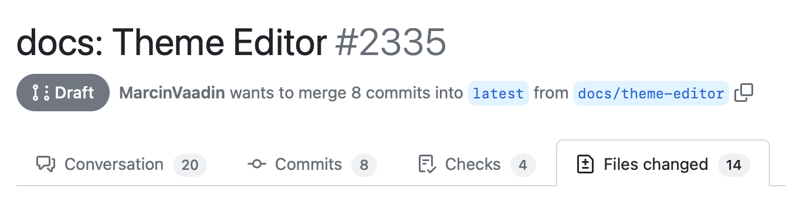
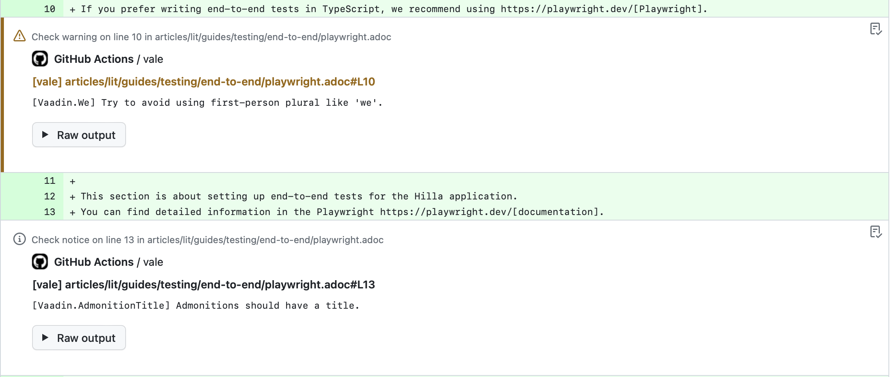

= Vale

https://vale.sh[Vale] is a tool that checks the content you write and reports issues in it based on a set of rules and guidelines. The documentation for Vaadin and Hilla have a set of rules and guidelines which you should follow.

== Pull Request Reviews

The Vale rules are automatically checked during a pull request review.

.Look for the [guilabel]*lint/vale* check in your pull request.

If the Vale check fails -- that is if it produces errors, warnings, or suggestions -- you can see those in the [guilabel]*Files changed* tab.

.Use the Files changed tab to see the Vale annotations.

An annotation shows below the line where Vale detected an issue.

.Examples of annotations Vale adds to pull requests.

You should always fix any errors Vale reports before you mark a pull request ready for review. Try to fix as many warnings and suggestions as well, although sometimes it's acceptable, or even preferable, to ignore warnings and suggestions (e.g., the use of passive voice or future tense). If you are unsure how to fix an issue, you can ask for help from the docs maintainers, or wait for the language check.

== Use Vale Locally

Vale is easiest to use together with VS Code and the https://github.com/errata-ai/vale-vscode[Vale extension]. You can also run Vale directly on the command line:

You can run it on command-line by giving one or more AsciiDoc files as parameters:

----
$ vale page-filename.adoc

 page-filename.adoc
 154:32  suggestion  'simply' is a weasel word.      Vaadin.Weasel

✖ 0 errors, 0 warnings and 1 suggestions in 1 file.
----

See the https://vale.sh/docs/vale-cli/installation/[Vale documentation] for instructions on installing Vale on macOS, Windows, or Linux.

== Configuration

Vale is configured with the `.vale.ini` file in the root of the `docs` project. A separate `.vale-pr.ini` configuration is used for pull requests. See https://vale.sh/docs/topics/config/[Vale documentation for Configuration] to learn more.

== Vocabulary

If you get false spelling errors from the `Vale.Spelling` rule (e.g., for the word "Vaadin"), you can add words to the `.github/styles/Vocab/accept.txt` file to suppress them. See https://vale.sh/docs/topics/vocab/[Vale documentation for Vocabularies] to learn more.

== Style Rules

The writing style rules are located in the `.githug/styles/Vaadin` folder, each rule in a separate YAML file. See https://vale.sh/docs/topics/styles/[Vale documentation for Styles] to learn how to create new rules.
