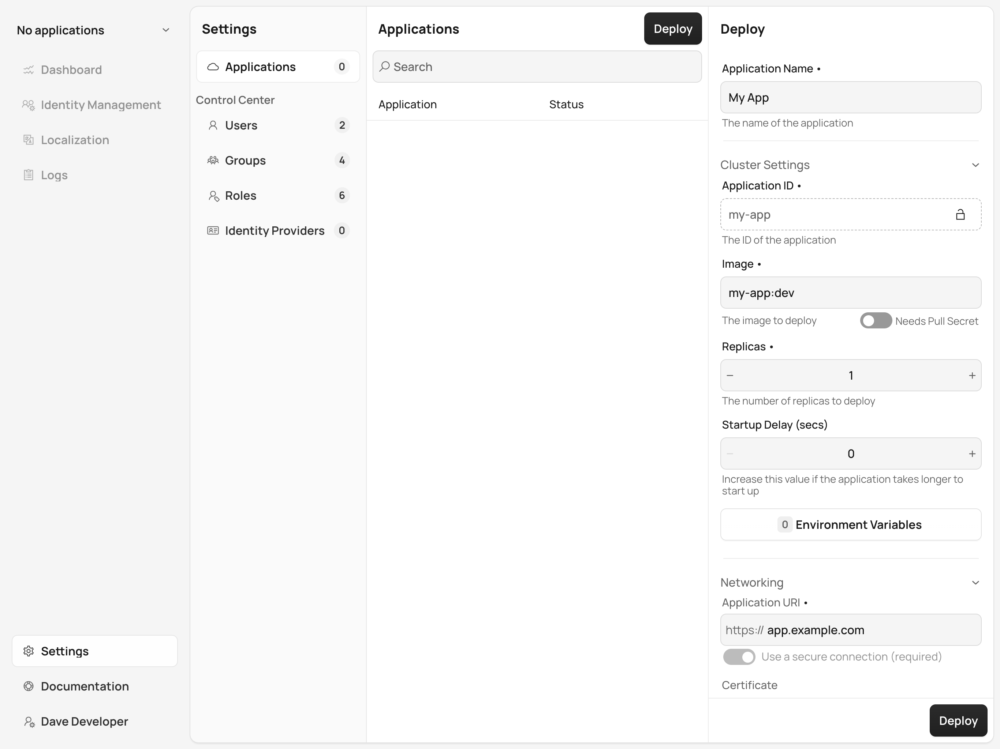
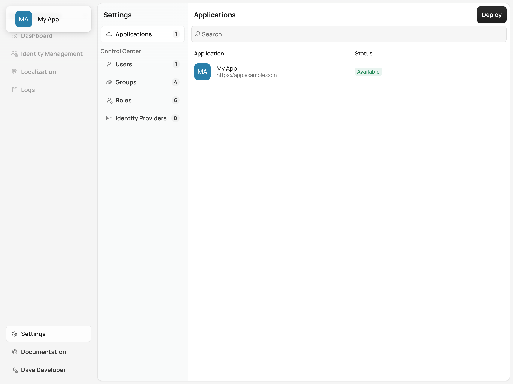

= Deploying an Application with Control Center

Control Center makes it easy for you to deploy Vaadin applications to a Kubernetes cluster, providing the necessary resources and connecting to services such as identity providers. This page explains the steps to prepare and deploy a Vaadin application using Control Center.

Before starting the deployment, prepare the application by adding the Control Center Starter dependency. Then build a Docker image for the application. You'll have to deploy the application via the Control Center UI.

== Control Center Starter Dependency

To ensure your application integrates with Control Center, add the `control-center-starter` dependency to your Maven project. This dependency enables Control Center to manage and monitor your Vaadin application.

Add the following to your [filename]`pom.xml` file:

[source,xml]
----
<dependency>
    <groupId>com.vaadin</groupId>
    <artifactId>control-center-starter</artifactId>
</dependency>
----

It's unnecessary to specify the version of this dependency if you're using the Vaadin BOM (Bill of Materials) since it manages versions for all Vaadin dependencies.

Once the dependency is added, build your application for production by running the following command:

[source,shell]
----
mvn -Pproduction package
----

This generates the production-ready `.jar` file that'll be used in the next step to create a Docker image.

== Build Docker Image

To deploy the application to a Kubernetes cluster, you'll need to create a Docker image. Begin by creating a `Dockerfile` in the root of your project with the following content:

[source,docker]
----
FROM eclipse-temurin:17-jre
COPY target/*.jar app.jar
EXPOSE 8080
ENTRYPOINT ["java", "-jar", "/app.jar"]
----

Next, build the Docker image with the following command:

[source,shell]
----
docker build -t my-app:latest .
----

The `my-app:latest` tag is important because it's used later when deploying the application in Control Center.

If you're working with a local Kubernetes cluster (e.g., Minikube or Docker Desktop), there is no need to push the image to a container registry. However, if you're deploying to a remote cluster, the image needs to be pushed to a registry like Docker Hub:

[source,shell]
----
docker push company/my-app:latest
----

Make sure you have a Docker account, and that the image is tagged with a proper namespace (e.g., `company/my-app:latest`).

== Deploy with Control Center

Once the Docker image is ready, the next step is to deploy the application using Control Center.

Navigate to the [guibutton]*Applications* section in Control Center, then click on the [guibutton]*Deploy* button in the top-right corner of the Application Discovery pane.

In the [guibutton]*Deploy* panel on the right-hand side (as shown in the screenshot below), fill in the following fields:

- *Application Name*: Give your application a meaningful name (e.g., `My App`).
- *Image*: Enter the tag of the Docker image (e.g., `my-app:latest`).
- *Replicas*: Specify the number of instances to run. The default is `1`.
- *Hostname*: Set the external URL to access your application (e.g., `https://app.example.com`). For more information on how to choose a proper hostname, refer to the <<hostname-guidelines, Hostname Guidelines>>.
- *Features*: Enable additional features like Identity Management and Localization if required.

Once all fields are completed, click [guibutton]*Deploy*.

Control Center now deploys your application to the Kubernetes cluster, creates the necessary resources, and handles configurations such as load balancing and service discovery.

== Accessing Application

Once the deployment is complete, your application can be accessed using the hostname you specified during deployment. For example, if you deployed to a cloud environment you'd use something like, `https://app.example.com`. If you're working in a local environment, you'd use `http://app.local`, instead.

You can now interact with the application in the browser, and it's fully connected to the services and resources provisioned by Control Center.

== Next Steps

After successfully deploying your application, you can manage it through the Control Center dashboard. Use the [guibutton]*Application Selector* to choose your application from the available applications.

Once selected, you can explore the following management options:

- *Identity Management*: Create users, configure groups and roles, and integration with identity providers.
- *Localization*: Upload and manage translations for different languages, enabling a localized experience for your users.

Explore the Control Center's features to further customize and optimize your application in the cluster.
