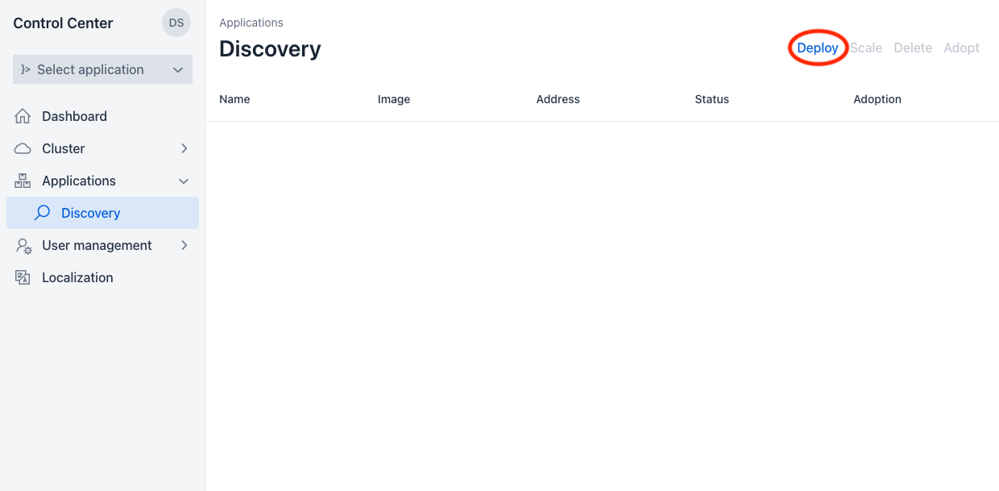
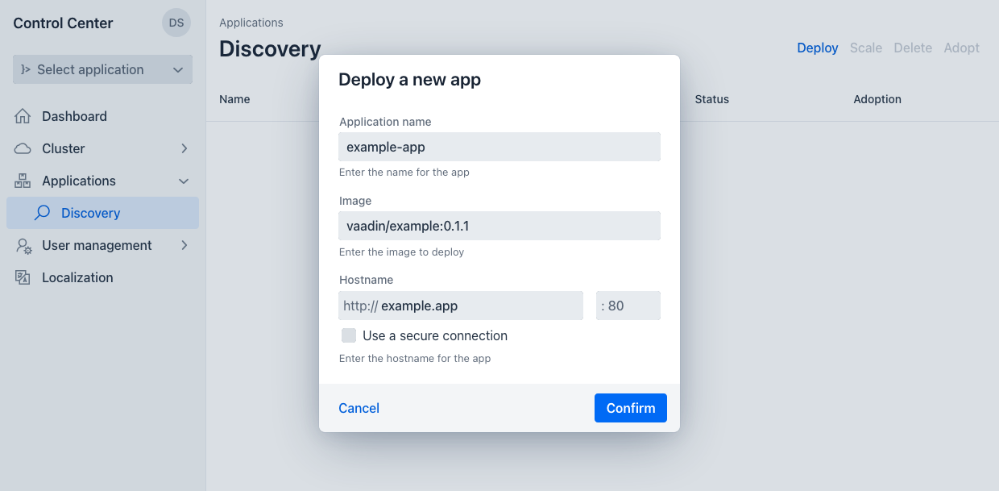
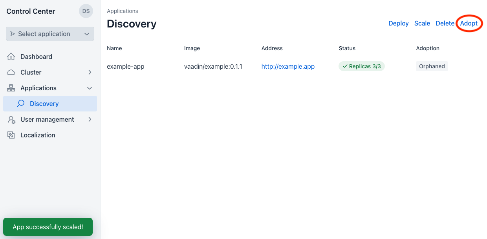
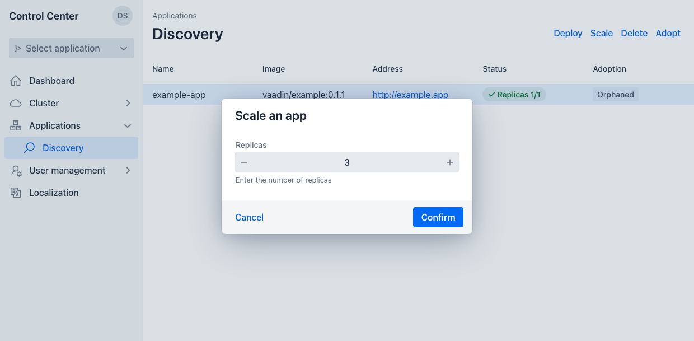

= Application Discovery

Control Center is meant to be a central management solution for Vaadin applications deployed in a Kubernetes cluster. If you want to manage a Vaadin application with Control Center, use the Discovery view to add the application to Control Center. Before an application can be managed properly by Control Center, some preparations are needed.

== Prepare an Application for Discovery

First, you must add the `control-center-starter` dependency to your Vaadin application like so:

[source,xml]
----
<dependency>
    <groupId>com.vaadin</groupId>
    <artifactId>control-center-starter</artifactId>
    <version>1.0.0</version>
</dependency>
----

Next, create a [filename]`bootstrap.yaml` file with the application name and Kubernetes reload enabled.

[source,yaml]
----
spring:
  application:
    name: control-center-application
  cloud:
    kubernetes:
      reload:
        enabled: true
----

Then build a docker image of your application with an appropriate [filename]`Dockerfile` file.

[source,shell]
----
docker build -t vaadin/example:0.1.1 .
----

== Deploy & Adopt a Vaadin Application

Once you have a docker image of your application ready, the next step is to deploy your application using Control Center. In the Application Discovery view, click on "Deploy". This opens the application deployment dialog.

Fill in the text fields with the data for the application: In the "Application name" field, use the same name as the one in the [filename]`bootstrap.yml` file. In the "Image" field, remember to use the correct tag (e.g., `0.1.1`). In the "Hostname" field, enter a hostname that is resolvable by the browser (e.g., the Keycloak hostname).

The "Use a secure connection" choice is optional. It determines whether a self-signed certificate is to be created for the application.

[NOTE]
If the version in the image tag is `latest`, Control Center pulls the image from the public registry.

Once you click "Confirm", Control Center creates a deployment using your application's docker image and makes it available at the specified hostname as soon as possible (see screenshot here).

You can adopt the application at any moment so that it's available in the application selection drop-down. This allows you to select the application for management in other parts of Control Center, like user management. To adopt an orphaned application, select it and click "Adopt" in the top right corner.

When you no longer wish to have Control Center manage an application, select it and click "Delete". Don't worry, it doesn’t delete the image from your system.

== Scale an Application

Once an application has been deployed, it's easy to scale it up or down. Select the application to scale and click on "Scale". This opens the scale application dialog. Enter the number of replicas you wish your cluster to have and click "Confirm". Your application then is automatically scaled to the desired number of replicas.

