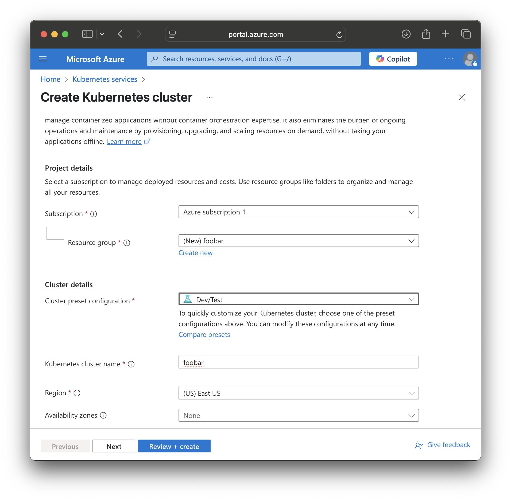
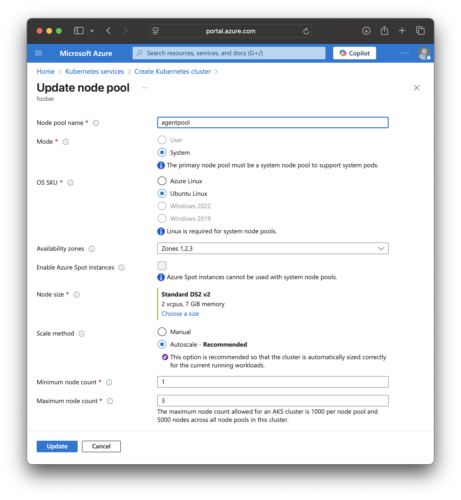
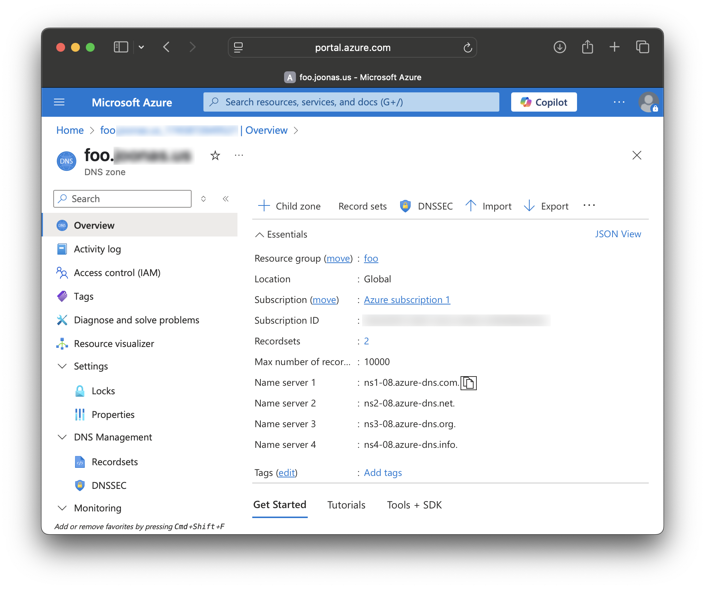

= Kubernetes on Azure

Azure is a cloud computing service created by Microsoft for building, testing, deploying, and managing applications and services through Microsoft-managed data centers. It provides a range of cloud services, including those for computing, analytics, storage, and networking. It extensively supports Kubernetes, which is an open-source system for automating the deployment, scaling, and management of containerized applications.

Here is a step-by-step guide on how to set up a Kubernetes cluster on Azure for deploying Vaadin Control Center.

== Prerequisites

* If you have not yet installed Azure CLI (`az`), install it from https://docs.microsoft.com/en-us/cli/azure/install-azure-cli.
* If you have not yet installed Kubernetes CLI (`kubectl`), install it from https://kubernetes.io/docs/tasks/tools/.

== Creating a Kubernetes cluster on Azure

* Log into https://portal.azure.com and search for "Kubernetes" in the menu.
* Click on "Kubernetes services" and then click on "Create cluster".
* Fill in the required fields:
** **Subscription**: Select your Azure subscription. If you don't have one, you can create a new one. For new users, there is a free trial credit available.
** **Cluster Preset**: Select "Dev/Test" for a development or testing environment. This creates a cluster with a smaller number of nodes and lower costs. For a production environment, select a suitable production profile.
** **Resource Group**: Create a new resource group and name it according to your use case. This example uses "foobar". You can later use this name as reference, to easily delete all resources in this group.
** **Kubernetes Cluster Name**: Enter a name for your cluster. Here you can use "foobar" as well.
** **Region**: Select the region where you want to deploy the cluster.

* Click on "Next" to configure the node pools.
* Click `agentpool` to edit the default node pool.
** In the node pools section, you can configure the number of nodes and their size. For this example, use the defaults, but configure minimum size of the cluster to 1 and maximum size to 3. This allows the cluster to scale up and down based on the load.
** Click Update to return to the previous screen.

* Click "Review + create" to review your settings.
* Click "Create" to create the cluster. This takes a few minutes.

== Connect your local machine to the cluster

[source, bash]
----
az aks get-credentials --resource-group foobar --name foobar
----

== Create DNS Zone and authorize cluster to manage it (Optional, but recommended)

Vaadin Control Center can manage creating DNS names and certificates for your applications. To do this, you need to create a DNS zone and authorize the cluster to manage it. This is optional, but recommended.

=== Create DNS zone

* In the Azure portal, search for "DNS zones" in the menu.
* Click on "DNS zones" and then click on "Create".
* Fill in the required fields:
** **Subscription**: Select your Azure subscription.
** **Resource Group**: Select the resource group you created earlier (e.g., "foobar").
** **Name**: Enter a name for your DNS zone. This should be a domain name that you own or have access to. For this example, use "example.com".
* Click "Review + create" to review your settings.
* Click "Create" to create the DNS zone. This takes a few minutes.

=== Point your domain to the DNS zone

* In your domain registrar, create a new NS record for your domain and point it to the name servers provided by Azure. You can find the name servers in the Azure portal under the DNS zone you created.

=== Authorize the cluster to manage the DNS zone

* First, create an authentication file for the cluster to manage the DNS zone.

[source, bash]
----
export NAME=<name you used before, in this example "foobar">
export DOMAIN=<your domain name, in this example "example.com">
export RESOURCEGROUP=$NAME
export KUBENAME=$NAME
export PRINCIPAL_ID=$(az aks show --resource-group $RESOURCEGROUP --name $KUBENAME --query "identityProfile.kubeletidentity.objectId" --output tsv)
export IDENTITY_CLIENT_ID=$(az aks show --resource-group $RESOURCEGROUP --name $KUBENAME --query "identityProfile.kubeletidentity.clientId" --output tsv)
export DNS_ID=$(az network dns zone show --name $DOMAIN --resource-group $RESOURCEGROUP --query "id" --output tsv)
az role assignment create --role "DNS Zone Contributor" --assignee $PRINCIPAL_ID --scope $DNS_ID
cat > azure.json <<EOF
{
  "tenantId": "$(az account show --query tenantId -o tsv)",
  "subscriptionId": "$(az account show --query id -o tsv)",
  "resourceGroup": "$RESOURCEGROUP",
  "useManagedIdentityExtension": true,
  "userAssignedIdentityID": "$IDENTITY_CLIENT_ID"
}
EOF
----

* Then, create a Kubernetes secret with the authentication file.
[source, bash]
----
kubectl create namespace $NAME
kubectl create secret generic azure-config-file --namespace $NAME --from-file=azure.json
----

== Deploying Vaadin Control Center

=== Using the above created DNS zone (Recommended)

Here it is assumed that you created a DNS zone and authorized the cluster to manage it. If you did not do this, you can still deploy Vaadin Control Center, but you need to manage the DNS names and certificates manually.

* First, create a deployment configuration file.

[source, bash]
----
cat > cc-config.yaml <<EOF
domain: &domain $DOMAIN
acme:
  enabled: true
external-dns:
  enabled: true

  provider:
    name: azure

  txtOwnerId: "control-center"
  
  domainFilters:
    - *domain

  fullnameOverride: external-dns

  serviceAccount:
    labels:
      azure.workload.identity/use: "true"
    annotations:
      azure.workload.identity/client-id: $IDENTITY_CLIENT_ID

  podLabels:
    azure.workload.identity/use: "true"

  extraVolumes:
    - name: azure-config-file
      secret:
        secretName: azure-config-file

  extraVolumeMounts:
    - name: azure-config-file
      mountPath: /etc/kubernetes
      readOnly: true
EOF
----

* The, deploy Vaadin Control Center with the configuration file.

[source, bash]
----
helm install control-center oci://docker.io/vaadin/control-center \
  --set user.email=your@email.address.com \
  -n $NAME \
  --set ingress-nginx.controller.service.externalTrafficPolicy=Local \
  --values cc-config.yaml \
  --wait
----

 
=== Deploying without DNS zone (Not recommended)

* Deploy Vaadin Control Center 

[source, bash]
----
helm install control-center oci://docker.io/vaadin/control-center \
  --set user.email=your@email.address.com \
  -n $NAME --create-namespace \
  --set domain=example.com \
  --set ingress-nginx.controller.service.externalTrafficPolicy=Local \
  --wait
----

* Create DNS names and certificates for your applications and for the Control Center.

== Accessing Vaadin Control Center

* Get your temporary password for the Control Center.

[source, bash]
----
kubectl get secret control-center-user -n $NAME -o go-template="{{ .data.password | base64decode | println }}"
----

* Log in to Vaadin Control Center using the URL provided in the output of the previous command (the URL follows the `https://control.<your-domain>` format), along with the email address you provided during the installation and the temporary password you retrieved in the previous step.

