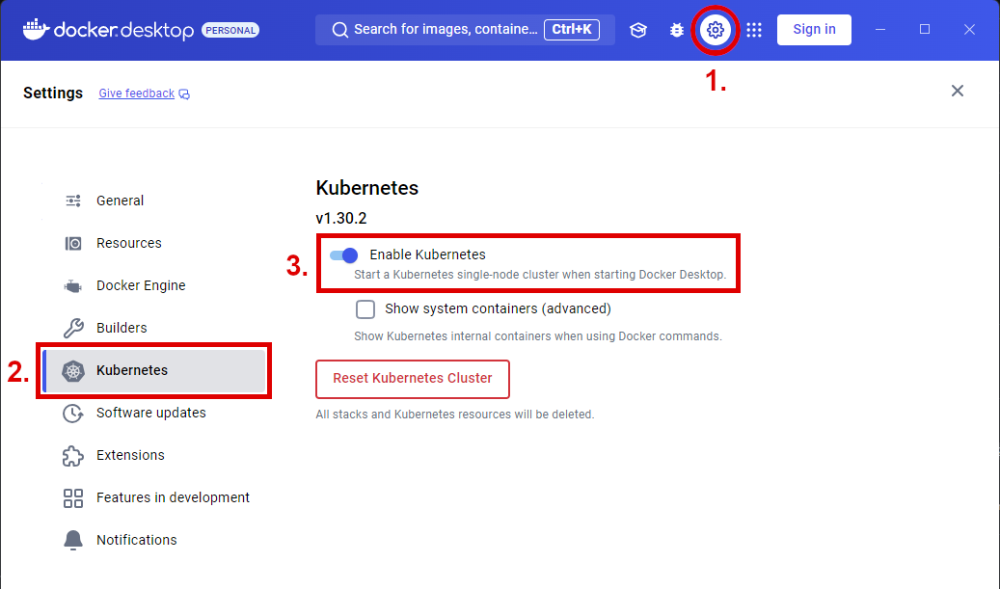

= Kubernetes on Docker Desktop

Docker Desktop is a popular tool for running Docker containers on Windows and macOS. It includes a built-in Kubernetes cluster that you can use to deploy and manage applications.

One advantage of using Docker Desktop is that it provides a consistent environment for development and testing.

== Enabling Kubernetes

To enable Kubernetes in Docker Desktop, follow these steps:

. Open Docker Desktop and click the Settings button (cog icon).
. Go to the Kubernetes tab.
. Switch the slider next to "Enable Kubernetes" to the on position and click the "Apply & Restart" button.

[discussion-id]`72879B6B-CB2C-4923-A42F-3B715ACB26E0`
