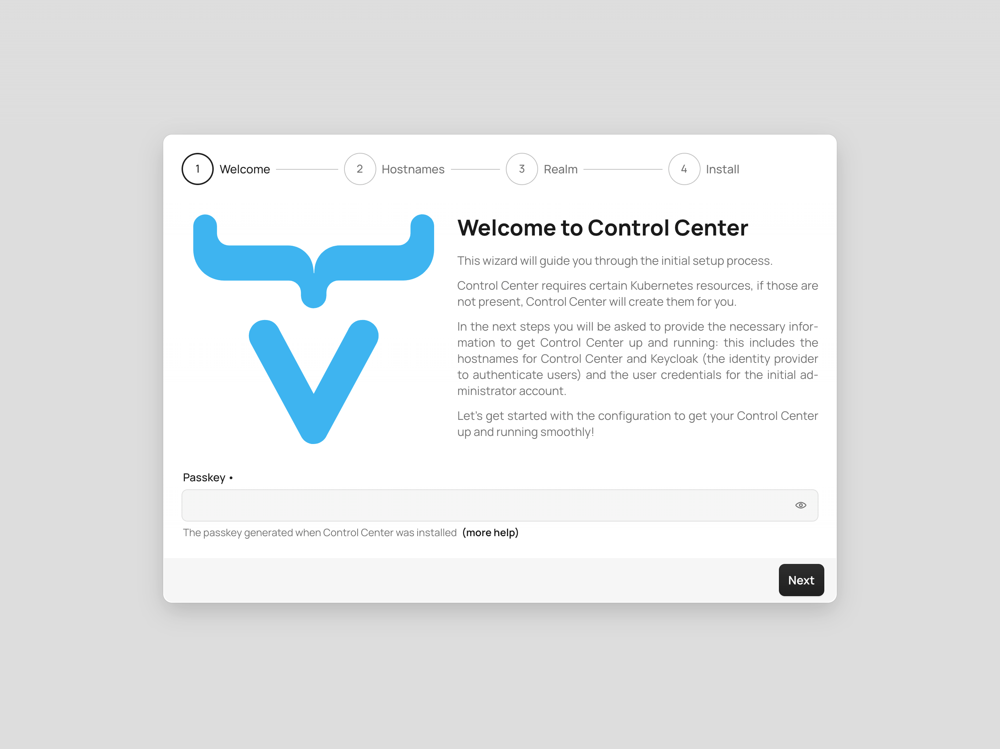
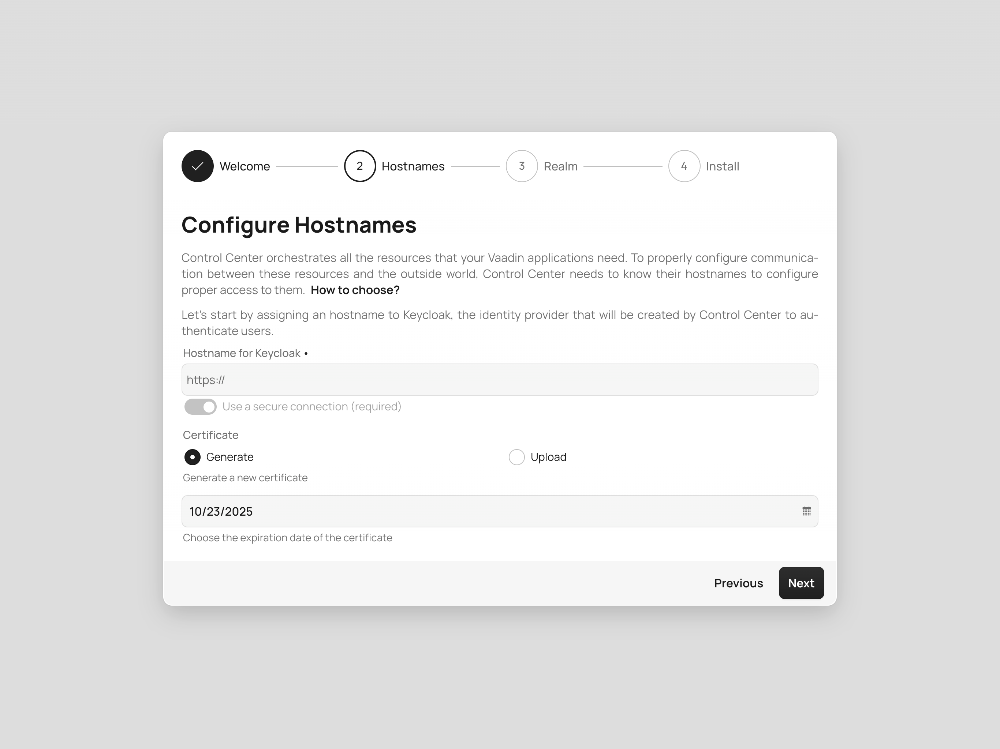
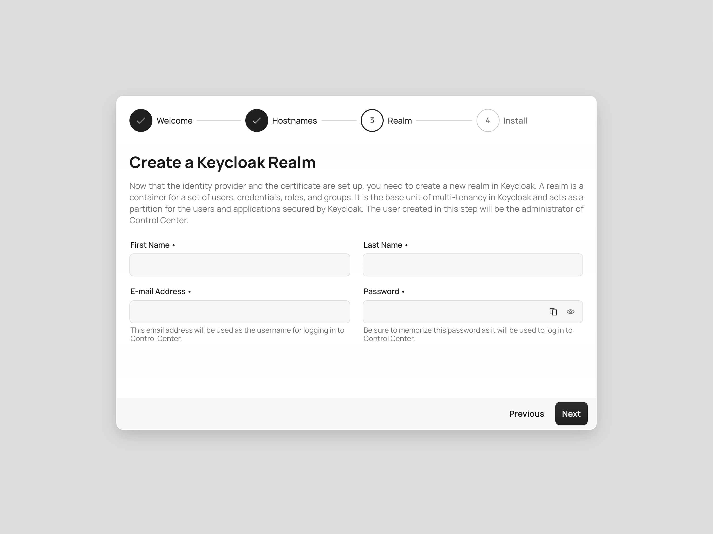
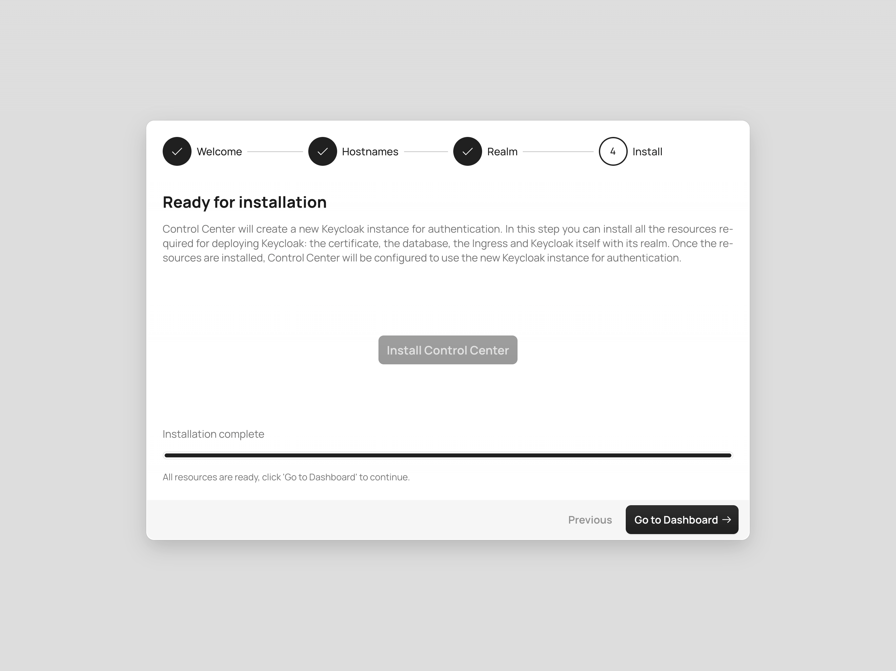
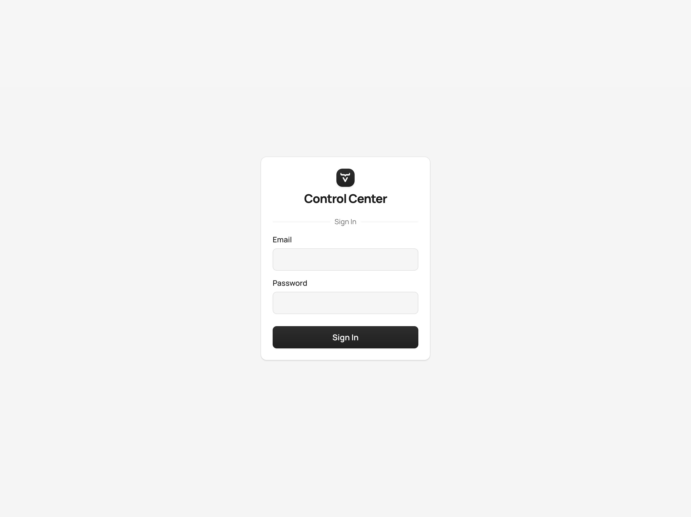
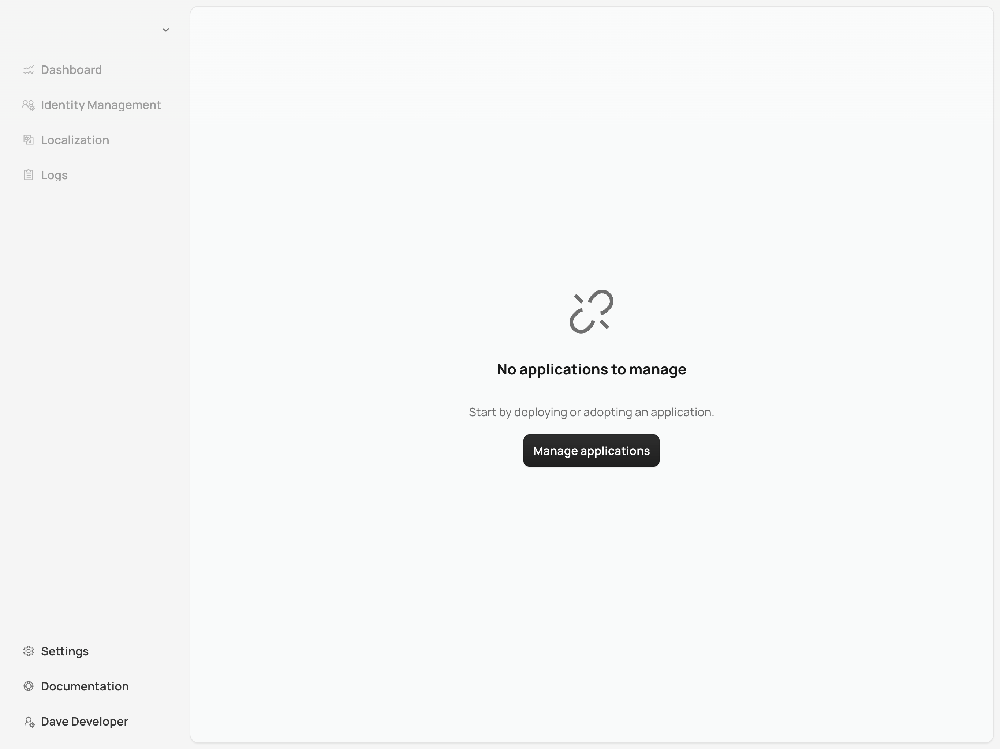

= Getting Started

Control Center simplifies the management of Vaadin applications on Kubernetes clusters. This page explains how deploy Control Center and get it running smoothly.

== Prerequisites

Before you begin, make sure you have a Kubernetes cluster. This can be a cloud-based service like https://cloud.google.com/kubernetes-engine[Google Kubernetes Engine (GKE)], https://aws.amazon.com/eks[Amazon EKS], or https://azure.microsoft.com/en-us/products/kubernetes-service[Azure AKS]. Alternatively, use a local cluster with tools like https://www.docker.com/products/docker-desktop[Docker Desktop] or https://minikube.sigs.k8s.io/[minikube], depending on your project needs.

Also, you'll need to install https://helm.sh/[Helm]. It's a Kubernetes package manager that simplifies application deployment and management. Ensure it's configured to interact with your cluster.

== Deploying Control Center

To deploy Control Center to your Kubernetes cluster, run the following Helm command:

.Terminal
[source,bash]
----
helm install control-center oci://docker.io/vaadin/control-center \  // <1>
    -n control-center --create-namespace \  // <2>
    --set serviceAccount.clusterAdmin=true \  // <3>
    --set service.type=LoadBalancer --set service.port=8000 \  // <4>
    --wait  // <5>
----

<1> This installs Control Center.
<2> This creates a dedicated namespace to isolate Control Center from other applications.
<3> Grants administrative privileges that allow Control Center to manage cluster resources.
<4> Configures service settings for a load balancer on port `8000`. Change the port if necessary for your environment.
<5> This says for Helm to wait until Control Center is fully deployed.

Granting administrative privileges enables automatic installation of required dependencies. If you choose not to grant these privileges, though, you'll need to install necessary resources, manually.

== Accessing Control Center

Once deployed, access Control Center through your web browser. For a local cluster, navigate to `http://localhost:8000`. For a cloud cluster, use the external IP or domain assigned by your cloud provider.

You'll see the *Startup Configuration Wizard*. It'll help you configure authentication and essential settings using https://openid.net/connect/[OpenID Connect].

=== Retrieve Passkey

The wizard requires a passkey to proceed. Run the following command to retrieve it:

.Terminal
[source,bash]
----
kubectl -n control-center get secret control-center-passkey -o jsonpath='{.data.passkey}' | base64 --decode
----

On Windows, you might need to remove `| base64 --decode` and use a separate tool to decode the base64 output.

=== Configure Keycloak Hostname

Keycloak is the identity provider used by Control Center. You'll therefore need to configure the hostname for it.

Keycloak needs a hostname that is accessible both from within the Kubernetes cluster and from your web browser running outside the cluster. This hostname allows your applications and users to authenticate securely via Keycloak.

This is necessary for secure authentication and for browser accessibility. Applications in the cluster need to access Keycloak to authenticate users, securely. At the same time, since authentication often involves redirects to Keycloak's login page, your browser must be able to reach Keycloak using a resolvable hostname.

Therefore, the hostname must resolve to an IP address reachable by both the cluster and external clients (e.g., your browser). Proper DNS configuration ensures secure and reliable communication.

==== Cloud Environments

In cloud deployments, first create a DNS Record. Point it to your cluster's public IP address provided by your cloud provider. For example, if your domain is `mydomain.com`, you might create `keycloak.mydomain.com` pointing to the cluster's external IP.

You can find the external IP address in your cloud provider's dashboard. Make sure that your network security settings allow traffic to this IP on the necessary ports.

==== Local Development & Testing

For local clusters, modify the [filename]`hosts` file. Add an entry to your operating system's [filename]`hosts` file to map the hostname to your local machine's IP address. Which file will depend on your operating system (see below).

===== Linux & macOS

When using a Unix based system like Linux or macOS, you'll need to open the [filename]`hosts` file with administrative privileges like so:

.Terminal
[source,bash]
----
sudo nano /etc/hosts
----

There you'll have to add the following line at the end of the file:

[source]
----
127.0.0.1   keycloak.local
----

====  Windows

If you're using a Windows system, you'll instead need to start Notepad as an administrator. Open with it the [filename]`hosts` file located at `C:\Windows\System32\drivers\etc\hosts`. Be careful when modifying system files, while logged in as administrator, to avoid unintended issues.

Add the following line to the end of that file:

[source]
----
127.0.0.1   keycloak.local
----

By adding this entry, `keycloak.local` resolves to `127.0.0.1`, allowing your browser and applications to access Keycloak running on your local machine.

Consistently use the same hostname (i.e., `keycloak.local` in this example) throughout your development environment to prevent configuration mismatches.

=== Create Administrator Account

Next you'll need to create an administrator account with full access to Control Center's features. Provide a name, email address, and password for the account.

=== Finalize Installation

Complete the setup by installing all necessary resources. This step configures Keycloak and ensures all dependencies are set up properly.

=== Log into Control Center

After the installation is completed, click the [guibutton]*Go to Dashboard* button. You'll be redirected to the Control Center login page.

Once there, enter the credentials for the administrator account you created. Then click [guibutton]*Sign In* to access Control Center. If you encounter any login issues, check that cookies and JavaScript are enabled in your browser.

=== Accessing Dashboard

Upon successful authentication, you'll be taken to the Control Center dashboard.

At this point, the dashboard should notify you that no applications are available.
This is because none are deployed yet.

To start deploying your Vaadin applications and take full advantage of Control Center's features, proceed to <<../application-deployment#,Application Deployment>>.
