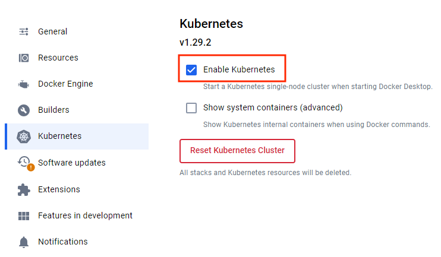
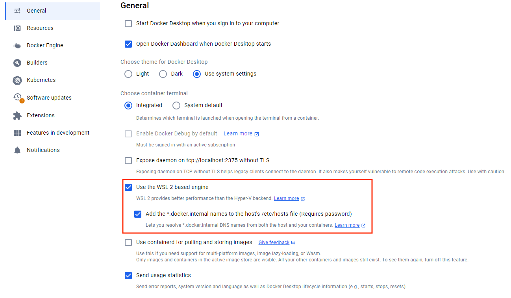
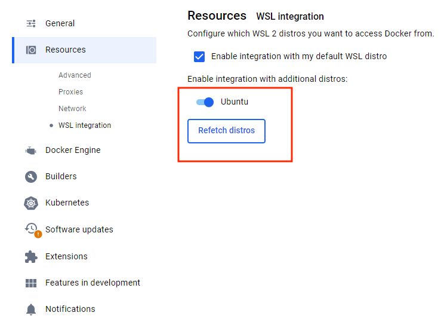

= Getting Started in a Local Environment

This page explains how to set up Control Center in a local environment for development and testing purposes. For use in a production environment, see the <<../getting-started/index#,Getting Started in a Production Environment>> guide.

== Prerequisites

Before you begin, make sure you have a Kubernetes cluster running and available on your local machine. You can use tools like https://www.docker.com/products/docker-desktop[Docker Desktop], which has an embedded Kubernetes (see <<docker-desktop#,Kubernetes on Docker Desktop>>), https://kind.sigs.k8s.io/[Kind], or https://minikube.sigs.k8s.io/[Minikube] to set up a local cluster. Deciding which to use depends on your project needs.

.Ensure Minikube Tunnel Is Running
[IMPORTANT]
If you're using Minikube, you'll need to ensure that the https://minikube.sigs.k8s.io/docs/handbook/accessing/#loadbalancer-access[minikube tunnel] is running before deploying Control Center.

You'll also need to install https://helm.sh/[Helm]. It's a Kubernetes package manager that simplifies application deployment and management. Make sure it's configured to interact with your cluster.

== Configure Hosts File

To access Control Center from your local machine, you'll need to add a couple of entries to your [filename]`hosts` file. The location of this file depends on the operating system you're using.

=== Linux & macOS

When using a Unix based system like Linux or macOS, you'll need to open the [filename]`hosts` file in the `/etc` directory, with administrative privileges like so:

.Terminal
[source,bash]
----
sudo nano /etc/hosts
----

There you'll have to add the following lines at the end of the file:

[source]
----
127.0.0.1   control.local
127.0.0.1   auth.local
----

=== Windows

If you're using a Windows system, you'll instead need to start Notepad as an administrator. With it, open the [filename]`hosts` file, which is usually located at `C:\Windows\System32\drivers\etc\hosts`. Be careful when modifying system files while logged in as administrator, to avoid problems.

Add the following lines to the end of that file:

[source]
----
127.0.0.1   control.local
127.0.0.1   auth.local
----

== Deploying Control Center

When you're ready, deploy Control Center. You can do this by entering the following from the command-line:

.Terminal
[source,bash]
----
helm install control-center oci://docker.io/vaadin/control-center \
    -n control-center --create-namespace \
    --set domain=local \
    --set user.email=example@foo.com \
    --wait
----

Replace the email address with your own. This is used to create the initial user account in Control Center.

.The installation of Control Center can be customized by modifying the Helm command.
[NOTE]
See the <<configure-installation#,Configure Installation>> page for more details.

== Accessing Control Center

Once deployed, copy the temporary password for the initial user. Execute the following to retrieve it:

.Terminal
[source,bash]
----
kubectl -n control-center get secret control-center-user -o go-template="{{ .data.password | base64decode | println }}"
----

You can access Control Center through the web browser at `http://control.local`.

=== Logging In

When you first access Control Center, you'll be prompted to log in. Use the email address you provided during deployment and the temporary password you retrieved earlier.

[.device]
image::images/login-view.png[Login to Control Center]

You'll then be prompted to change your password, and to provide a first and last name.

=== Accessing the Dashboard

Upon successful authentication, you'll be taken to the Control Center dashboard, as shown in the screenshot here:

[.device]
image::images/dashboard-view.png[Control Center Dashboard]

At this point, the dashboard should notify you that no applications are available. This is because none are deployed yet.

To start deploying your Vaadin applications and take full advantage of Control Center's features, proceed to the <<../application-deployment#,Application Deployment>> documentation page.

== Application Development

To develop applications locally, you can use the <<../dev-mode#,Local Development Mode>>. It allows you to run your application locally and interact with the cluster as if it were running inside it.

== Install Control Center in WSL

One solution to install Control Center on Windows in a local environment is to use https://www.docker.com/products/docker-desktop[Docker Desktop] and https://learn.microsoft.com/en-us/windows/wsl[WSL] (Windows Subsystem for Linux).

First, you need to https://learn.microsoft.com/en-us/windows/wsl/install[install] WSL. It is important to choose a distribution that allows installation of Helm, for example Ubuntu:

[source,shell]
----
wsl --install -d Ubuntu
----

Then, you need to enable Kubernetes and WSL in Docker Desktop:

You also need to enable integration with the Ubuntu distribution in Docker Desktop:

Then, you can start the WSL with the following command, using the distribution you chose before (in this case Ubuntu):

[source,shell]
----
wsl.exe -d Ubuntu
----

After this, you need to use the WSL terminal to install Helm and Control Center. First,  you need to https://helm.sh/docs/intro/install/#from-apt-debianubuntu[install] Helm before you can xref:../getting-started/local-environment#deploying-control-center[install] Control Center in the local environment.

It is important to xref:../getting-started/local-environment#windows[update] the `hosts` file on the Windows system, which is usually located at `C:\Windows\System32\drivers\etc\hosts`, with the domain you used during the Control Center installation, in this case with the `control.local` and `auth.local` domains:

[source,text]
----
# Added by Docker Desktop:
192.168.31.179 host.docker.internal
192.168.31.179 gateway.docker.internal
# Added by Docker Desktop to allow the same kube context to work on the host and the container:
127.0.0.1 kubernetes.docker.internal
# You need to add these entries:
127.0.0.1 control.local
127.0.0.1 auth.local
----

Note that there are other entries added to the `hosts` file which are also important. Those should be added automatically by the Docker Desktop when the Kubernetes and WSL engines are enabled.
