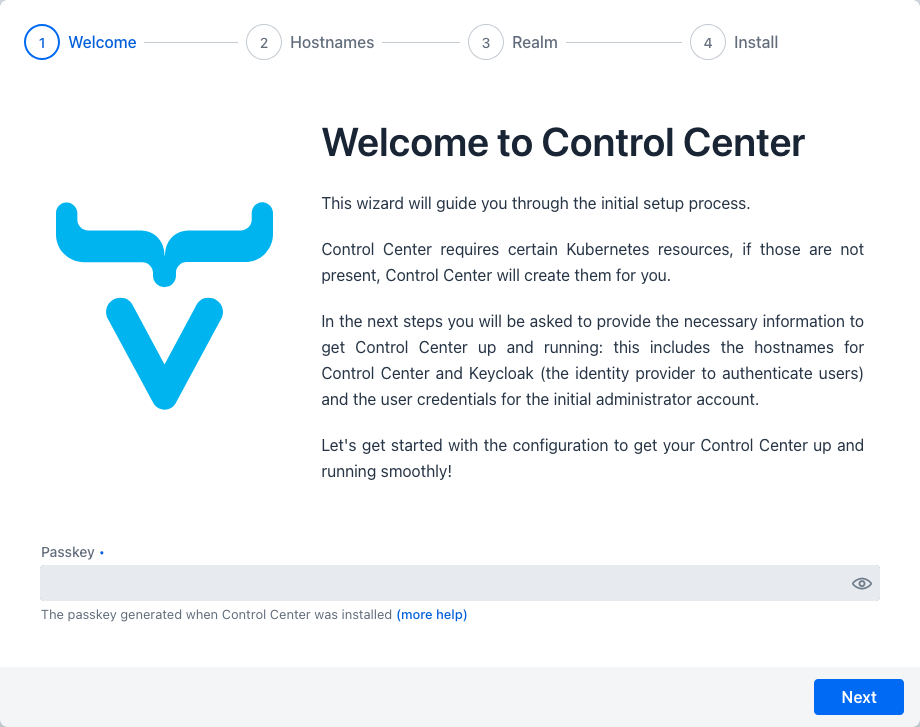
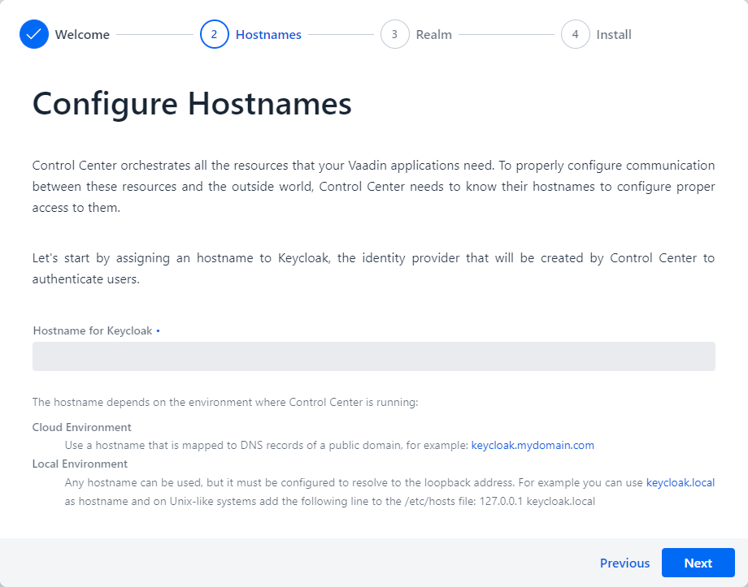
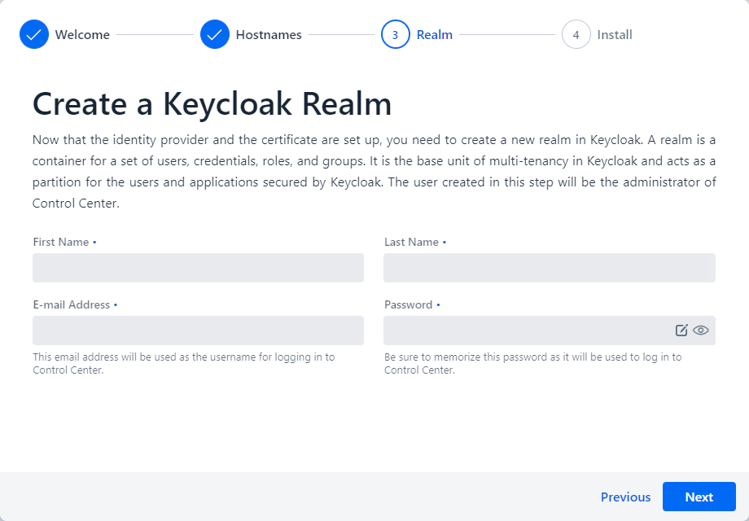
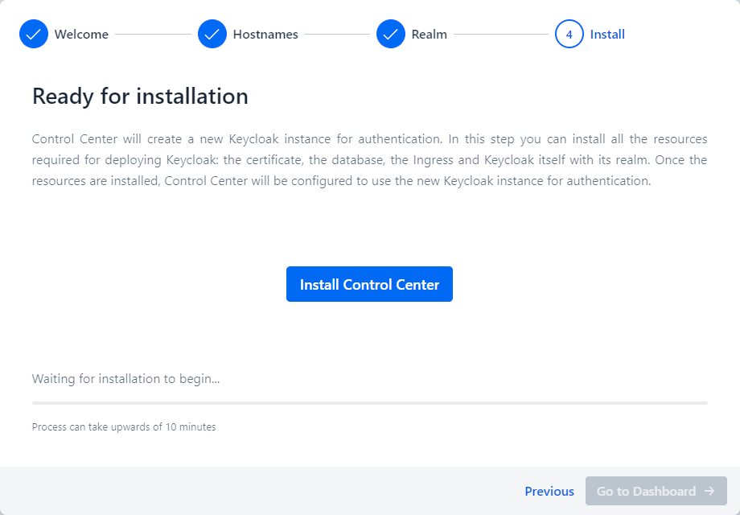

= Startup Configuration

Once deployed, accessing Control Center is straightforward: for local clusters, navigate to `http://localhost:8000` on your browser, and you'll be greeted by the **Startup Configuration Wizard**. This wizard is an essential part of the setup process, guiding you through configuring authentication and other necessary settings for Control Center to function correctly.

The Startup Configuration Wizard is designed to set up authentication to access Control Center using https://openid.net/developers/how-connect-works/[OpenID Connect].

== Welcome

First you are greeted with a welcome screen that explains the steps required to finish installation of Control Center.

== Configure Keycloak Hostname

Next, you configure the hostname for Keycloak. This should be a unique external URL that can be used to reach the Kubernetes cluster. For a cloud environment, this can be something like `keycloak.mydomain.com`, whereas for a local environment, you need to create an entry in your operating system's hosts file.

== Configure Administrator Account

Next, input a name, email address, and choose a password for the Control Center administrator account.

== Installation

The final step installs all the resources that Control Center needs. This involves setting up Keycloak configuring the administrator account, and ensuring all necessary dependencies and services are correctly installed.

After completing these steps, you are directed to the Keycloak login page to authenticate. Once authenticated, you can gain access to the Control Center dashboard, marking the completion of the setup process.

== Conclusion

Congratulations on setting up Control Center! You're now ready to leverage its comprehensive features to manage and monitor your Vaadin applications and services on Kubernetes. Control Center is designed to streamline your operations, offering a centralized platform for managing your Vaadin deployments efficiently.

