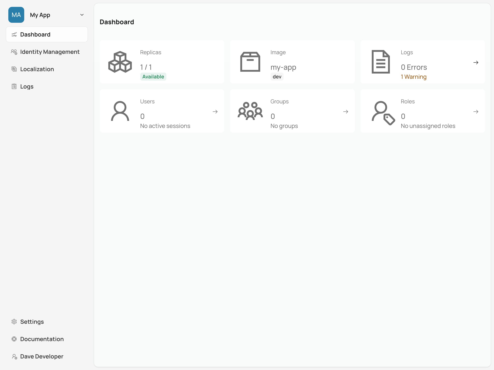
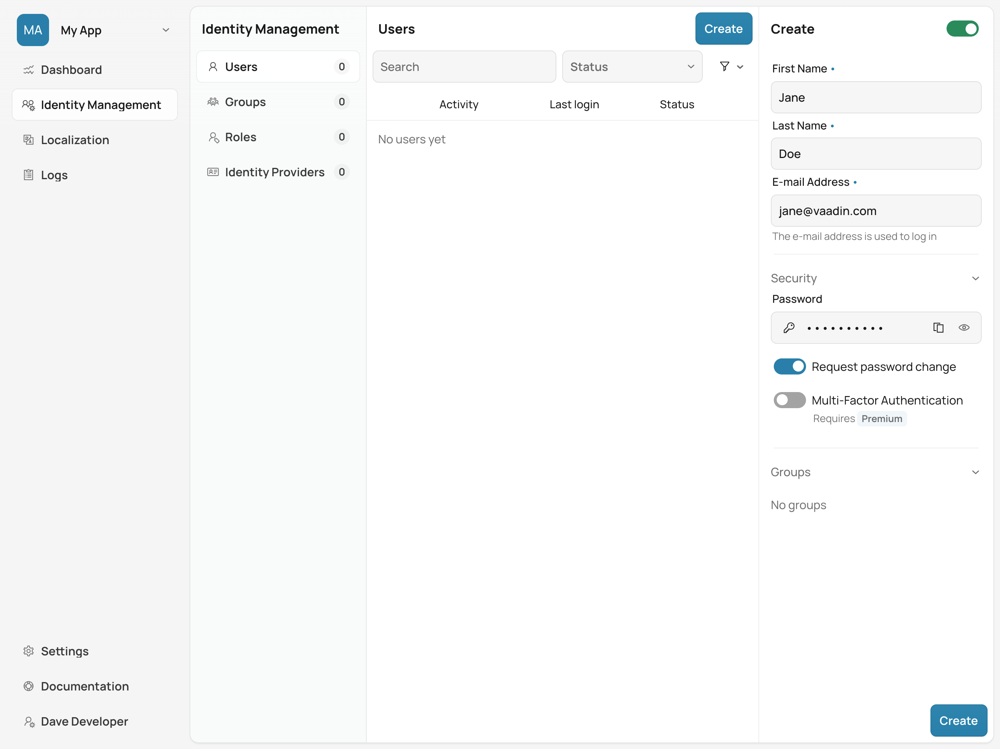
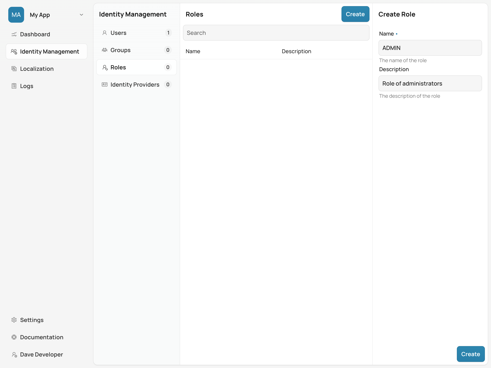
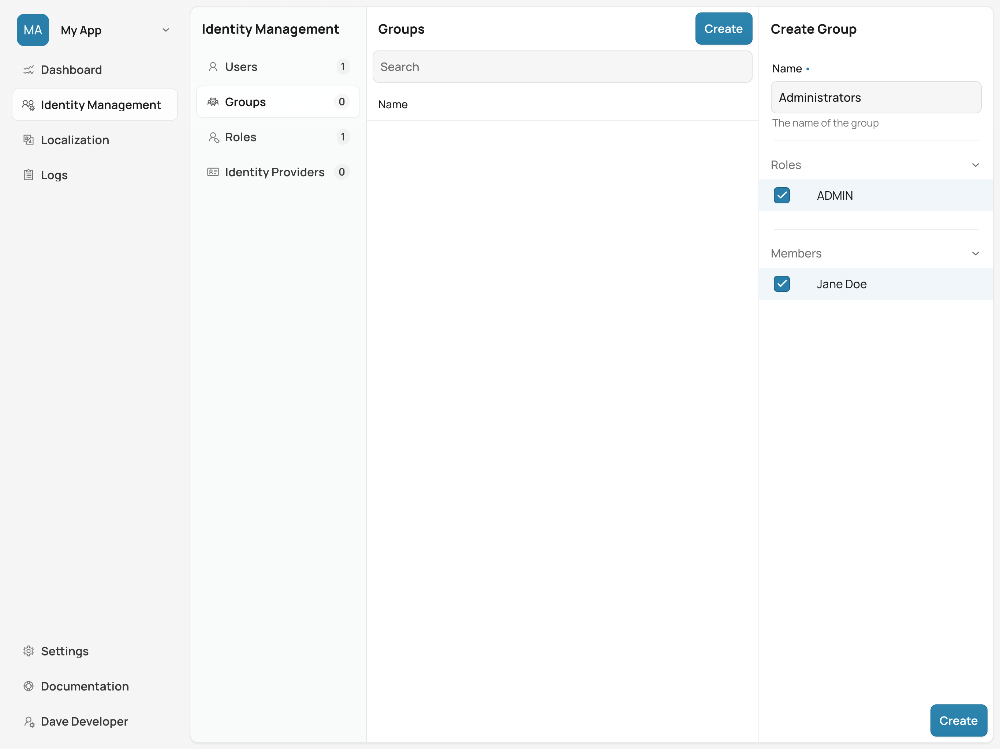

= Managing Users, Groups, & Roles

Control Center provides powerful tools to manage users, groups, and roles for Vaadin applications deployed in a Kubernetes cluster. These features are essential for controlling access to various parts of an application and ensuring secure authentication and authorization for users.

With Control Center, you can do several things that allow you to centralize user management, enforce security policies, and control access across different parts of your Vaadin application:

- *Manage Users*: Create and manage users, enable or disable them, request password changes, or enable Multi-Factor Authentication (MFA).
- *Create & Assign Groups*: Organize users into groups, assign specific roles to the groups, and streamline permissions management.
- *Manage Roles*: Define roles that can be used to control access to specific views or functionality in your application.

Before starting, make sure you've already deployed an application as described in <<../application-deployment, Deploying a Vaadin Application with Control Center>>. 

== Creating a New User

To create a new user, first select the relevant application from the [guilabel]*Application Selector*, as shown in the screenshot here. It'll display the application's dashboard.

image::../application-deployment/images/app-selector.png[App Selector]
 
The dashboard provides an overview of the current user base for the selected application.

Navigate to the [guilabel]*Identity Management* section and select [guilabel]*Users*. Then, click the [guibutton]*Create* button to open the user creation form.

Once you're in the user creation form, fill in the required fields:

- *First Name* & **Last Name**: The user's display name.
- *Email Address*: This is used for the user's login.
- *Password*: Set an initial password for the user. You can also enable the [guilabel]*Request password change* option to force the user to change their password at the next login.
- *Multi-Factor Authentication*: Enable MFA to require the user to verify their identity with an additional factor, such as an authenticator app.

Once all of the information has been entered, click [guibutton]*Create* to finalize the process. The new user should appear in the list of users for the application.

== Creating a New Role

Next, you may want to define specific roles to make controlling access easier within your application. Roles can be used to limit access for a set of users to certain views or features.

In the [guilabel]*Identity Management* section, navigate to [guilabel]*Roles* and click the [guibutton]*Create* button to open the role creation form.

Fill in the fields in the role creation form:

- *Name*: The name of the role (e.g., `ADMIN`).
- *Description*: A brief description of what this role entails (e.g., "Role for administrators").

Click [guibutton]*Create* to save the new role. This role can now be assigned to users or to groups to control access.

== Creating a Group & Assigning a Role

To efficiently manage permissions, you can organize users into groups and assign roles to these groups. This saves you the time of having to assign the same privileges to each person. For instance, you might have all sales people in the group called, _sales_ and all managers in another group called, _managers_. And if you have a few users who are sales managers, you can assign them to both groups.

To create a group, in the [guilabel]*Identity Management* section, navigate to [guilabel]*Groups* and click the [guibutton]*Create* button.

Fill in the fields to create a new group:

- *Name*: Enter the name of the group (e.g., `Administrators`).
- *Roles*: Select the roles that this group should have (e.g., `ADMIN`).
- *Members*: Add users to this group by selecting them from the list.

Once the group is created, the assigned users inherit the permissions associated with the roles assigned to the group.

