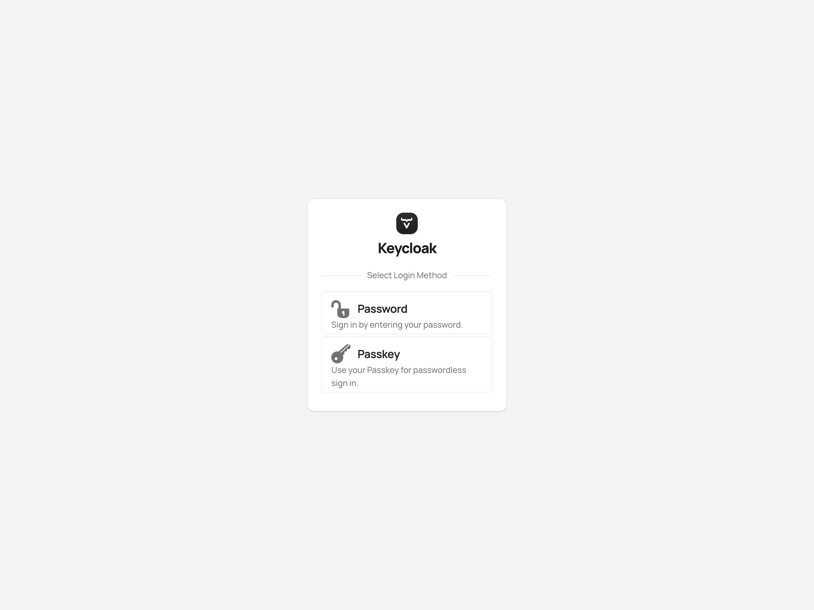
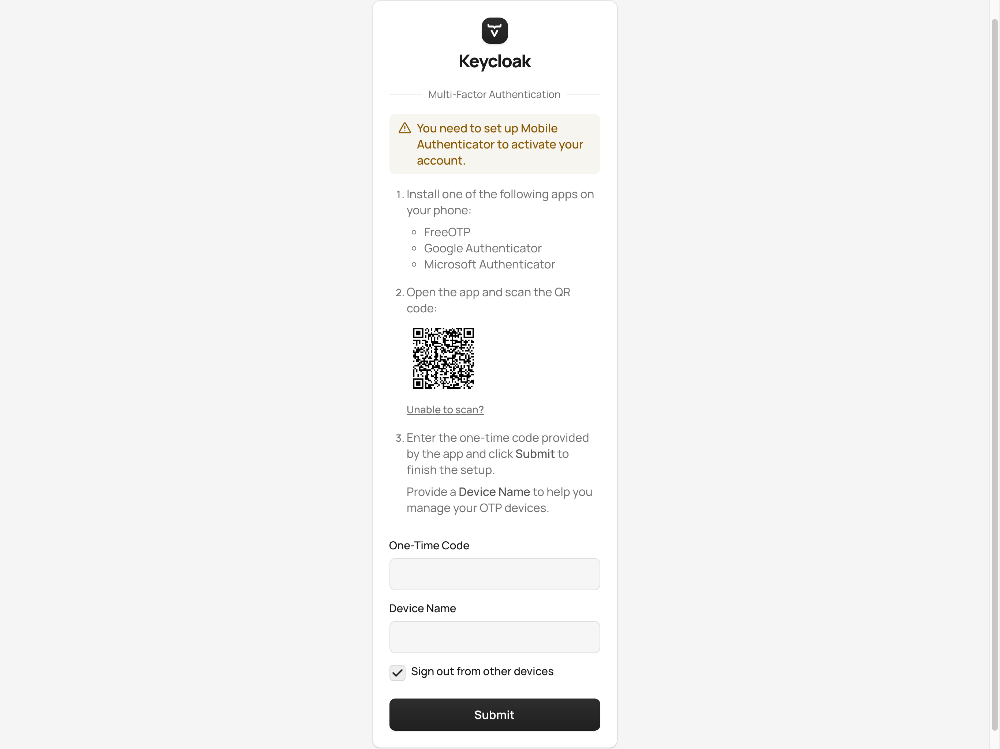
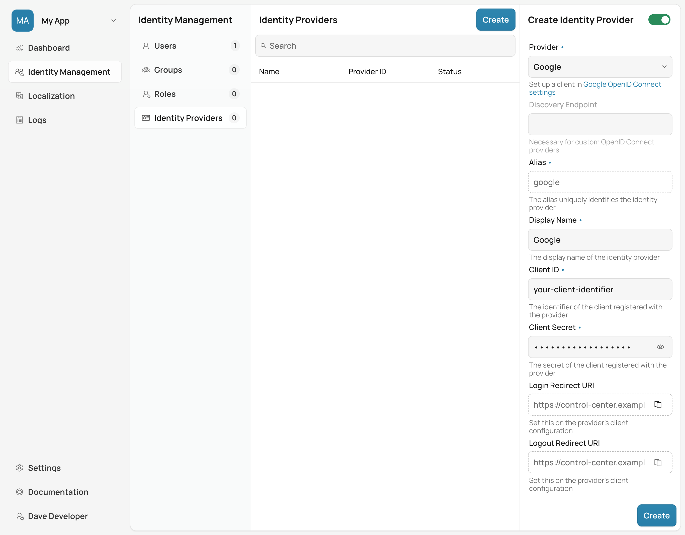
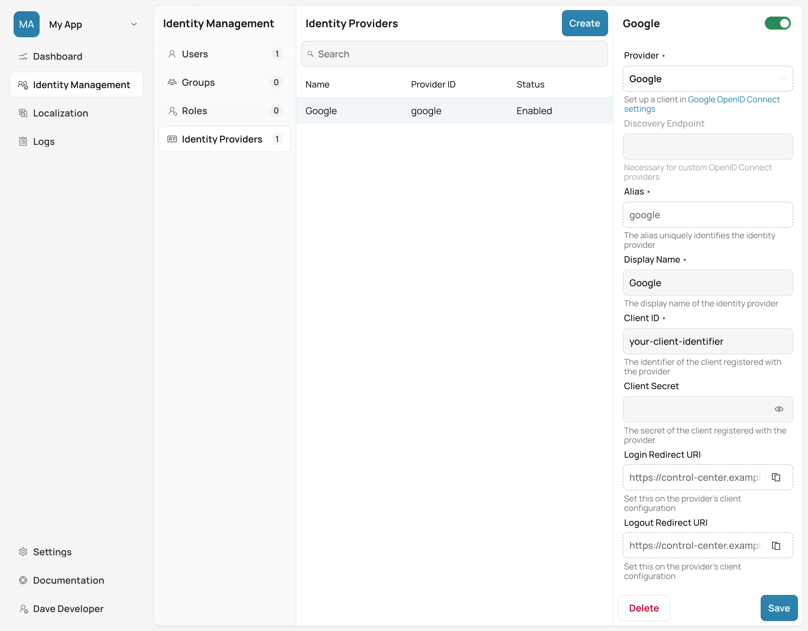
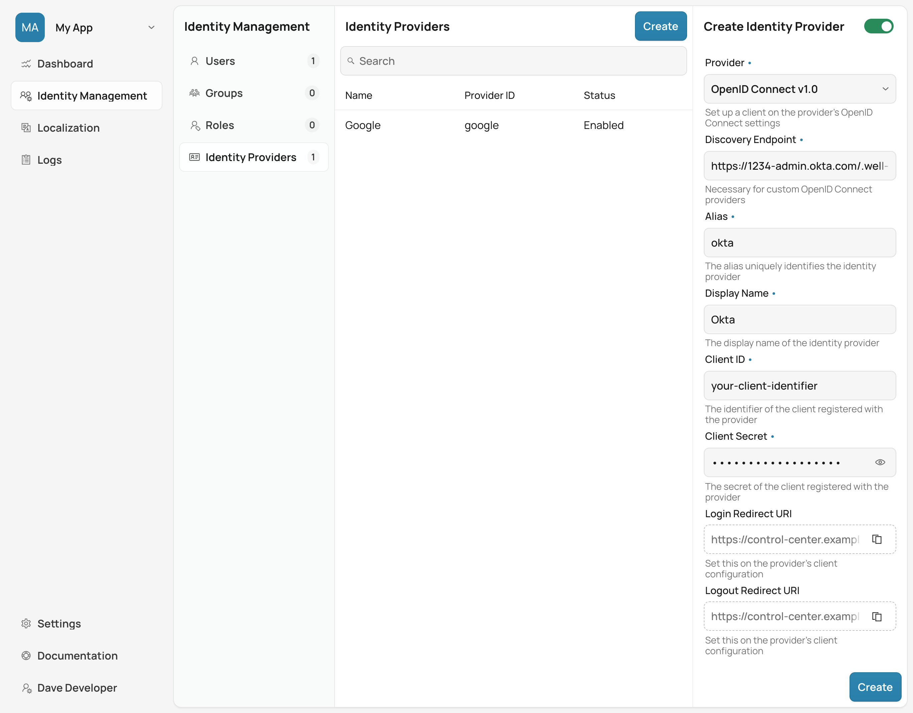
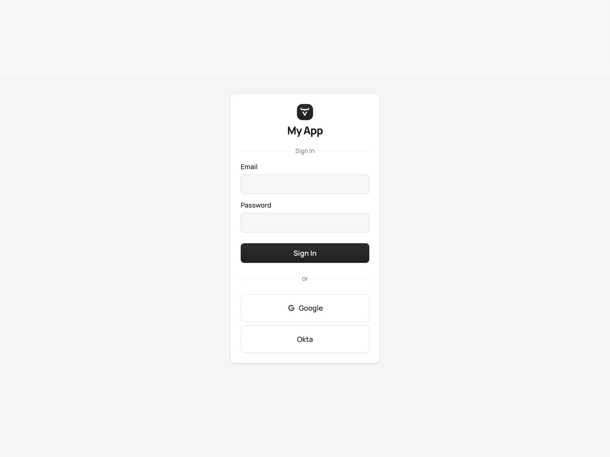
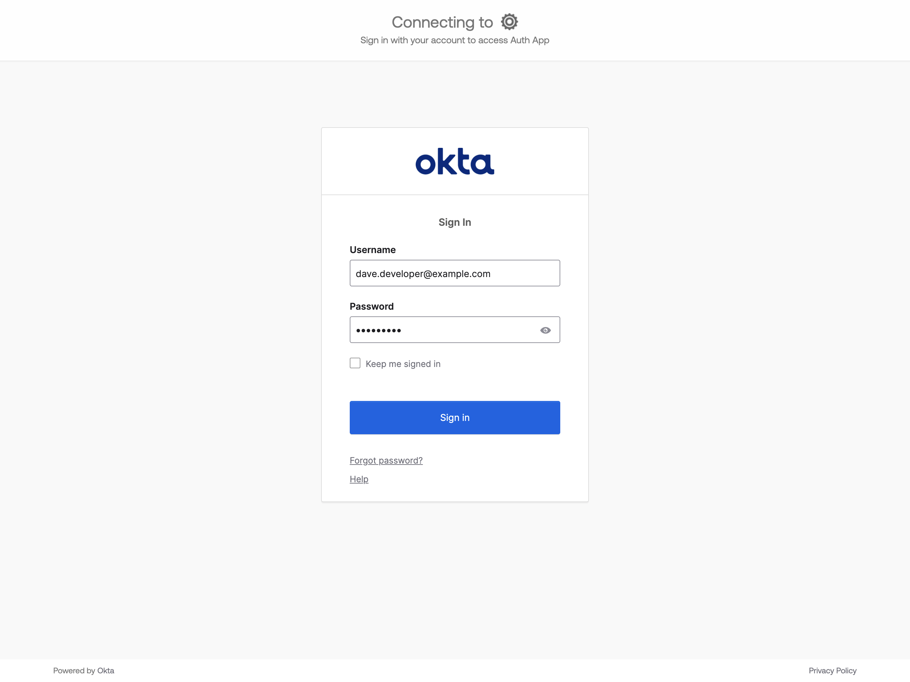
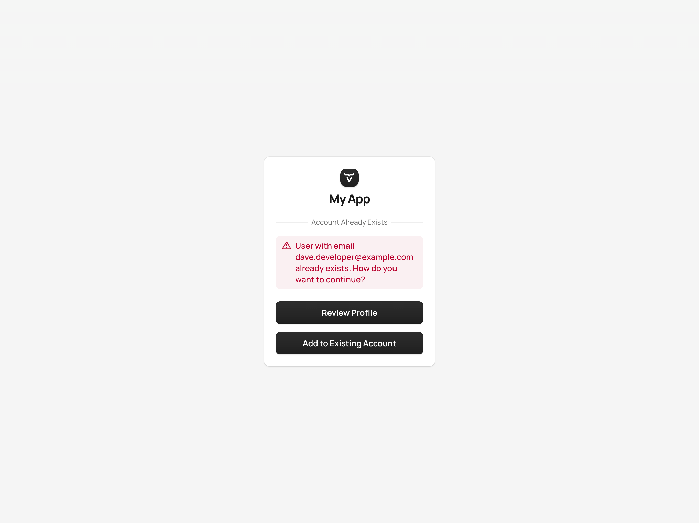
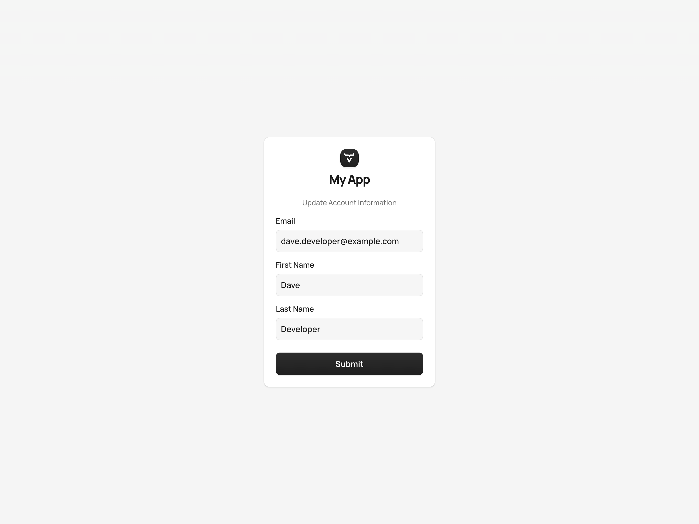
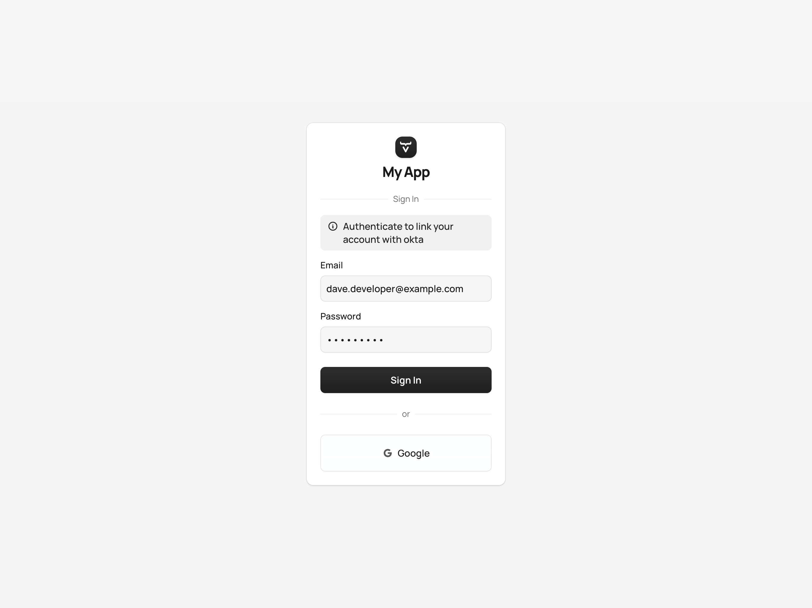

= Identity Management

Control Center provides powerful tools to manage users, groups, roles, and identity providers for Vaadin applications deployed in a Kubernetes cluster. These features are essential for controlling access to various parts of an application and providing secure authentication and authorization for users.

With Control Center, you can do several things that allow you to centralize user management, enforce security policies, and control access across different parts of a Vaadin application:

- *Manage Users*: Create and manage user accounts, enable or disable them, request password changes, or enable Multi-Factor Authentication (MFA).
- *Create & Assign Groups*: Organize user accounts into groups, assign specific roles to the groups, and streamline permissions management.
- *Manage Roles*: Define roles that can be used to control access to specific views or functionality in an application.
- *Manage Identity Providers*: Create identity providers (e.g., a social provider), to manage the authentication of users.

Before starting, make sure you've already deployed an application as described in <<../application-deployment#,Application Deployment>>.

== Creating a New User

To create a new user account, first select the relevant application from the [guilabel]*Application Selector*, as shown in the screenshot here. It'll display the application's dashboard.

[.device]
image::../application-deployment/images/app-selector.png[Application Selector]

The dashboard provides an overview of the current user base for the selected application.

[.device]
image::images/app-dashboard.png[Application Dashboard]

Navigate to the [guilabel]*Identity Management* section and select [guilabel]*Users*. Then, click the [guibutton]*Create* button to open the user creation form.

[.device]
image::images/user-create.png[Create User Form]

Once you're in the user creation form, fill in the required fields:

- *First Name* & **Last Name**: The user's display name.
- *Email Address*: This is used for the user's login.
- *Password*: Set an initial password for the user. You can also enable the [guilabel]*Request password change* option to force the user to change this password at the next login.
- [.commercial]*Multi-Factor Authentication*: Enable MFA to require the user to verify their identity with an additional factor, such as an authenticator application.
- [.commercial]*Password-less authentication*: Allow the user to authenticate using a passkey instead of their password. When enabled, the user must register a passkey on their next login.

Once all of the information has been entered, click [guibutton]*Create* to finalize the process. The new user account should appear in the list of users for the application.

== Alternative Authentication Methods

:commercial-feature: MFA & Password-less authentication
include::{articles}/_commercial-banner.adoc[opts=optional]

Control Center offers a couple of alternatives to password-only authentication for deployed applications.
These alternative authentication methods can be enabled on a per user basis.
Applications deployed with Control Center can enable two-factor authentication using One-Time Passcode.
Password-less authentication is available through the use of Passkeys.

[.device]

[.commercial]
=== One-Time Passcode

One-Time Passcodes can only be used as a second factor of authentication, and not on their own as single factor of authentication.
Once OTP has been enabled for a user, they must register an authenticator application on their next login attempt.
They must use the authenticator application to get the actual one-time passcode on every subsequent login attempt, as long as OTP stays enabled.
Currently supported authenticator applications include: FreeOTP, Google Authenticator, and Microsoft Authenticator.
If OTP is then disabled and re-enabled for a user, they will have to register the authenticator application once again.

[.device]

[.commercial]
=== Authenticating with Passkeys

Each user of any deployed application in Control Center can have an alternative authentication method that lets them authenticate using a passkey instead of a password.
Once password-less authentication has been enabled for a user, they must register a passkey on their next login attempt.
If password-less authentication is disabled and re-enabled for a user, they will have to register a new passkey once again.
Password-less authentication is offered as an *alternative* to authenticating a user using a password and can only be used as the first factor of authentication.

You can learn more about passkeys from https://passkey.org.

[.device]

== Creating a New Role

Next, you may want to define specific roles to make controlling access easier within your application. Roles can be used to limit access for a set of users to certain views or features.

In the [guilabel]*Identity Management* section, navigate to [guilabel]*Roles* and click the [guibutton]*Create* button to open the role creation form.

[.device]
image::images/role-create.png[Create Role Form]

Fill in the fields in the role creation form:

- *Name*: The name of the role (e.g., `ADMIN`).
- *Description*: A brief description of what this role entails (e.g., "Role for administrators.").

Click [guibutton]*Create* to save the new role. This role can now be assigned to users or to groups to control access.

== Creating a Group & Assigning a Role

To manage the permissions efficiently, you can organize users into groups and assign roles to these groups. This saves you the time of having to assign the same privileges to each person. For instance, you might have all sales people in a group called, _sales_ and all managers in another group called, _managers_. And if you have a few users who are sales managers, you can assign them to both groups.

To create a group, in the [guilabel]*Identity Management* section, navigate to [guilabel]*Groups* and click the [guibutton]*Create* button.

[.device]
image::images/group-create.png[Create Group Form]

Fill in the fields to create a new group:

- *Name*: Enter the name of the group (e.g., `Administrators`).
- *Roles*: Select the roles for the group (e.g., `ADMIN`).
- *Members*: Add users to the group by selecting them from the list of users.

Once the group is created, the assigned users inherit the permissions associated with the roles assigned to the group.

== Creating Identity Providers

An identity provider represents an external service, which can be used to authenticate access to Control Center, or a deployed application. This can be a social provider or a custom provider. The supported social providers are GitHub, Google, LinkedIn, Microsoft, and X (formerly Twitter). A custom provider can be any that implements the OpenID Connect 1.0 protocol (e.g., Okta).

When creating an identity provider, you need to choose the type of the provider you want to create from the list presented. Afterwards, in the case of social providers, you need to specify the `Alias`, `Display Name`, `Client ID`, and `Client Secret`. If you've already registered a client with an external identity provider, you only need to provide its ID and secret. If not, you can follow the link under the provider list, which takes you to the provider's page where you can create a new client.

When everything is filled in, you can copy the `Login Redirect URI` or the `Logout Redirect URI`, and use them in your external provider's client to tell it where to redirect the user after a successful authentication or logout, respectively. At the end, click on the [guibutton]*Create* button. As an example, creating a Google identity provider looks like this:

[.device]

After creating an identity provider, you can find it in the *Identity Providers* list. You can select one to check its details, update some of the fields, or to delete it:

[.device]

[.commercial]
=== Custom Identity Provider

When you want to create a custom OpenID Connect 1.0 provider, you'll also need to specify the `Discovery Endpoint`. This is used during the provider creation to get relevant metadata from the external provider. The endpoint URL has a specific format: It always ends with the `.well-known/openid-configuration` path. (e.g., `https://1234-admin.okta.com/.well-known/openid-configuration`). Usually, you can find the discovery endpoint in the client details after you create it with the external provider. As an example, creating an Okta provider looks like this:

[.device]

After creating providers, you can see them on the login form. If you want to remove any of the providers, you can disable or delete them in the provider settings. This login form shows the previously created identity providers:

[.device]

When you click on one of the providers, it redirects you to the external provider's login page where you'll need to specify your external username and password:

[.device]

After a successful authentication, if a user with the same email already exists in Control Center, you can link that user with one or more identities from identity providers, or create a new user based on the identity information from them:

[.device]

If you click on the [guibutton]*Review Profile* button, you can edit the identity information before linking it to a user in Control Center:

[.device]

After successfully linking a user and an external identity, you need to confirm this link by logging in with your user:

[.device]

The authentication process behind these steps is the following:

- The unauthenticated user requests a protected view in an application.
- The application then redirects the user to Control Center to authenticate, where it displays the login page with a list of configured identity providers.
- Here the user selects one of the identity providers by clicking its respective button.
- Control Center then issues an authentication request to the target identity provider, asking for authentication and redirects the user to the identity provider's login page.
- Next, the user provides credentials or consents to authenticate with the identity provider.
- Upon successful authentication by the identity provider, the user is redirected back to Control Center with an authentication response.
- Control Center checks if the response from the identity provider is valid. If it is, one of two things happen: If the user already exists, Control Center asks the user to link the accounts (i.e., link the identity returned from the identity provider with the existing user). If the user doesn't exist, Control Center imports and creates a user.

After the user has completed this authentication process, Control Center permits access to the protected view.

== Login & Logout Controls

To create login and logout links or buttons in your Vaadin application, refer to the guide on <<login-logout#,Creating Login and Logout Controls>>.

[discussion-id]`74FB605D-F5C5-4B36-A22A-41E358F51441`
