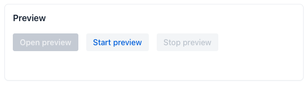

= Localization

The Localization feature in Control Center provides support for translating Vaadin applications. First, it allows uploading translation files from a Vaadin application. Translators can then add new translations or update existing ones. While translators are working, they can preview updated translations directly in the application. Finally, translations can be downloaded again in order to sync them back into the application.

== Enabling the Feature

In order to use the localization feature, it must be enabled for an application managed by Control Center. From the navigation menu on the left, select an application from the dropdown. Then open the [guilabel]*Localization* view. If the feature is not already enabled, you should see that the feature's status is disabled, as well as a button for enabling it.

[.device]
image::images/feature-toggle.png[Localization view with feature disabled]

Click on [guibutton]*Enable* to enable the feature. If everything went well, the feature's status should switch to [guilabel]*Enabled*.

== Uploading Translations

To get started, files from the application's `translations` resource bundle have to be uploaded first. To upload translations, click the [guibutton]*Replace data* button in the [guilabel]*Localization* view. This opens a dialog with multiple options:

[.device]
image::images/upload-dialog.png[Upload dialog]

Let's go through these individually. First, select the file type that you want to upload. Control Center supports two types of uploads:

* As multiple [filename]`.properties` files. This allows to select all files from the `translations` resource bundle in the application's source code. In a typical Vaadin application, the translations resource bundle is located in [filename]`src/main/resources/vaadin-i18n`. From there, select all [filename]`.properties` files that start with `translations`.
* As zipped data package. This package can be generated from the [guilabel]*Internationalization* panel in Vaadin Copilot. This package contains the same [filename]`.properties` files that you would select with the previous option. In addition, it can contain screenshots that Copilot has taken when localizing static strings in the application, which provide additional visual context for translators.

In the upload below, select the file(s) that you want to upload. Depending on what you selected for the upload type, either select all [filename]`.properties` files from the `translations` resource bundle, or a single [filename]`.zip` file that you have generated with Vaadin Copilot.

Next, a default language needs to be selected. The default language is usually the base language from which translations into other languages are made. Control Center assumes that the [filename]`translations.properties` file contains the translations in that default language. Since this file does not have any indicator of what language that is, it must be selected in this step. For other files, Control Center will detect the language from the file name. For example, for a file named [filename]`translations_en_US.properties`, Control Center will assume that translations in that file are in American English.

Finally, select the checkbox to confirm that you want to replace existing data in Control Center with the new uploaded data.

.Existing data will be replaced
[WARNING]
Control Center currently does not support synchronizing uploaded translations with existing translations already stored in its database. As such, any upload will remove / replace any existing translation data. If you have made any modifications to translations in Control Center since the last upload, synchronize them back to the application first before starting a new upload.

Then click [guibutton]*Replace data* to start the upload. Once the upload is complete, you should receive a notification that it was successful.

== Editing Translations

The [guilabel]*Translations* view is the central view of the localization feature, allowing to view, filter and edit translations. The view has a toolbar at the top and a grid with all messages and their translations below. Next to the grid is a panel showing details for the currently selected message.

[.device]
image::images/editing-translations.png[Translations view with toolbar and grid]

=== Toolbar

The toolbar at the top contains several controls to customize the view and visible data. The first is a dropdown for selecting a working language. The working language is the language that a translator currently wants to work on. When no working language is selected, the grid shows columns for all languages that have been detected during the translation upload. This gives a broad overview over all translations for a message. When selecting a working language, the grid only shows columns for the default language and the current working language. This allows to focus on translating from the base / default language into the working language, and also provides more horizontal space for the translation texts.

The next control is a search filter, allowing to filter messages to be shown in the grid. When entering a filter, it only shows those messages that:

* Contain the search term in the message key
* Or contain the search term in any of the translations for the languages currently shown in the grid. For example, when having English as the default language, and selecting French as the working language, the filter will only search within English and French translations, but not in translations for other languages.

Finally, a checkbox allows to only show messages that have one or more missing translations in any of the languages currently visible in the grid. For example, when having English as the default language, and selecting French as the working language, this will only show messages that have a missing translation for either English or French.

=== Translations Grid

The grid contains rows for all messages that have been detected in any of the files of the `translations` resource bundle. It always shows a column for the message key and additional columns for translations into different languages.

To edit translations for a message / row, click on one of the cells in a language column. Using the keyboard, you can also focus one of the cells and press kbd:[Enter]. This will start the inline editing mode in that row. You can now change the translation text for one or more languages in the edited row. To save changes you must explicitly commit them by:

* Pressing kbd:[Enter]
* Or clicking the confirm icon button in the last column

You can cancel editing without saving changes by:

* Pressing kbd:[Escape]
* Or clicking the cancel icon button in the last column

=== Details Panel

The details panel shows additional information for the currently selected message in the grid. It shows the message key, the default language translation, and translations for all other languages. If the message has been localized using Vaadin Copilot, it also shows a screenshot of where that message is used in the application UI.

== Previewing Translations

Translators can preview the changes they have made in an actual deployment of the application, for example to verify that a text fits into the space of its container, or if a translation makes sense in the context that it's used.

To preview translations, click on [guibutton]*Start preview* in the [guilabel]*Localization* view. This will create a copy of the currently selected application that is configured to load translations from Control Center, instead of the application's own `translations` resource bundle. Once the preview is ready, click on [guibutton]*Open preview* to open the preview in a new browser tab.

The preview will always use the latest translations stored in Control Center. Translators can switch back and forth between the preview and the [guilabel]*Translations* view to make changes and see them reflected in the preview.

[NOTE]
After changing a translation in Control Center, the browser tab with the preview needs to be reloaded manually to see the changes.

When the preview is not needed anymore, it should be stopped by clicking on [guibutton]*Stop preview* in the [guilabel]*Localization* view.

== Downloading Translations

In order to get updated translations back into the application's source code, they can be downloaded from the [guilabel]*Localization* view. Clicking the [guibutton]*Download* button will trigger a download of a [filename]`.zip` file. That file contains [filename]`.properties` files for each language that was present in the translation upload, now containing translations that have been added or updated in Control Center. You can then copy the [filename]`.properties` files back into your application's `translations` resource bundle, which is usually in [filename]`src/main/resources/vaadin-i18n`.