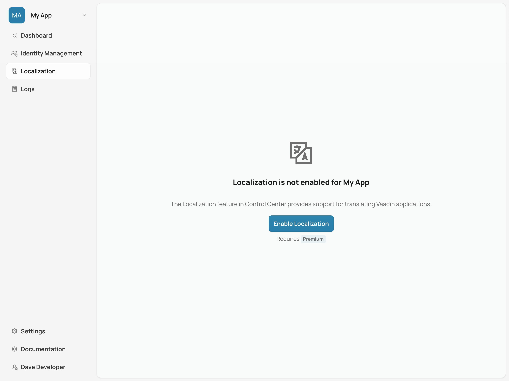
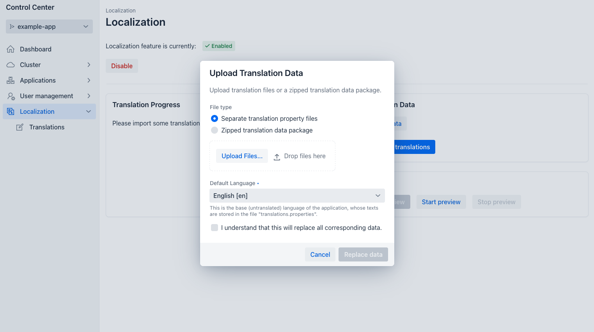
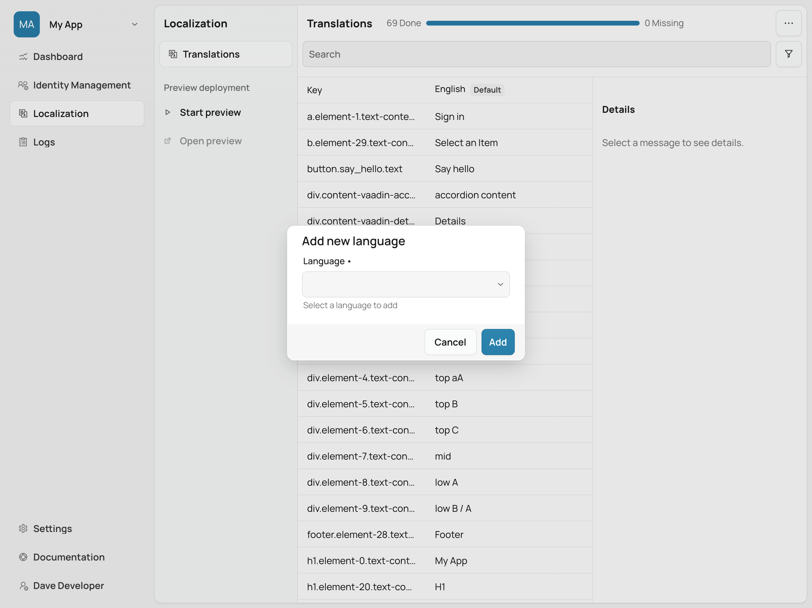
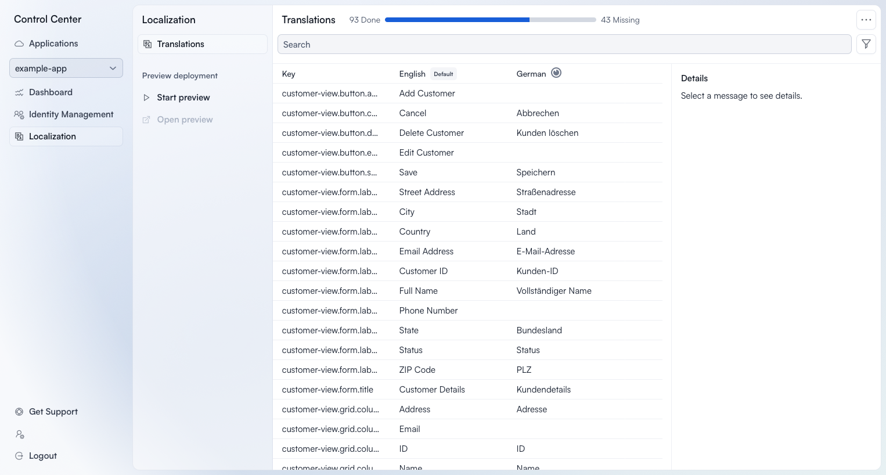

= Localization

:commercial-feature: Localization
include::{articles}/_commercial-banner.adoc[opts=optional]

The Localization feature in Control Center provides support for translating Vaadin applications. After uploading translation files for the application, translators can add new translations and modify existing ones. Translations can be previewed in real-time in a deployed application. Once translation work has been completed, the updated translation files can be downloaded for synching back into the application's codebase.

== Enabling Localization

In order to use the localization feature, it must be enabled for an application managed by Control Center. From the navigation menu on the left, select an application from the drop-down. Then open the [guilabel]*Localization* view. If it isn't already enabled, you'll see a message explaining that the feature is disabled, and a button for enabling it.

[.device]

Click on [guibutton]*Enable Localization* to enable the feature. Afterward, you should be redirected to the [guilabel]*Translations* view.

== Uploading Translations

To start, files from the application's `translations` resource bundle have to be uploaded. To upload translations, open the drop-down menu in the top-right corner of the [guilabel]*Translations* view and select [guibutton]*Upload translations*. This opens a dialog with multiple options.

[.device]

First, select the file type that you want to upload. Control Center supports two types of uploads: multiple [filename]`.properties` files, or a zipped data package.

The multiple [filename]`.properties` file type allows selection of all files from the `translations` resource bundle in the application's source code. In a typical Vaadin application, the translations resource bundle is located in [filename]`src/main/resources/vaadin-i18n`. From there, select all [filename]`.properties` files that start with `translations`.

The zipped data package can be generated from the [guilabel]*Internationalization* panel in <</tools/copilot#, Vaadin Copilot>>. This package contains the same [filename]`.properties` files that you would select with the previous option. It can also contain screenshots that Copilot took when internationalizing static strings in the application. These provide visual context for translators.

When ready, select the files you want to upload. Depending on what you chose for the upload type, either select all [filename]`.properties` files from the `translations` resource bundle, or select a single [filename]`.zip` file that you generated with Vaadin Copilot.

Next, a default language needs to be selected from the drop-down in the same dialog. The default language is usually the base language from which translations to other languages are made. Control Center assumes that the [filename]`translations.properties` file contains the translation in that default language. Since this file doesn't have any indicator of that language, it must be selected in this step. For other files, Control Center detects the language from the file name. For example, for a file named [filename]`translations_en_US.properties`, Control Center assumes it's in U.S. English.

Finally, check the checkbox to confirm that you understand and want to replace any existing translation data in Control Center with the new uploaded data. Then click [guibutton]*Replace data* to start the upload. Once the upload is complete, you should receive a notification that it was successful.

.Existing Data is Replaced
[WARNING]
Control Center does not currently support synchronizing uploaded translations with existing translations already stored in its database. Any upload removes or replaces any existing translation data. If you've made any modifications to translations in Control Center since the last upload, synchronize them back to the application before starting a new upload.

== Adding New Languages

After uploading translations, translators can translate into any language for which a property file has been uploaded. To add a new language, open the drop-down in the top right corner of the [guilabel]*Translations* view and select [guibutton]*Add language*. This opens a dialog where you can select the language to add. Once you've selected the language, click [guibutton]*Add* to confirm. The new language is now available for translation in the grid.

[.device]

== Editing Translations

The [guilabel]*Translations* view is the central view of the localization feature (see screenshot below). It allows users to view, filter and edit translations. The view has a toolbar at the top, and a grid with all messages and their translations below that. Next to the grid is a panel showing details for the currently selected message.

[.device]

=== Toolbar

The toolbar at the top of the [guilabel]*Translations* view contains several controls to customize the view and visible data. The first is a search filter. It allows the user to filter messages to be shown in the grid. When entering a filter, it only shows those messages that contain the search term in the message key, or ones that contain the search term in any of the translations for the languages currently shown in the grid. For example, when the grid only shows columns for English and French, the filter searches within English and French translations, and not in translations for other languages.

The next toolbar control is a drop-down with additional filter settings. It contains a radio group for filtering messages based on their translation status, and a checkbox group for selecting which languages to display in the grid.

The translation status filter allows to limit the display to only messages that have one or more missing translations in any of the languages currently visible in the grid. For example, when only the English and French languages are shown in the grid, this shows only messages that have a missing translation for either English or French.

The language select allows configuration of the languages that are shown in the grid. This allows translators to focus on the languages that are relevant for their work.

=== Translations Grid

The grid contains rows for all messages that have been detected in any of the files of the `translations` resource bundle. It always shows a column for the message key and additional columns for translations into different languages.

To edit translations for a message, click on one of the cells in a language column. Using the keyboard, you can also focus one of the cells and press kbd:[Enter]. You can now change the translation text for one or more languages in the edited row. To save changes, you must explicitly commit them by pressing kbd:[Enter] or clicking the `Confirm` icon button in the last column. When the last translation on a row has been committed with kbd:[Enter], focus moves automatically down to the first translation on the next row.

You can cancel editing without saving changes by pressing kbd:[Escape] or by clicking the `Cancel` icon button in the last column.

=== Details Panel

The details panel shows additional information for the currently selected message in the grid. It shows the message key, the default language translation, and translations for all other languages. If the message has been localized using Vaadin Copilot, it also shows a screenshot of where that message is used in the application UI. Clicking the screenshot opens it in full size in an overlay.

== Previewing Translations

Translations edited in Control Center can be previewed in a special instance of the deployed application. This can be useful for verifying that text fits into the space of its container, or to confirm that a translation makes sense in the context where it's used.

To preview translations, click on [guibutton]*Start preview* in the sidebar of the [guilabel]*Translations* view. This starts a new instance of the application configured to load translations from Control Center instead of the application's own `translations` resource bundle. Once the preview is ready, click on [guibutton]*Open preview* to open the preview in a new browser tab.

The preview always uses the latest translations stored in Control Center. Translators can switch back and forth between the preview and the [guilabel]*Translations* view to make changes and see them reflected in the preview. When the preview is no longer needed, it should be closed by clicking on [guibutton]*Stop preview* in the [guilabel]*Localization* view.

[NOTE]
After changing a translation in Control Center, the browser tab with the preview needs to be reloaded manually to see the changes.

== Downloading Translations

To get updated translations back into the application's source code, they can be downloaded from the [guilabel]*Translations* view. Open the drop-down in the top right corner and select the [guibutton]*Download translations* item to trigger a download of a [filename]`.zip` file. That file contains [filename]`.properties` files for each language that was present in the translation upload, now containing translations that have been added or updated in Control Center.

You can then copy the [filename]`.properties` files back into your application's `translations` resource bundle, which is usually in [filename]`src/main/resources/vaadin-i18n`.

[discussion-id]`8124CFA4-F694-4A96-8A81-1ADF4F36F5DB`
