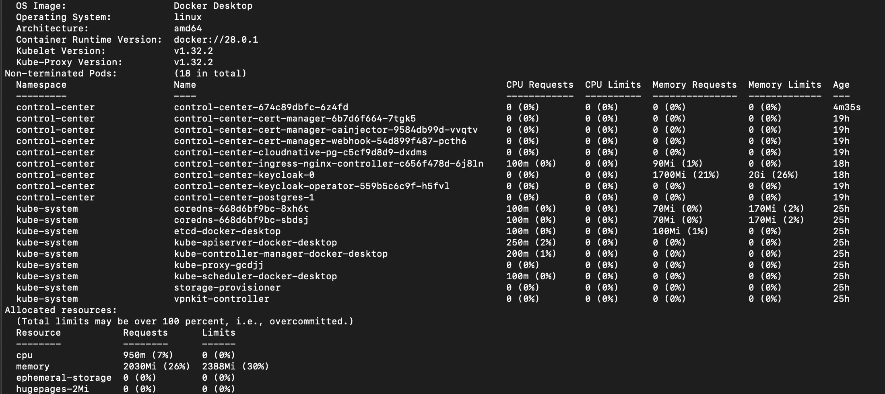
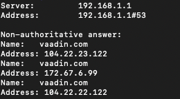
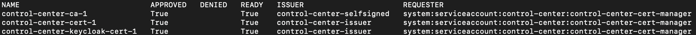
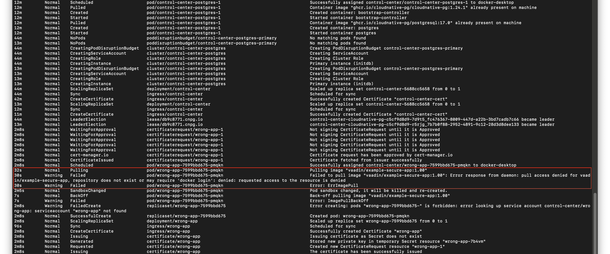

= Troubleshooting

When installing Control Center or deploying an application using Control Center, you may encounter issues that are not caused by Control Center itself, but by external factors such as cluster resource limits, DNS propagation delays, or misconfigured dependencies.

== 503 Service Temporarily Unavailable

When trying to access Control Center (or any deployed application) with your web browser and are greeted with a `503 Service Temporarily Unavailable` error page, the application might not be running and available.
You can see the logs of deployed applications in the Control Center logs screen.
To check the status of Control Center itself, you can print the logs by running:

[source,shell]
----
# assuming your deployment is named 'control-center'
kubectl -n <namespace> logs -f deployment/control-center
----

If the logs show normal startup messages, then you might only need to wait until the deployment becomes available.
If a specific error is shown in the logs, address it accordingly. If no specific error is shown in the logs, check the Kubernetes events in the namespace where Control Center was installed.

[source,shell]
----
kubectl -n <namespace> events
----

For deployed applications, if you see events of failing probes, then xref:../application-deployment/index.adoc#deploy-with-control-center[increase the startup delay time] enough to give it time to finish.
If Control Center itself has failing probe events, try upgrading the installation with an extra setting increasing the startup delay time.

[source,shell]
----
helm upgrade control-center oci://docker.io/vaadin/control-center -n control-center \
--reuse-values \
--set app.startupProbe.initialDelaySeconds=30
----

== Insufficient Cluster Resources

When Control Center instance is slow to respond it might be because of lacking enough resources (CPU, memory).
You can check resource allocation using:

[source,shell]
----
kubectl describe node
----



The above command shows a lot of information about a kubelet, including memory pressure, disk pressure, PID, and the percentage of allocated resources.

=== Solution

Make sure there are enough resources allocated for your kubelet, and if not, then increase the node capabilities on your cloud provider.
You can also try increasing resource requests of Control Center by upgrading with `helm` and setting certain values.

[source,shell]
----
helm upgrade control-center oci://docker.io/vaadin/control-center -n control-center \
--reuse-values \
--set app.resources.requests.cpu=2 \
--set app.resources.requests.memory=512Mi
----

This example modifies the Control Center deployment with a CPU request of 2 CPU and a memory request of 512 MiB of memory.

== DNS Record Propagation Delays

DNS propagation refers to the process of updating information on the internet's DNS (Domain Name System) servers.
DNS servers are responsible for the mapping of domain names to IP addresses.
In essence, DNS propagation is the time required for DNS servers worldwide to update their cached information for a domain name.

DNS propagation can take some time to complete because it involves updating information on many servers across the internet.
DNS records, like IP addresses, must be updated on all servers resolving your domain name.
Even after making a change, some servers may still have outdated information, leading to inconsistencies in DNS resolution and longer propagation times.

=== Solution

Verify DNS records of your domain are ready and available.
To check the IP address a domain resolves to, run:

[source,shell]
----
nslookup <domain>
----

Expect your server's IP address to be shown when running `nslookup`.



You can also try to ping your domain:

[source,shell]
----
ping -t 4 <domain>
----

The ping is only successful if the domain name can be resolved to an IP address.

If the lookup cannot resolve the hostname into an IP address, double-check for typos.
If the DNS server can't find the domain, then it is yet to be propagated.
The time it takes for a domain to propagate is unpredictable; it can take from just a few minutes up to 24 hours, or even more.

Double-check the DNS configuration within your cloud provider and verify that the domain is correct.
You can also manually associate the server's IP address with the desired domain by adding it to xref:../getting-started/local-environment#configure-hosts-file[your `hosts` file].

Another symptom of this problem is that the public key certificates might not be ready.
You can check if the certificates are still being requested by running:

[source,shell]
----
kubectl -n control-center get certificaterequests
----

When certificates are ready, the output of the above command should look like this:




== Invalid Docker Image

An application deployed with Control Center with an invalid image reference won't ever become available.
In this situation, trying to access the logs fails with an error saying that the image can't be pulled.
Since there is no valid image there also isn't a valid deployment to get logs from.
A docker image reference consists of several components that describe where the image is stored and its identity. These components are:

```
[HOST[:PORT]/]NAMESPACE/REPOSITORY[:TAG]
```

`HOST` +
Specifies the registry location where the image resides. If omitted, Docker defaults to Docker Hub (`docker.io`).

`PORT` +
An optional port number for the registry, if necessary (for example, `:5000`).

`NAMESPACE/REPOSITORY` +
The namespace (optional) usually represents a user or organization. The repository is required and identifies the specific image. If the namespace is omitted, Docker defaults to `library`, the namespace reserved for Docker Official Images.

`TAG` +
An optional identifier used to specify a particular version or variant of the image. If no tag is provided, Docker defaults to `latest`.

If an invalid docker image is used to deploy an application, the application may never become available.
To check if an unavailable application has an invalid image, look for a Warning event with the message `Failed to pull image...`

[source,shell]
----
kubectl -n <namespace> events --types=Warning
----



If the image is hosted in a private repository, you might need to provide an image pull secret as necessary authentication to pull the image.
This value can be provided in the application deploy screen, below the field where the docker image is provided.

[discussion-id]`DD5CC002-0FD2-451A-8CA2-5FD8C18E37FC`
