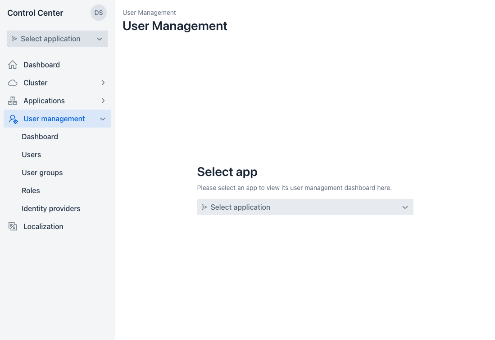
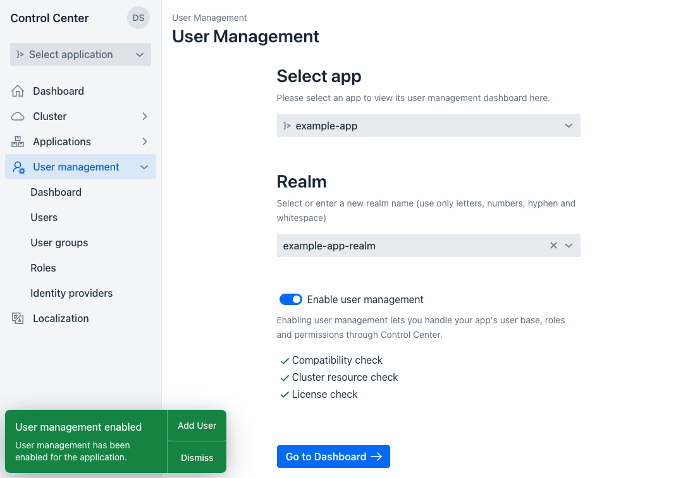
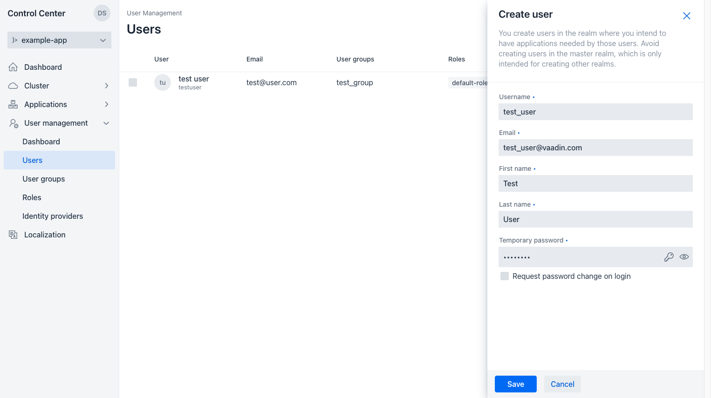
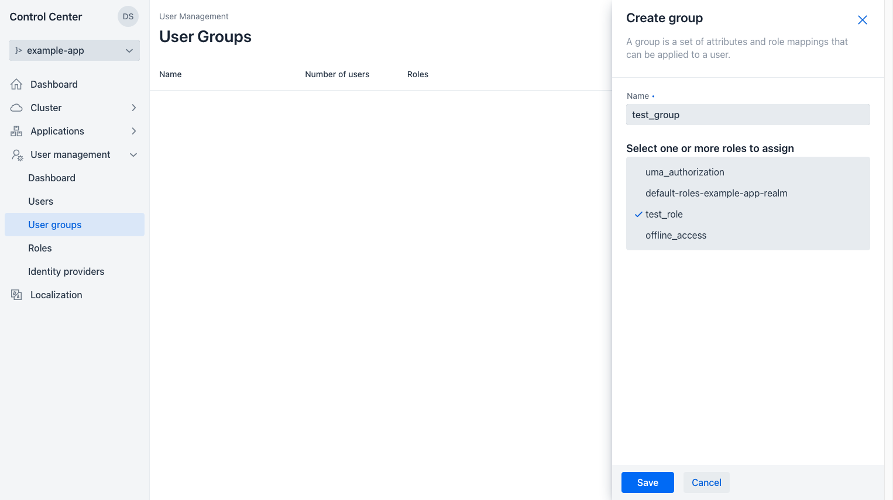
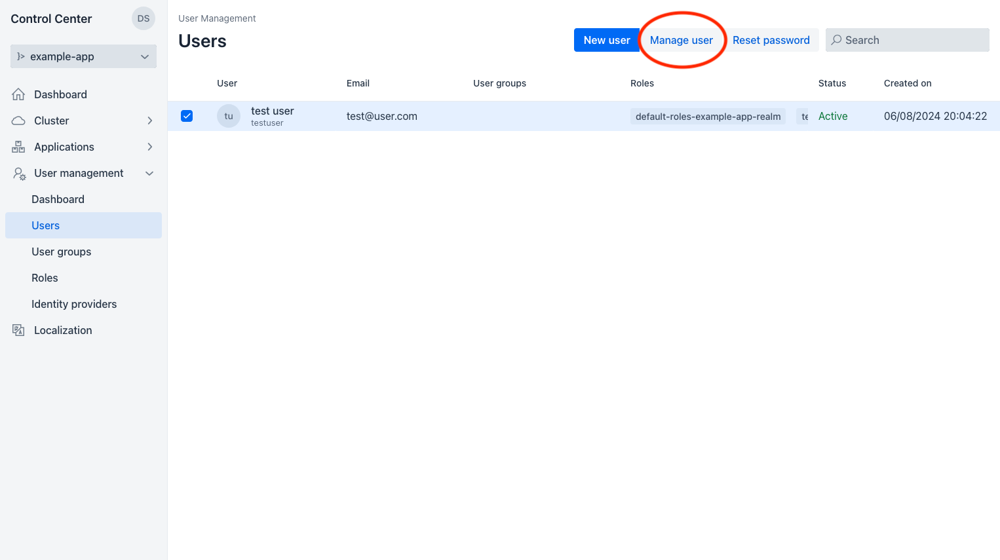
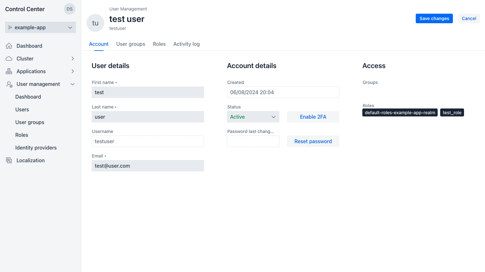
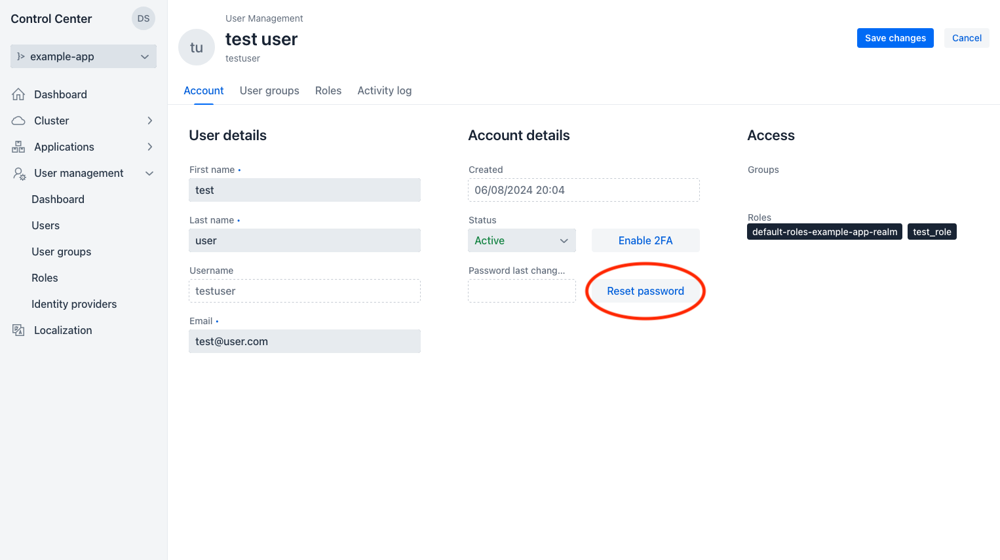
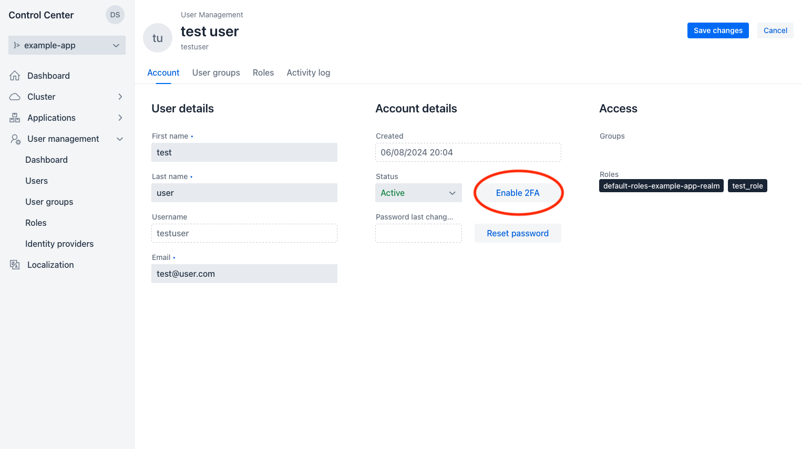

== User Management

Through the user management feature in Control Center, you can select or create Keycloak realms to hold the users of an application, create new users, edit user information, request password resets, create user groups, create roles and enable two-factor authentication.

=== Enabling User Management for a Vaadin Application

To enable security features and user management in a Vaadin application, go to the "User management" screen and select the application from the application selector component.

NOTE: This feature is only available for applications that have been adopted by Control Center. See xref:../application-discovery/index.adoc#deploy-adopt-a-vaadin-application[Deploy & Adopt a Vaadin Application] for information about adopting a Vaadin application.

. Choose the Keycloak realm in which you wish the users' data to be stored.
. You can enter a new realm to be created for this application.
. Make sure all requirement checks pass.
. Click on the toggle switch to enable user management for the selected app using the selected realm.

=== Creating New Users

In the "Users" screen, you can see a list of users for the selected application. 
To create a new user, click on the "New user" button at the top right corner of the screen. 
This opens a side panel with a form to create a new user. Enter all necessary user data and click "Save".
The "Temporary password" field can be filled automatically with a randomly generated password by clicking the key icon in it.
You can optionally have Keycloak ask the new user to change their password the first time they log in.

=== Assigning permissions using roles and groups

Roles and groups have a similar purpose, which is to give users access and permissions to use applications. 
Roles define specific applications permissions and access control.
Groups are a collection of users to which you apply roles and attributes. 

Groups in Keycloak manage a common set of attributes and role mappings for each user. 
Users can be members of any number of groups and inherit the attributes and role mappings assigned to each group.

Groups are hierarchical. 
A group can have multiple subgroups but a group can have only one parent. 
Subgroups inherit the attributes and role mappings from their parent. 
Users inherit the attributes and role mappings from their parent as well.
If you have a parent group and a child group, and a user that belongs only to the child group, the user in the child group inherits the attributes and role mappings of both the parent group and the child group.

==== Creating User Groups

To add a group, go to the "User groups" screen and click the "New group" button on the top right corner of the screen, which opens a side panel to create a new group.
Enter the name of the new group and select the roles you want to assign to the group. 
Click "Save" to save the group.
Clicking on a group opens the side panel to edit or delete the group.

==== Creating Roles

To add a new role, go to the "Roles" screen and click "New role" button on the top right corner of the screen, which opens a side panel to create a new role.
Enter the name of the role. 
Click "Save" to save the role.
Clicking on a role opens the side panel to edit or delete the role.

image::images/create_role.png[Create role form]

=== Managing a User

From the "Users" screen, select a user from the grid and click on the "Manage user" button to manage that user's information, groups and roles.

This redirects you to the user management screen, where you can see all of the user's information and manage its status, groups, roles, reset its password and enable or disable two-factor authentication.

==== Edit user information

From the "Manage user" screen, you can edit a user's first and last names, email, their status (active or inactive), the groups they belong to and the roles they have. Remember to click "Save changes" on the top right corner after making any desired changes and before changing tabs or leaving the screen or else any changes are discarded without warning.

==== Requesting Password Reset

To reset a user's password, click on the "Reset password button" either by selecting a user on the user grid or by clicking the button available from the "Account" tab in the screen where you edit a user's information.

==== Two-Factor Authentication

Clicking "Enable 2FA" enables two-factor authentication for the user. To disable two-factor authentication for a user, click "Disable 2FA".

