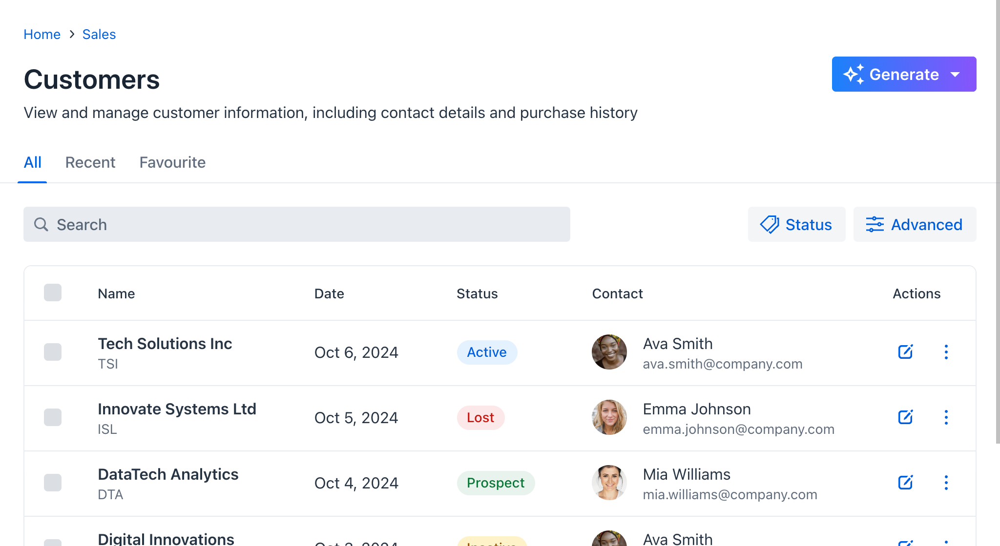
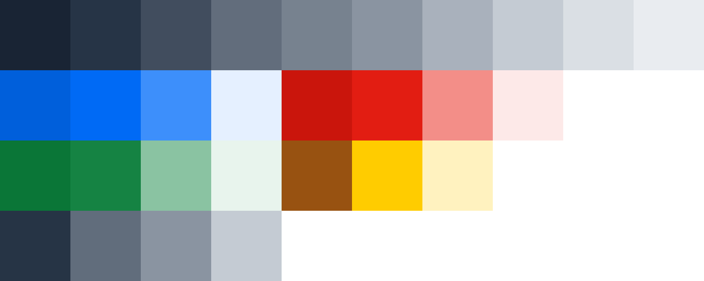
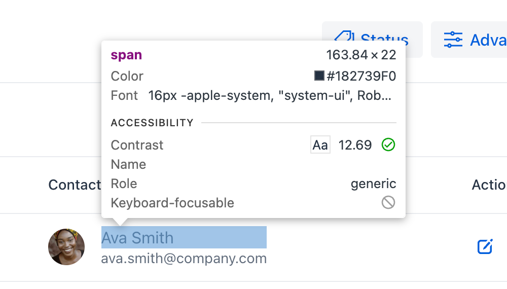
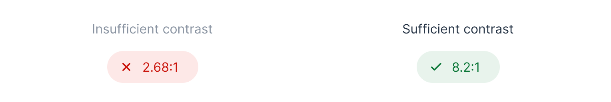
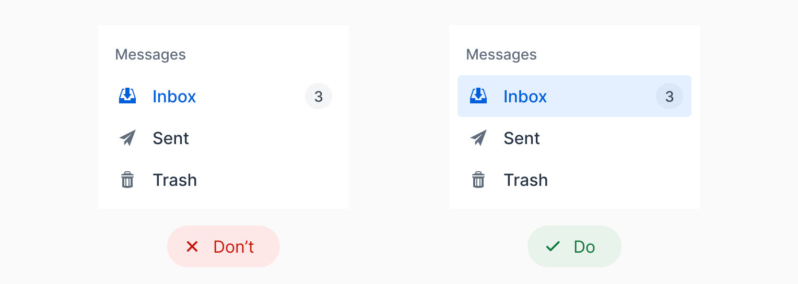
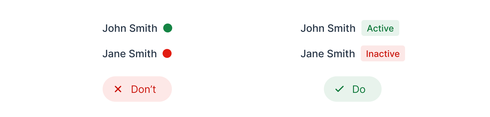

= Color

When starting from scratch, without a brand guideline, choose a primary and an accent color that suits your design's mood or tone. Lumo defaults to blue, a common yet neutral and safe choice. If you opt for green or red, be mindful as they're often tied to success and error messages. Purple and vibrant gradients have gained popularity in AI branding and design.

In the following screenshot, you can see a gradient on the [guilabel]*Generate* button, indicating it is an AI feature:

.Vibrant gradient colors are often used to indicate AI-driven features.
[.device]

== Generating a Color Palette

Should you need help generating a color palette, there are many tools available online, such as:

- https://coolors.co/[Coolors]
- https://color.adobe.com/[Adobe Color]
- https://colors.eva.design/[Eva Design]

Lumo's <</styling/lumo/lumo-style-properties/color#,color palette>> consists of grayscale shades, blue as the primary color, red for errors, green for success, yellow for warnings, and text colors:

.Lumo's Color Palette

Follow the “less is more” approach when using color in your application. Limiting your color palette to a few strategic choices -- such as one primary color, a couple of accent shades, and neutral tones -- helps to create a clean, cohesive interface. This reduces visual clutter and ensures that important elements stand out. Keep it simple for a more intuitive and focused user experience.

== Color Contrast

Ensure there is sufficient contrast between the text and its background. For legibility purposes, you should target a contrast ratio of at least 4.5:1, in accordance with https://www.w3.org/WAI/WCAG21/Understanding/contrast-minimum[WCAG 1.4.3]. Most browsers feature a built-in color contrast checker that can be accessed through their inspection tools.

.Chrome's Color Contrast Checker
[.fill.white]

Lumo is compliant by default. However, if you customize the text colors, be sure to check the contrast.

The following image demonstrates the difference between insufficient and sufficient contrast ratios. On the left, the contrast ratio is 2.68:1, which is less than the recommended ratio. On the right, the contrast is 8.2:1, which is greater than the recommended ratio:

== Conveying Information with Color

Avoid relying on color alone to convey information, as outlined in https://www.w3.org/WAI/WCAG21/Understanding/use-of-color[WCAG 1.4.1]. Use text labels, patterns, or shapes in addition to colors to ensure accessibility.

In the following example, the selected mailbox folder is indicated by a blue text color only on the left. This can be difficult for some users to see. On the right, the selected folder is also indicated by a colored background, which makes it easier to notice:

In the following example, the left version only uses colors to show whether a contact is active (green) or inactive (red). This is problematic, as it may be impossible for color blind users to distinguish between the two colors. The right version still uses colors, but also adds the labels "Active" and "Inactive". This makes the user interface accessible to color blind users as well:

