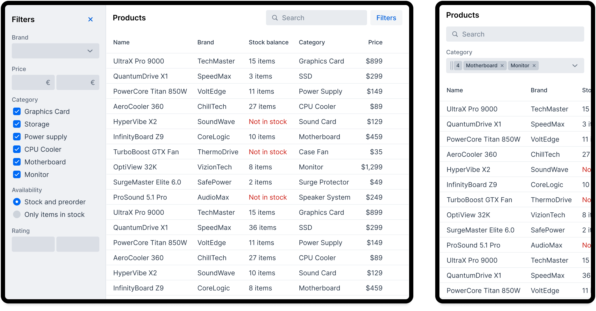
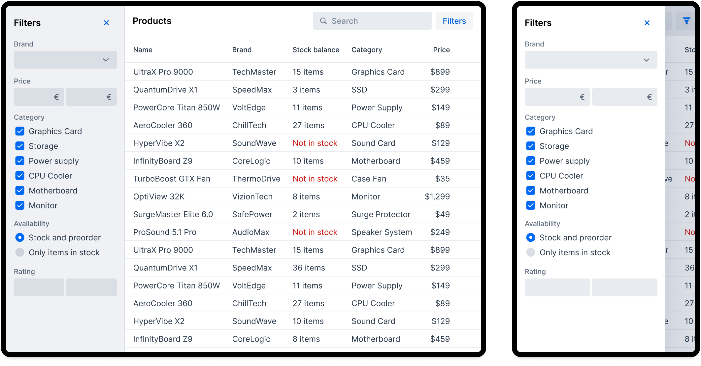
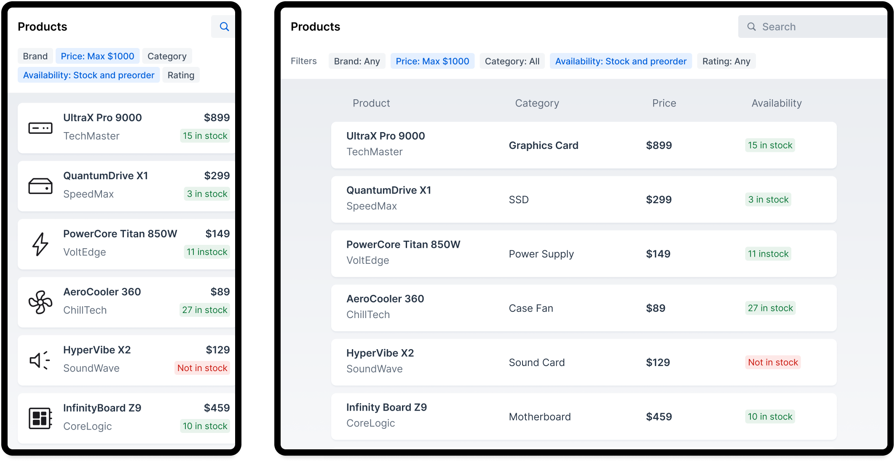
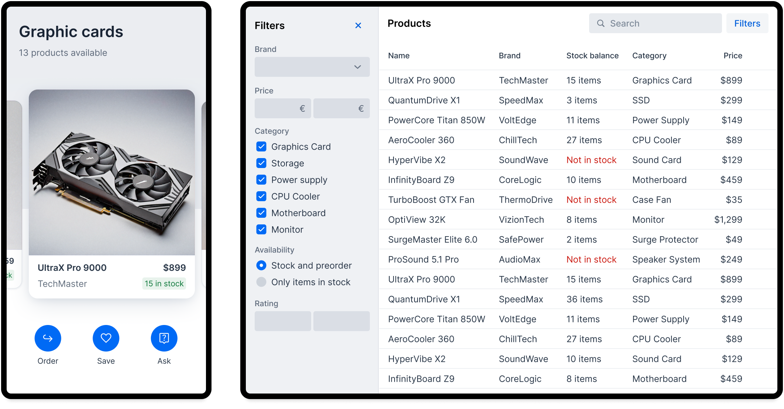
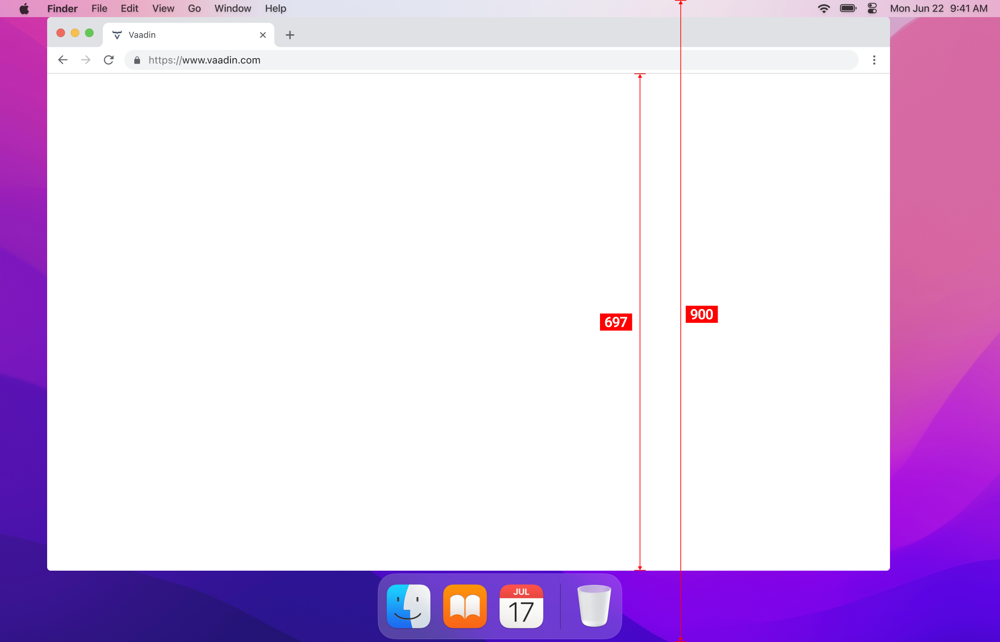
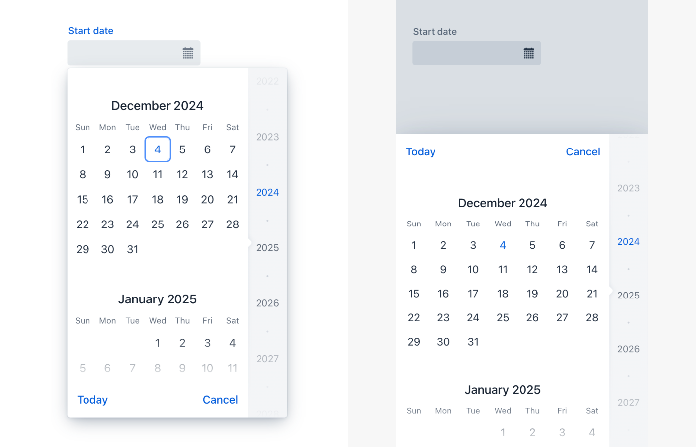
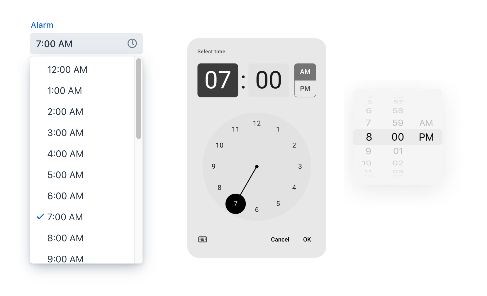

// TODO The following terms should be explained somewhere (not necessarily on this page):
// - Viewport
// - Overlay
// - Navbar
// - Hamburger menu

= Responsiveness
:toclevels: 2

In the scope of UX design, responsiveness refers to the UI responding to changes in the viewport size. Making a responsive application often means adapting the UI to mobile phone screen sizes and taking touch interactions into consideration. The same responsive techniques can also be adapted to make the best out of large screen sizes. The goal is not to squeeze or stretch the UI elements to fill the available space, but rather to adapt the user interfaces to best use the available screen estate.

== Designing for Mobile Responsiveness

You can optimize a user interface for a small touchscreen in different ways, depending on your application's specific needs. As a rule of thumb it's better to do a limited set of mobile functionalities well, than to rush through and force everything to fit on a small screen.

=== Reduce Features on Small Screens

The most lightweight option is to reduce the number of features on smaller screens. This works for applications that are primarily used on the desktop, and whose mobile UI is used only from time to time to access read-only data or simple workflows. For instance, users may not need to do system administration and heavy data entry on their mobiles.

In the following example, you can see two variants of the same user interface. On the left is the desktop variant with all the features. On the right is the mobile variant with less filters:

[link=images/responsiveness1.png]

=== Build a Responsive UI

The next option is to adapt the entire user interface to be mobile friendly. To make this easy, you should base the UI on a design system that takes responsiveness into account. In practice, you use CSS media queries and container queries to make responsive UI building blocks. To reduce the need for one-off, view specific overrides, the building blocks should adapt to the viewport size independently.

In the following example, the mobile variant of the user interface contains all the filters of the desktop variant. To adapt to the smaller viewport, the filter panel shows up as an overlay that the user can show and hide as needed:

[link=images/responsiveness2.png]

=== Start with Small Screens

If the mobile variant of your user interface is as important as the desktop variant, you should start by designing the mobile variant. This approach is called “mobile first”. The user experience on mobile becomes more natural without the burden of an existing desktop design. Once the mobile UI is ready, you adapt it to larger viewport sizes for the desktop variant.

The following example shows a UI design that was first made for mobile, and then adapted to the desktop. The use case is the same as in the earlier examples, but the desktop variant is based on the mobile variant and not vice versa:

[link=images/responsiveness3.png]

Adapting a mobile user interface to the desktop is not only about adjusting the size of elements. For instance, a workflow may consist of a series of smaller steps on the mobile that can be combined on the desktop.

=== Build Separate UIs

The approaches covered so far have been compromises: either the mobile UI is a variant of the desktop UI or vice versa. When the best possible user experience is required for both, you should develop the user interfaces independently from each other. However, this doubles the effort and amount of UI code. You may also need to create separate backend services for each UI, making the application more complex. This in turn makes it more expensive to add new features and make changes.

Because of this, you should aim for a responsive user interface, and only create separate versions for the parts where it is needed. For instance, QR code scanning, or a full-screen map, may benefit from having their own UI implementations for mobile and desktop.

The following example shows a mobile UI that relies on swipe gestures, while the desktop version has totally different interaction patterns:

[link=images/responsiveness4.png]

=== Design for Fluid Screen Sizes

Avoid designing explicitly for any specific screen resolution like 1920x1080 or “iPhone 22 Pro”. Even if your users have a specific hardware setup they would still benefit from being able to resize their browser window to half screen, or use browser zoom. The design tool canvas needs to have some size, but consider that to be fluid. Also, the browser window is often smaller than the screen resolution. Push yourself to test how your design adapts to larger and smaller sizes.

The following image demonstrates that only 75% of the height is actually available for the browser content on a 1270x900 screen:

== Responsive Features in Vaadin

Some <</components#,Vaadin components>> have responsive features built into them. For example, the position of the <</components/date-picker#,Date Picker's>> overlay is changed to optimize for touchscreen devices. This is demonstrated in the following image, with the desktop version on the left, and the mobile version on the right. On the desktop version, the overlay shows up below the field itself. On the mobile version, the overlay is fixed to the bottom of the screen:

The following table contains an overview of the responsive features of each component:

[cols="1,2"]
|===
|Component|Responsive Features

|<</components/app-layout#,App Layout>>|The navigation drawer can be displayed as an overlay or bottom navbar. The drawer automatically collapses to a hamburger menu on small viewports.
|<</components/dashboard#,Dashboard>>|The layout is automatically optimized and adjusted based on the screen size.
|<</components/charts#,Charts>>|All chart types can be configured to fill any available space. Charts scale in real time when the container size changes.
|<</components/context-menu#,Context Menu>>|The menu is fixed to the bottom of the screen on small viewports.
|<</components/crud#,CRUD>>|The editor is always shown as an overlay on small viewports.
|<</components/date-picker#,Date Picker>>|The calendar is fixed to the bottom of the screen on small viewports.
|<</components/dialog#,Dialog>>, <</components/confirm-dialog#,Confirm Dialog>>|The button toolbar changes to a vertical layout when space is limited.
|<</components/email-field#,Email Field>>|An email specific touchscreen keyboard is used if provided by the OS.
|<</components/form-layout#,Form Layout>>|The label positions and number of columns are adjusted based on the screen size.
|<</components/menu-bar#,Menu Bar>>|An overflow menu appears when items don't fit into the width of the menu bar.
|<</components/number-field#,Number Field>>|A number specific touchscreen keyboard is used if provided by the OS.
|<</components/password-field#,Password Field>>|Mobile browsers can display the typed character for a moment before obscuring it.
|<</components/select#,Select>>|The overlay is fixed to bottom of the screen on small viewports.
|<</components/tabs#,Tabs>>|Horizontal scroll buttons appear when tabs don't fit into the width of the tab bar. The tab bar is also horizontally scrollable.
|===

=== Native Inputs and Vaadin Fields

At first glance the operating system's native overlays for selecting days or options from a list may seem like a good choice. However, Vaadin components allow for better control when the input has min-max limits, disabled options, or other logic for entering a value. For instance, some operating systems might not offer date pickers that can limit the dates or times the user can choose. This in turn can lead to usability issues and a different experience depending on the user's device. Because of this, you should use Vaadin components in favour of native inputs.

The following image shows the Vaadin <</components/time-picker#,Time Picker>> on the left, next to two native time pickers from Android and iOS:

== Developing Responsive User Interfaces

The Vaadin components use standard web technologies to implement responsiveness: flexbox, grid, media queries, and container queries. You use the same technologies to make your user interfaces responsive. If you are unfamiliar with CSS, Vaadin also provides some utilities for using them.

=== Flexbox and Grid

Flexbox is a one-dimensional layout system for arranging items in rows or columns. Items either expand to fill the available space, or shrink to minimize the used space. In addition, flexbox can be configured to wrap its children to a new line when needed. This is useful when adapting user interfaces for smaller viewports.

For more information, see the https://developer.mozilla.org/en-US/docs/Learn/CSS/CSS_layout/Flexbox[MDN web docs for flexbox].

Grid is a two-dimensional layout system that is slightly more complex than flexbox. It's similar to having multiple flexboxes next to each other, but adds more control over the layout. By mastering both grid and flexbox, you can implement sophisticated responsive layouts.

[IMPORTANT]
Don't confuse the CSS grid layout system with the Vaadin <</components/grid#,Grid component>>.

For more information, see the https://developer.mozilla.org/en-US/docs/Learn/CSS/CSS_layout/Grids[MDN web docs for grid].

In Vaadin, the <</components#layout_components,layout components>> already use flexbox and grid under the hood. This makes them easier to use even if you are not familiar with how the CSS works. If the Vaadin layout components don't fit your specific needs, you can write your own CSS or use the <</components/themes/lumo/utility-classes#,Lumo utility classes>>.

=== CSS Media Query and Container Query

Media queries allow you to apply CSS styles based on the characteristics of the device that is used to access the application. When building responsive user interfaces, the most common characteristics you'll use are the width and height of the viewport.

In the following example, the mobile toolbar is invisible by default. The media query overrides the styles and makes the toolbar visible when the viewport width is equal to or narrower than 640px. In practice, this means that the toolbar is hidden on non-mobile devices and visible on mobile devices:

[source,css]
----
.mobile-toolbar {
    display: none;
}

@media (max-width: 640px) {
    .mobile-toolbar {
        display: flex;
    }
}
----

For more information, see the https://developer.mozilla.org/en-US/docs/Web/CSS/CSS_media_queries/Using_media_queries[MDN web docs for media queries].

Sometimes, styling based on the viewport width isn't enough. For instance, if an application has resizable content areas, it's desirable to style the content based on the width of the content area rather than the width of the screen. Container queries allow you to do this.

In the following example, the side panel is resizable. It has a footer that is hidden by default. The container query overrides the styles and makes the footer visible when the side panel width is equal to or wider than 400px.

[source,css]
----
.sidepanel {
    container-type: inline-size;
    container-name: sidepanel;   /* Optional */
}

.sidepanel .footer {
    display: none;
}

@container sidepanel (min-width: 400px) {
    .footer {
        display: flex;
    }
}
----

For more information, see the https://developer.mozilla.org/en-US/docs/Web/CSS/CSS_containment/Container_queries[MDN web docs for container queries].

=== Lumo Utility Classes

The <</components/themes/lumo/utility-classes#,Lumo utility classes>> are small, single-purpose CSS classes that can be applied directly to a component or HTML element to style it in a specific way. Unlike traditional CSS approaches, which often involve writing custom styles for each element, utility classes offer a more modular and reusable way to style your content.

The responsive Lumo utility classes follow a mobile-first approach. This means that the default styles should optimize for mobile viewports. You then add extra styles for larger viewports through something called _breakpoints_. Breakpoints target various minimum screen widths. For instance, the `Small` breakpoint applies to screens that are 640px or wider, whereas the `Medium` breakpoint applies to screens that are 768px or wider.

In the following example, the mobile toolbar is visible by default. The `Small` breakpoint makes it hidden when the viewport width is equal to or wider than 640px:

[.example]
--
[source,html]
----
<source-info group="Lit"></source-info>

----

[source,java]
----
<source-info group="Flow"></source-info>
mobileToolbar.addClassNames(Display.FLEX, Display.Breakpoint.Small.HIDDEN);
----
.TSX
[source,html]
----
<source-info group="React"></source-info>

----
--

For more information and examples, see the blog post https://vaadin.com/blog/building-responsive-layouts-with-vaadin-utility-classes[Building responsive layouts with Vaadin utility classes].

// TODO The blog post contents should be incorporated into the Desiging Apps guide, maybe as a deep dive.
