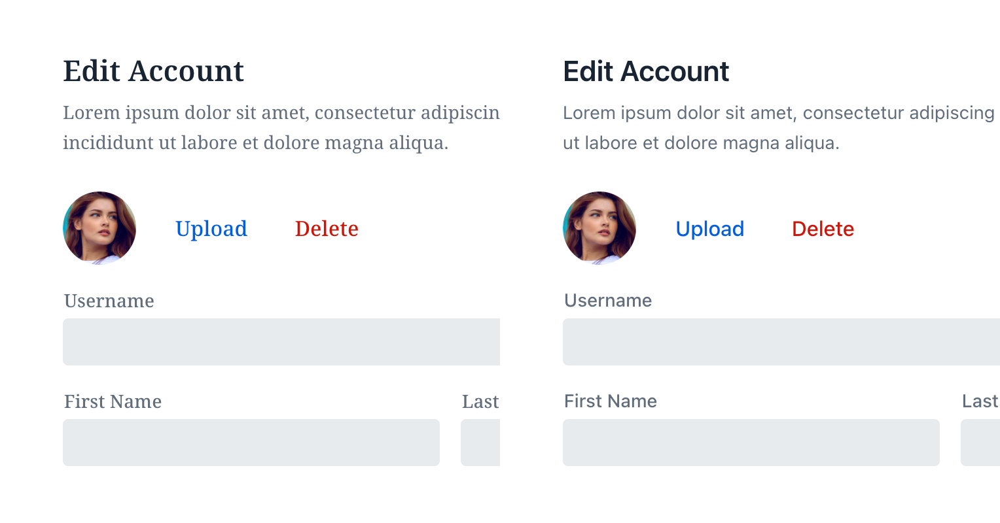
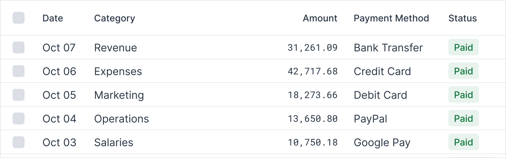
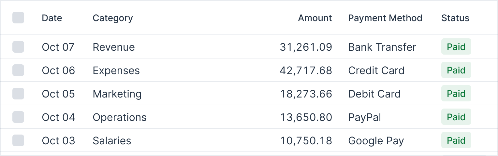
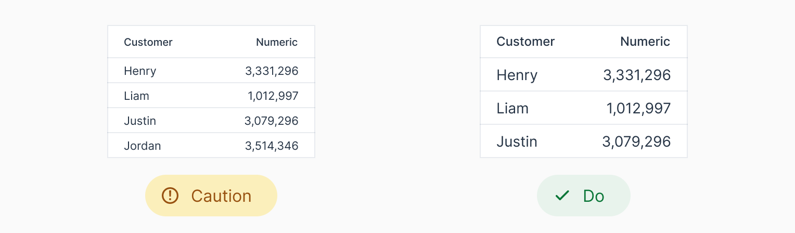
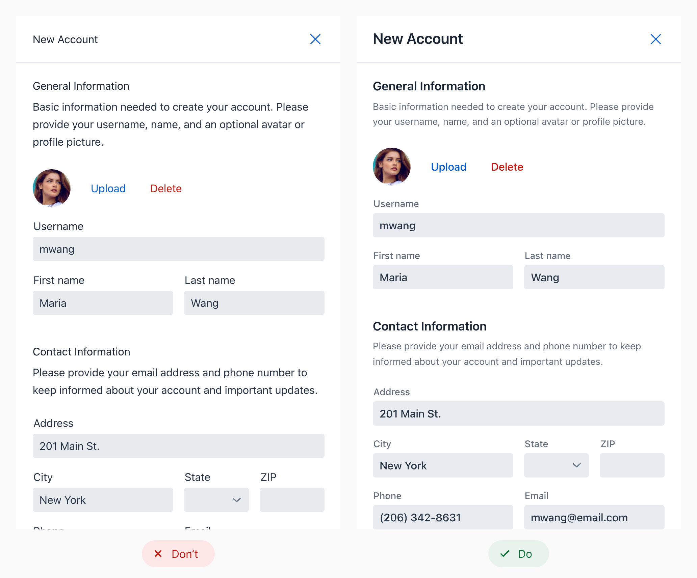

= Typography

Typography is a key element of business application design that directly affects the user experience and readability. By thoughtfully selecting the right font families and sizes, designers can create interfaces that are both visually appealing and easy to use. 

This page explores the key components of typography, offering insights on making choices that enhance the overall effectiveness of your application’s design.

== Font Family

Choose a font family that suits your application and its content. Generally, serif fonts are more traditional, while sans-serif fonts are more modern. Some research suggests that the latter slightly outperforms serif fonts in legibility tests for those with poor eyesight.

The default font family in Lumo depends on the operating system: Segoe UI on Windows; Roboto on Android and Chrome OS; San Francisco on macOS, iOS, and iPadOS; and Helvetica and Arial as the fallback fonts on other systems. All of these font families, regardless of the operating system, are sans serif fonts.

The image below compares a serif font on the left with a sans serif on the right:

Notice in the image above the difference in styles and how it affects readability.

Monospace fonts are excellent for displaying numeric values when comparisons are necessary. Notice how the font in this next image makes the numbers easier to read:

Alternatively, you can use link:https://developer.mozilla.org/en-US/docs/Web/CSS/font-variant-numeric[CSS to display numbers in a monospace style], depending on font support.

== Font Size

WCAG doesn't specify a minimum font size requirement. Still, be cautious about using less than 12 pixels. This also depends on the inherent size of the typeface: some typefaces may appear smaller or larger at the same size, which affects legibility.

The image above shows two tables for comparison of font sizes. The one on the left uses a very small font size, and the one on the right has a larger size. This comparison highlights the difference in readability with font sizes.

== Type Scale

A type scale is a system for choosing font sizes based on a base size and scaling ratio. This approach creates a clear visual hierarchy for headings and body text, improving content navigation for users. Alongside font size, variations in font weight and color also contribute to this hierarchy.

Looking at the image above: notice how using varying font sizes in the form on the right provides a clear visual hierarchy. It enhances readability and ease of navigation.

You can find online several tools to help you preview and select a type scale that suits your needs, including:

- https://baseline.is/tools/type-scale-generator/[Baseline]
- https://typescale.com/[Typescale]