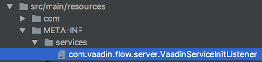

= Service Init Listener

The [classname]`ServiceInitEvent` is fired when your Vaadin application starts. It's a good place to configure the [classname]`RequestHandler`, [classname]`IndexHtmlRequestListener` and <<dependency-filter#,`DependencyFilter`>> objects. You can also use it to <</flow/routing/dynamic#application.startup,dynamically register routes>> during application startup, and to <<session-and-ui-init-listener#, register session and UI listeners>>.

In Spring and CDI applications, the [classname]`ServiceInitEvent` is fired as an application event. It's enough to annotate your bean method accepting [classname]`ServiceInitEvent` as a parameter with the https://docs.spring.io/spring-framework/docs/current/javadoc-api/org/springframework/context/event/EventListener.html[`@EventListener`] (Spring) or https://jakarta.ee/specifications/cdi/4.0/apidocs/jakarta.cdi/jakarta/enterprise/event/observes[`@Observes`] (CDI) annotation. The following shows an example of this:

[source,java]
----
@Component
public class MyBean {

    @EventListener
    public void logSessionInits(ServiceInitEvent event) {
        event.getSource().addSessionInitListener(
                sessionInitEvent -> LoggerFactory.getLogger(getClass())
                        .info("A new Session has been initialized!"));
    }

}
----

Alternatively, you can implement the [interfacename]`VaadinServiceInitListener` interface and register it, like shown in the following example:

[source,java]
----
public class ApplicationServiceInitListener
        implements VaadinServiceInitListener {

    @Override
    public void serviceInit(ServiceInitEvent event) {
        event.addIndexHtmlRequestListener(response -> {
            // IndexHtmlRequestListener to change the bootstrap page
        });

        event.addDependencyFilter((dependencies, filterContext) -> {
            // DependencyFilter to add/remove/change dependencies sent to
            // the client
            return dependencies;
        });

        event.addRequestHandler((session, request, response) -> {
            // RequestHandler to change how responses are handled
            return false;
        });
    }

}
----

In a Spring or CDI project, all beans implementing the [interfacename]`VaadinServiceInitListener` interface are registered automatically. Remember to add the `@Component` annotation to the class, to make it a managed bean.

In plain Java projects, the listener should be registered as a provider via the Java Service Provider Interface (SPI) loading facility. To do this, you should create the [filename]`META-INF/services` resource directory and a provider configuration file with the name [filename]`com.vaadin.flow.server.VaadinServiceInitListener`. This is a text file and should contain the fully qualified name of the [classname]`ApplicationServiceInitListener` class on its own line. It allows the application to discover the [classname]`ApplicationServiceInitListener` class, instantiate it and register it as a service init listener for the application.

.Location of the Configuration File

The content of the configuration file should look like this, as an example (replace `com.mycompany` with the package name of your implementation):
----
com.mycompany.ApplicationServiceInitListener
----

The following pages offer more details about Java SPI loading:

- https://docs.oracle.com/javase/tutorial/ext/basics/spi.html#register-service-providers
- https://docs.oracle.com/javase/7/docs/api/java/util/ServiceLoader.html

[discussion-id]`EA8B92C9-D967-4C55-B760-FEBEEA964D72`
