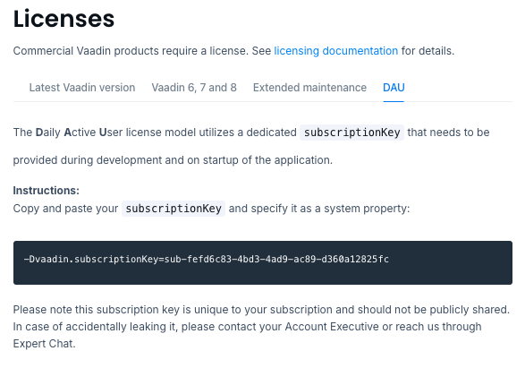
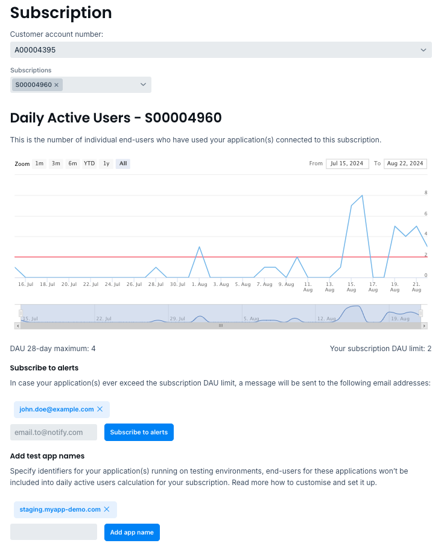

[role="since:com.vaadin:vaadin@v24.5"]
= Daily Active Users

Daily Active User (DAU) represents a human end-user for one application that you built with Vaadin, during a 24-hour period. Vaadin limits the DAU number in some subscription plans (see https://vaadin.com/pricing[Pricing]). The DAU license model is only supported by Vaadin versions starting from 24.5.

This page describes the DAU license model and how to customize it for a project's specifics.

== End-Users Counts

DAU counting is made per Vaadin application, or for a group of applications sharing the same subscription. End-users don't need to log into the application to be counted as a DAU. Anonymous users are also counted. Vaadin uses a persistent technical cookie, with an expiration time of twenty-four hours, as a main method for counting end-users. This ensures that the same user is counted only once for their sessions during a one-day period.

End-users who use the application with two different browsers or devices, though, are counted twice, by default. However, Vaadin provides an API to configure the application user identity (e.g., it might use the email of the logged-in user). This ensures the same logged-in end-user to be counted as a single user, no matter which browser or device uses the application, no matter how many times in a day.

See <<{articles}/flow/configuration/licenses/daily-active-users#customizing-user-identity-supplier, User Identity Supplier>> for more information and examples.

Incidentally, an end-user needs to interact with the application to be counted. Merely opening the application in a browser and closing it immediately doesn't count as a DAU. The threshold of activity for DAU is one minute.

== DAU Information Storage

Vaadin doesn't collect or store any end-users personal data -- only the number of end-users.
If an application provides a user identity function, this identity is hashed immediately and published to Vaadin's license server as a hash value with nothing about the end-user. Vaadin license server only stores the hashes generated this way and counts unique number of hashes per day (i.e., the DAU number). Vaadin applications store these hashes in memory and don't persist them anywhere, rather than publishing to Vaadin's license server once a day.

== Exceeding the DAU Limit

Vaadin follows soft DAU limit rules. DAU limit is enforced, but it's done in a way that minimizes the risk of disruption to production applications. You're allowed to exceed a limit, temporarily. When a limit is exceeded, a 30-day grace period starts and you're alerted by email that the grace period has started and explains why it occurred and how to resolve it.

After half of the grace period has passed (i.e., fifteen days), if the limit is still exceeded for at least past five consecutive days, you'll be alerted that limit enforcement may start soon. As for the Vaadin team, they'll contact you to suggest an increased DAU limit.

After the grace period has ended, if the limit hasn't been increased, more reactions occur. If the DAU limit is reached on three consecutive days, the application responds with a `Service Unavailable` error. It won't allow additional end-users that day, but it'll remain fully functional for users that were counted before the limit was reached. Also, every time the limit is exceeded, you'll be alerted and instructed that continuing to ignore the issue results in the application's usage being restricted.

After the limit has been updated, the grace period and enforcement are deactivated. A new grace period is started, allowing for the possibility of another DAU limit overrun.

Emails for notifications can be added on the https://vaadin.com/myaccount/subscriptions[Subscriptions page] for your account (see <<{articles}/flow/configuration/licenses/daily-active-users#what-is-available-in-my-account-page, Personal Account Page Information>>).

== Production Environments

The DAU license model only counts the end-users, when the Vaadin application runs in production mode. However, testing environments, such as staging or performance tests environments, might also use production mode. Vaadin provides a way to avoid DAU counting these environments:

- Set a unique string name to `vaadin.applicationIdentifier` property for each Vaadin application that runs on test environment; and
- Add these application names on the [guibutton]*Subscriptions* page of the https://vaadin.com/myaccount/subscriptions[vaadin.com] web-site.

Vaadin uses a hash string by default -- if this property in not defined -- as the application name that is based on project's unique parameters (i.e., `groupId` and `artifactId` for Maven, `projectName` for Gradle). To distinguish default and custom application names, it also adds the `app-` prefix. Therefore, don't use `app-` as a prefix for your custom application names.

See <<{articles}/flow/configuration/licenses/daily-active-users#what-is-available-in-my-account-page, Personal Account Page Information>> for more.

== Building & Running Applications

Vaadin doesn't track DAU numbers, nor does it limit DAU, or require any configuration for DAU during development (i.e., in development mode). Only production mode is relevant.

To build Vaadin applications for production under a subscription plan with DAU license model, you'll need to use the server license key, as described in <<{articles}/flow/configuration/licenses#server-license-key, License Validation on a CI/CD or Build Server>> article.

To run the application, you'll need to obtain the subscription key from the menu:Licenses[DAU] page of your personal account on the https://vaadin.com/myaccount/licenses[vaadin.com] web-site:

You have to configure the subscription key for each application that runs within the same subscription. It can be set in the following ways:

- Using `vaadin.subscriptionKey` system property;
- The `VAADIN_SUBSCRIPTION_KEY` environment variable;
- In a file named [filename]`subscriptionKey` in Vaadin home directory -- `%userprofile%\.vaadin\` for Windows, `~/.vaadin/` for macOS/Linux; or
- With the server license key file that was used to build the application.

If Vaadin doesn't find the subscription key in any of the sources above, the application's startup fails with the corresponding message.

Vaadin License Checker is mandatory at runtime in production for Vaadin subscriptions using DAU. Although it may be available in a project as a transitive dependency from Vaadin commercial products used by it, you should explicitly add the License Checker into the production build profile like so:

[.example]
--
[source,xml]
----
<source-info group="Maven"></source-info>
<profile>
    <!-- Production mode is activated using -Pproduction -->
    <id>production</id>
    <dependencies>
        <dependency>
            <groupId>com.vaadin</groupId>
            <artifactId>license-checker</artifactId>
            <scope>runtime</scope>
        </dependency>
    </dependencies>
    <!-- ... -->
</profile>
----
[source,groovy]
----
<source-info group="Gradle"></source-info>
dependencies {
    // other dependencies

    def productionMode = project.findProperty('vaadin.productionMode')?.toBoolean()
    if (productionMode) {
        runtimeOnly 'com.vaadin:license-checker'
    }
}
----
--

If you have a subscription plan with the DAU license model and want to build your application for production by not using the server license key (e.g., build from a local machine with internet access), you must set the subscription key like this:

[source,terminal]
----
mvn clean package -Pproduction -Dvaadin.subscriptionKey=[YOUR_SUBSCRIPTION_KEY]
----

See the instructions above where to find it and how to set this key.

[[what-is-available-in-my-account-page]]
== Personal Account Page Information

Below you can see an example of a [guibutton]*Subscription* page in a https://vaadin.com/myaccount/subscriptions[vaadin.com] personal account:

*Customer account number and Subscriptions:* Select an account number from the drop-down for subscriptions of this account that you'd like to browse.

*DAU chart:* You can browse visually the DAU distribution over time, as well as the current DAU limit and maximum DAU number for the past 28 days. Use time interval selectors for filtering by date.

*Subscribe to alerts:* Add a new email address to which Vaadin sends DAU-related alerts by entering it into the text field. Use "X" to remove an email address and [guibutton]*Subscribe to alerts* button to save it.

*Add test application names:* Specify identifiers for your applications running on testing environments by entering them in a text field. Use "X" to remove an application name and [guibutton]*Add application name* button to save it.

== DAU Customizations

You can customize the Daily Active Users feature in your Vaadin application using the [interfacename]`DAUCustomizer` interface. This customization is crucial for tracking unique users across multiple devices and tailoring the enforcement notification messages displayed to them.

The [interfacename]`DAUCustomizer` interface allows you to implement two key customizations:

- *User Identity Supplier:* This allows the system to identify and count a user as a single entity, even when they access the application from multiple devices.
- *Enforcement Notification Messages:* This allows you to provide custom messages and, optionally, a landing page for the enforcement notification popup that users might encounter.

=== Implementing Customization

To apply the available customizations, you'll need to create a class that implements the [interfacename]`DAUCustomizer` interface. Only one implementation of this interface is permitted per application. It's discovered through the Vaadin [interfacename]`Instantiator`. Making the [interfacename]`DAUCustomizer` implementation available to your application depends on the architecture you're using.

For a plain Java servlet application, you'll need to register the implementation using the Java ServiceLoader mechanism. To do this, create a [filename]`META-INF/services/com.vaadin.flow.server.dau.DAUCustomizer` file that lists the fully qualified name of your custom class.

For Spring, CDI, and Quarkus applications, it's sufficient to expose your [interfacename]`DAUCustomizer` implementation as a [annotationname]`@Singleton` or [annotationname]`@ApplicationScoped` bean, which is picked up automatically by the framework. Quarkus developers should also add the [annotationname]`@Unremovable` annotation to the implementation class, to prevent Quarkus to consider the bean unused and therefore removed at build time.

The example below shows how to register DAU customization for Spring, CDI, and Quarkus:

[.example]
--
[source,java]
.`Spring`
----
package com.yourpackage;

@Component
public class MyDAUCustomizer implements DAUCustomizer {
    // Implementation omitted for brevity
}
----

[source,java]
.`CDI`
----
package com.yourpackage;

@Singleton
public class MyDAUCustomizer implements DAUCustomizer {
    // Implementation omitted for brevity
}
----

[source,java]
.`Quarkus`
----
package com.yourpackage;

@Singleton
@Unremovable
public class MyDAUCustomizer implements DAUCustomizer {
    // Implementation omitted for brevity
}
----

--

This example shows how to register DAU customization for a Plain Java Servlet Application:

[source,java]
----
package com.yourpackage;

public class MyDAUCustomizer implements DAUCustomizer {
    // Implementation omitted for brevity
}
----
[source,text]
.`META-INF/services/com.vaadin.flow.server.dau.DAUCustomizer`
----
com.yourpackage.MyDAUCustomizer
----

[[customizing-user-identity-supplier]]
=== User Identity Supplier

The user identity supplier is a function that defines how the system identifies a unique user. By default, this feature is not enabled. However, you can provide a custom implementation to count a user only once, regardless of how many different devices or browser applications on a single device they use to access the application.

The function must always return the same value for a given user of the application, or an empty [classname]`Optional` if it isn't possible to determine the user identity for the current request.

The example here shows how to customize the DAU User Identity Supplier:

[source,java]
----
@Singleton
public class MyDAUCustomizer implements DAUCustomizer {

    @Override
    public UserIdentitySupplier getUserIdentitySupplier() {
        return userIdentityContext -> Optional.ofNullable(
            // In this example a session attribute is supposed to be saved
            // upon authentication and then used to provide the user identity
            (String) userIdentityContext.session().getAttribute("userId")
        );
    }
}
----

=== Enforcement Notification Messages

The enforcement notification messages are used to notify users about application usage restrictions caused by exceeding the DAU limit. An enforcement message object has four properties: a short caption; a message; an optional detailed text, such as technical details and a further explanation; and a URL as to where to redirect the user after displaying the notification. If a URL isn't specified, the current page is reloaded.

The [methodname]`getEnforcementNotificationMessages()` method receives a [classname]`SystemMessagesInfo` parameter to allows access to the UI locale. This is so that messages can be translated into the current user language.

The default values of the properties are shown below:

- `caption`: Service Unavailable
- `message`: Please notify the administrator. Take note of any unsaved data, and click here or press kbd:[ESC] to continue.
- `details`: null
- `url`: null

This example customizes enforcement notification messages:

[source,java]
----
public class MyDAUCustomizer implements DAUCustomizer {

    @Override
    public EnforcementNotificationMessages getEnforcementNotificationMessages(SystemMessagesInfo systemMessagesInfo) {
        return new EnforcementNotificationMessages(
            "DAU Limit Reached",                                 // caption
            "The allowed number of users has been exceeded.",    // message
            "Please contact customer service.",                  // details
            "/device-management"                                 // url
        );
    }
}
----

The URL parameter should reference either a static page, or a dynamic page that isn't built with Vaadin. A Vaadin view won't be shown because of DAU restrictions.
