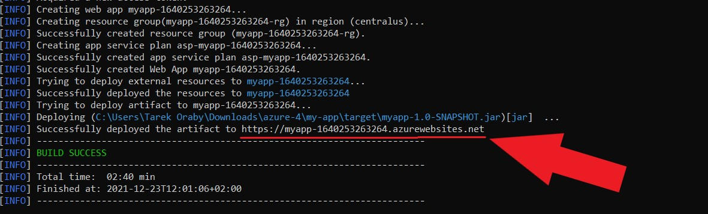

= Deploying a Vaadin Application to Azure Cloud

// Allow "Container Apps"
pass:[<!-- vale Vaadin.Terms = NO -->]
// Allow "App Service"
pass:[<!-- vale Vaadin.Terms-App = NO -->]

This tutorial shows you how to deploy a Vaadin application to Microsoft's Azure cloud using the traditional https://learn.microsoft.com/en-us/azure/app-service/overview/[App Service], that works well for most typical Vaadin applications. If you have specific requirements, Azure has several other options to host Vaadin applications, such as raw virtual machines, and Container Apps (which are used in <<{articles}/tutorial/production-deployment#,the tutorial>>). Azure also has great https://vaadin.com/clustering[Kubernetes support].

pass:[<!-- vale Vaadin.Terms = YES -->]
pass:[<!-- vale Vaadin.Terms-App = YES -->]

Azure offers a 30-day free trial that includes 12 months of free commercial services. You can find details of their free and commercial services on the link:https://azure.microsoft.com/[Azure website].

.Azure account required
[NOTE]
To complete this tutorial, you need an Azure account.
You can sign up at https://signup.azure.com/.

== Step 1: Install the Azure CLI

You can find installation instructions for different platforms in the link:https://docs.microsoft.com/en-us/cli/azure/?view=azure-cli-latest[Azure CLI documentation].

== Step 2: Download a Starter App

Download a minimal Vaadin project and unpack the downloaded zip into a folder on your computer.

link:https://start.vaadin.com/dl[Download project]

== Step 3: Add the Azure Plugin

Open your [filename]`pom.xml` file and add the following section in the `<plugins>` tag in the `<build>` section:

.`pom.xml`
[source,xml]
----
<plugin>
  <groupId>com.microsoft.azure</groupId>
  <artifactId>azure-webapp-maven-plugin</artifactId>
  <version>2.5.0</version>
</plugin>
----

// Allow "App Service"
pass:[<!-- vale Vaadin.Terms-App = NO -->]

Check the latest version of the plugin from the link:https://learn.microsoft.com/en-us/azure/app-service/quickstart-java?tabs=javase&pivots=platform-linux-development-environment-maven#3---configure-the-maven-plugin[Azure App Service docs].

pass:[<!-- vale Vaadin.Terms-App = YES -->]

== Step 4: Create a Production Build

Open the project directory from a terminal window, and enter the following command to generate a `JAR` file of your application:

[source,terminal]
----
mvn package -Pproduction
----

== Step 5: Configure Your Application

From the terminal window, enter the following command:

[source,terminal]
----
mvn azure-webapp:config
----

This command authenticates you with Azure via the browser, assuming you aren't already logged in with Azure CLI.
Then you are prompted to choose from various options.
For example, you could select the following:

. *<create>* when asked to choose a Java SE Web App
. *Linux* when asked to choose an OS
. *Java* 11 for the Java version
. *F1* for the `pricingTier`
. Enter *'Y'* on your keyboard to confirm

image::images/azure-choices.png[Azure CLI choices]

== Step 6: Deploy Your Application

Enter the following command to deploy your application:

[source,terminal]
----
mvn azure-webapp:deploy
----

You may be required to authenticate again in the browser.
Once authenticated, your application is deployed to Azure and you should see your application URL in the logs, as in the following screenshot.

++++

++++
