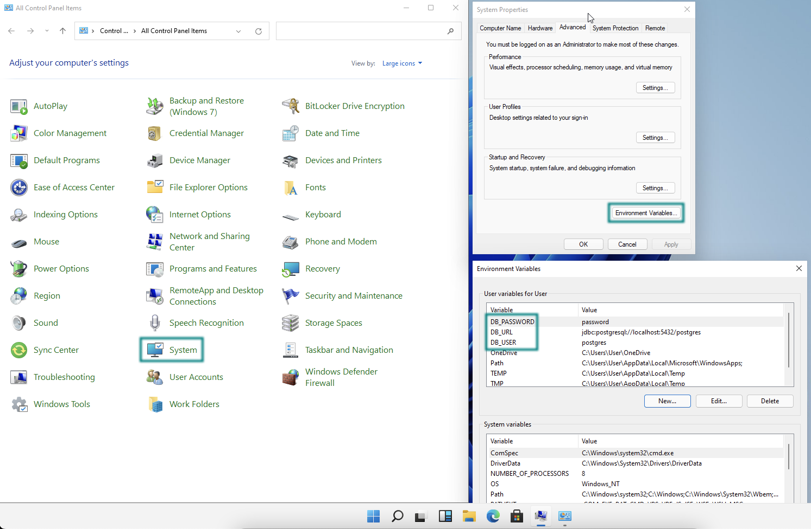

= Storing Sensitive Data in a Spring Boot Application

It's often bad practice to put sensitive information, such as database URI, username, or password, in your [filename]`application.properties` file. If sensitive information is stored in project files or code, it might leak when you commit your project to source control management systems.

To avoid leaking sensitive information, you should consider storing sensitive information outside of your project files. In no case should you ever `git commit` passwords or other secrets into the repository.

This guide demonstrates three ways to externalize sensitive data: using system environment variables; using an external properties file; and using encrypted property values with Jasypt.

== Use System Environment Variables

One of the easiest ways to externalize sensitive information is to set those values as system environment variables.

For example, a https://start.vaadin.com/[Vaadin Start] project configured to use PostgreSQL might contain the following sensitive information in the [filename]`application.properties` file.

.application.properties
[source,properties]
----
...
spring.datasource.url = jdbc:postgresql://localhost:5432/postgres
spring.datasource.username = postgres
spring.datasource.password = password
...
----

To replace the sensitive information with system environment variables, you should edit your file similarly to the following:

.application.properties
[source,properties]
----
...
spring.datasource.url = ${DB_URL}
spring.datasource.username = ${DB_USER}
spring.datasource.password = ${DB_PASSWORD}
...
----

The `${...}` token is the special syntax for Spring's https://docs.spring.io/spring-boot/docs/current/reference/html/features.html#features.external-config.files.property-placeholders[property placeholder], while `DB_URL`, `DB_USER`, and `DB_PASSWORD` represent the actual environment variables that you need to set in your own system.

On Linux and macOS, use the following commands in a terminal to temporarily set the environment variables.

[source,zsh]
----
export DB_URL=jdbc:postgresql://localhost:5432/postgres
export DB_USER=postgres
export DB_PASSWORD=password
----

However, if you want to set the environment variables permanently, you need to add these commands to your [filename]`~/.zprofile` (_zsh_) or [filename]`~/.bashrc` (_bash_) files, depending on your system's default shell.

On Windows, you can set the environment variable by:

- Navigating to *Control Panel* > *System*.
- In *System Properties*, select *Advanced* > *Environment Variables*.
- Add new user or system environment variables by using the *New* buttons.

== Import Configuration from External File

Another simple solution to externalize sensitive information would be to import external property files using Spring Boot's `spring.config.import` properties.

Assuming that you have an external file called [filename]`db.properties` to hold your database secrets,

.db.properties
[source,properties]
----
spring.datasource.url = jdbc:postgresql://localhost:5432/postgres
spring.datasource.username = postgres
spring.datasource.password = password
----

Then you can import this file into your Vaadin app's default [filename]`application.properties` instead.

.application.properties
[source,properties]
----
...
spring.config.import = file:/Users/MyUserName/secret/db.properties
...
----

== Use Encrypted Property Values with Jasypt
Jasypt (Java Simplified Encryption) is a Java library that provides simple and transparent encryption/decryption for application data. It integrates with Spring Boot to encrypt sensitive values (e.g., database passwords) directly in properties files like `application.properties`.

This prevents accidental exposure of sensitive values by decrypting values at runtime using a master password.

For using this in your project, add the Jasypt Spring Boot starter dependency in the project like this:

.pom.xml
[source,xml]
----
...
<dependency>
  <groupId>com.github.ulisesbocchio</groupId>
  <artifactId>jasypt-spring-boot-starter</artifactId>
  <version>3.0.4</version>
</dependency>
...
----

Add the Jasypt Maven plugin to the plugins section.

.pom.xml
[source,xml]
----
...
<plugin>
  <groupId>com.github.ulisesbocchio</groupId>
  <artifactId>jasypt-maven-plugin</artifactId>
  <version>3.0.4</version>
</plugin>
...
----

Enable Jasypt for properties decryption by annotating a `@Configuration` class with `@EnableEncryptableProperties`. Only one occurrence of this annotation is needed.

For example, add `@EnableEncryptableProperties` annotation to the Spring Boot `Application` class like this:

.Application.java
[source,java]
----
...
@SpringBootApplication
@EnableEncryptableProperties
public class Application implements AppShellConfigurator {
...
----

Now, wrap the values that you want to encrypt with `DEC()`, for example, `DEC(your-secret-value-here)` in any properties file that is used in the Spring Boot application like this:

.application.properties
[source,properties]
----
...
spring.datasource.password=DEC(super-secret-password)
...
----

Run the following command to encrypt the values in place. The `jasypt.plugin.path` should point to the properties file where you have the `DEC()` wrapped value which you want to encrypt.

The file path specified is relative to the directory the command is executed in.

[source,sh]
----
mvn jasypt:encrypt -Djasypt.encryptor.password=<choose-a-password-to-use-for-encryption> -Djasypt.plugin.path="file:src/main/resources/application.properties"
----

Once the above command completes, all `DEC()` wrapped values in the properties file should have been encrypted in place and replaced with `ENC(....)` like this:

.application.properties
[source,properties]
----
...
spring.datasource.password=ENC(C7lfsna/9gxDsdfsdfsXiJQcFzpsdfsdfss70sdfsdfsr2wfjEa+qDM)
...
----

The Jasypt encrypted property files can be checked into source control, since the values are now encrypted.

.Do not commit the password used for encryption
[CAUTION]
If the password is leaked all encrypted values are compromised. Attackers with read access to both the encrypted file and the password can recover the sensitive values.

When starting the application, set the system property `jasypt.encryptor.password` to the password that was used for encryption in the step above.

For example,
[source,sh]
----
java -Djasypt.encryptor.password=<the-password-used-for-encryption> -jar your-application.jar
----

[discussion-id]`FCC4C231-5DB9-4950-9559-C89630042A43`
