= [since:com.vaadin:vaadin@V24.3]#Navigation Access Control#

Navigation Access Control is a Flow security feature in which you can allow or deny the navigation to a certain view based on different and pluggable rules. When active, the access control intercepts navigation events, evaluates all configured rules. It then decides whether the target view should be rendered, or if the access should be denied.

Navigation Access Control is an improvement and a replacement of the [deprecated:com.vaadin:vaadin@V24.3]#[classname]`ViewAccessChecker` mechanism#. It provides annotation-based view security. It also expands the capabilities of the former access checker by introducing a new path-based check and by allowing custom rules, which are set by implementing the [interfacename]`NavigationAccessChecker` interface.

== Architecture

The Navigation Access Control mechanism is composed of three fundamental components: [classname]`NavigationAccessControl`; [interfacename]`NavigationAccessChecker`; and [interfacename]`AccessCheckDecisionResolver`.

[classname]`NavigationAccessControl` is the entry point for navigation security. It listens for navigation events, and it evaluates all security rules. Based on the results, it allows or denies access to the target view.

[interfacename]`NavigationAccessChecker` interface implementers represent the security rules that are evaluated during a navigation event.

[interfacename]`AccessCheckDecisionResolver` has the responsibility of taking the final decision to allow or deny a navigation, based on the result of the evaluation of the security rules.

[.fill.white]
[link=images/navigation_access_control.svg]

[classname]`NavigationAccessControl` can be configured to evaluate multiple [interfacename]`NavigationAccessChecker`. For example, you can enable annotation-based view access check and path-based access check. During a navigation request, both checkers are evaluated against the current [classname]`NavigationContext` and they produce an [classname]`AccessCheckResult`.

The [interfacename]`AccessCheckDecisionResolver` analyzes the results and provides the final decision. The access control uses that decision to proceed with the navigation or reroute to the login view or to an error page.

=== Navigation Access Checkers

Vaadin Flow provides two implementations of [interfacename]`NavigationAccessChecker` interface: [classname]`AnnotatedViewAccessChecker` and [classname]`RoutePathAccessChecker`.

==== AnnotatedViewAccessChecker

[classname]`AnnotatedViewAccessChecker` works in the same way as the former [classname]`ViewAccessChecker`. It looks for security annotation ([annotationname]`@AnonymousAllowed`, [annotationname]`@PermitAll`, [annotationname]`@RolesAllowed`, or [annotationname]`@DenyAll`) on the target view class. It evaluates them against the current navigation context. [classname]`AnnotatedViewAccessChecker` delegates the check to an instance of [classname]`AccessAnnotationChecker`, that can be extended to provide custom rules.

==== RoutePathAccessChecker

[classname]`RoutePathAccessChecker` evaluates instead the path used to navigate to a view. It requires an implementation of [interfacename]`AccessPathChecker`, that is responsible for the effective path verification.

The Vaadin Spring add-on offers an [interfacename]`AccessPathChecker` implementation based on Spring Security configuration. The path used to navigate to the target view is evaluated using the Spring [interfacename]`WebInvocationPrivilegeEvaluator` component, that applies the rules defined by the request matchers configured for Spring Security.

This means that to protect a Flow route, you can configure a Spring request matchers matching the route path, and use the authorization helpers to define the access grants, as in the following example.

[.example]
--

[source,java]
----
<source-info group="VaadinSecurityConfigurer"></source-info>
@Route("admin")
public class AdminView extends Div { }

@Route("protected/profile")
public class ProfileView extends Div { }

@Route("special/preview-feature")
public class ProfileView extends Div { }

@Route("")
public class HomeView extends Div { }

@Configuration
@EnableWebSecurity
@Import(VaadinAwareSecurityContextHolderStrategyConfiguration.class)
public class SecurityConfig {

    @Bean
    SecurityFilterChain securityFilterChain(HttpSecurity http) throws Exception {
        http.authorizeHttpRequests(auth -> auth
                .requestMatchers(PathPatternRequestMatcher.withDefaults()
                            .matcher("/admin")).hasAnyRole(ROLE_ADMIN)
                .requestMatchers(PathPatternRequestMatcher.withDefaults()
                            .matcher("/protected/**")).authenticated()
                .requestMatchers(PathPatternRequestMatcher.withDefaults()
                            .matcher("/special/**"))
                    .access((authentication, object) -> {
                        // Custom authorization logic
                        return new AuthorizationDecision(isPremiumUser(authentication));
                    })
                .requestMatchers(PathPatternRequestMatcher.withDefaults()
                            .matcher("/"))
                .permitAll()
        );

        http.with(VaadinSecurityConfigurer.vaadin(), configurer -> {
            // Configure Vaadin security settings
        });

        return http.build();
    }
}
----

[source,java]
----
<source-info group="VaadinWebSecurity (deprecated since V24.8)"></source-info>
@Route("admin")
public class AdminView extends Div { }

@Route("protected/profile")
public class ProfileView extends Div { }

@Route("special/preview-feature")
public class ProfileView extends Div { }

@Route("")
public class HomeView extends Div { }

public class SecurityConfig extends VaadinWebSecurity {

    @Override
    public void configure(HttpSecurity http) throws Exception {
        http.authorizeHttpRequests(auth -> auth
                .requestMatchers(antMatchers("/admin")).hasAnyRole(ROLE_ADMIN)
                .requestMatchers(antMatchers("/protected/**")).authenticated()
                .requestMatchers(antMatchers("/special/**"))
                    .access((authentication, object) -> {
                        // Custom authorization logic
                        return new AuthorizationDecision(isPremiumUser(authentication));
                    })
                .requestMatchers(antMatchers("/"))
                .permitAll()
        );
    }
}
----

--

Integration with other security frameworks can be accomplished similarly by providing a specific [interfacename]`AccessPathChecker` implementation.

==== Implementing a Custom Navigation Access Checker

If the above checkers aren't enough to fulfill the project requirements, a custom [classname]`NavigationAccessChecker` can be implemented. [classname]`NavigationAccessChecker` has a single method that takes a [classname]`NavigationContext` as input and produces an [classname]`AccessCheckResult` as output.

The [classname]`NavigationContext` provides information about the current navigation, such as target view class and location, potential authenticated user and its roles.

The [classname]`AccessCheckResult` holds the decision taken by the checker -- and potentially an informative reason about the decision. The decision can be `ALLOW`, `DENY`, `NEUTRAL`, or `REJECT`. `ALLOW` and `DENY` are self-explanatory. `NEUTRAL` means that the checker doesn't have enough information to make a decision, and it delegates the responsibility to the other configured checkers. `REJECT` has the same meaning of `DENY`, but it's used to signal a critical situation where the checker cannot make the decision because of a system configuration error.

In development mode, a rejection is handled by throwing an exception so that the situation can be detected immediately. The [classname]`AccessCheckResult` object is created by calling its factory methods [methodname]`allow`, [methodname]`deny`, [methodname]`neutral`, or [methodname]`reject`. In alternative, similar methods can be called on [classname]`NavigationContext` instance.

For example, a navigation access check implementation that allows access to a voting view only when voting has been marked as open, could look like the following code:

[source,java]
----
include::{root}/src/main/java/com/vaadin/demo/flow/auth/VotingNavigationAccessChecker.java[tags=snippet]
----

==== Navigation Error Handling Phase

When implementing a custom [classname]`NavigationAccessChecker`, it's important to know that the checker is called also when the navigation is rerouted to an error handler view. The [classname]`NavigationContext` class provides the [methodname]`isErrorHandling()` method to verify if the call happens during a navigation error handling phase. In this case, a custom checker would probably abstain from making a decision for the internal navigation, by returning a `NEUTRAL` result.

.Neutral Result on Error Handling Phase
[source,java]
----
@Override
public AccessCheckResult check(NavigationContext context) {
    if (context.isErrorHandling()) {
        return AccessCheckResult.neutral();
    }
    ....
}
----

=== Decision Resolver

The [interfacename]`AccessCheckDecisionResolver` component is responsible for analyzing the results provided by the navigation access checkers, and for computing the final decision to grant or deny access to a view.

The default implementation makes the decision by applying the following rules:

.Default Decision Resolver Rules
[cols="1,1"]
|===
| Navigation Access Checkers Results | Decision

| `ALL ALLOW`              | `ALLOW`
| `ALLOW + NEUTRAL`        | `ALLOW`
| `ALL DENY`               | `DENY`
| `DENY + NEUTRAL`         | `DENY`
| `ALL NEUTRAL`            | `DENY`
| `ALLOW + DENY`           | `REJECT`
| `ALLOW + DENY + NEUTRAL` | `REJECT`
|===

As shown in the above table, if the navigation access checkers do not agree on the decision -- excluding neutral votes -- the default resolver rejects the navigation, causing an exception to be thrown in development mode. This situation happens usually because of invalid security configurations. For example, a view may be annotated with [annotationname]`@AnonymousAllowed`, but the Spring Security configuration has a request matcher for the view path that grants access only to an authenticated user.

In error handling phase, almost the same rule applies with the exception that if all the results are `NEUTRAL`, the access is granted.
The reason is that, in this case, the target of the navigation is supposed to be an error handler component that do not expose sensible information.

.Default Decision Resolver Rules For Error Handling Phase
[cols="1,1"]
|===
| Navigation Access Checkers Results | Decision

| `ALL ALLOW`              | `ALLOW`
| `ALLOW + NEUTRAL`        | `ALLOW`
| `ALL NEUTRAL`            | `ALLOW`
| `ALL DENY`               | `DENY`
| `DENY + NEUTRAL`         | `DENY`
| `ALLOW + DENY`           | `REJECT`
| `ALLOW + DENY + NEUTRAL` | `REJECT`
|===

If the default implementation doesn't fit the requirements of the project, you can implement your own [interfacename]`AccessCheckDecisionResolver`. The interface defines a single method that takes as input the results computed by the navigation access checker and the current navigation context. Its output is an [classname]`AccessCheckResult`.

In the following example, the decision resolver allows access to the view if at least one of the checkers provided an `ALLOW` result:

[source,java]
----
include::{root}/src/main/java/com/vaadin/demo/flow/auth/CustomDecisionResolver.java[tags=snippet]
----

== Configuration

Navigation Access Control is enabled automatically on Spring Boot projects using <<#configurer,VaadinSecurityConfigurer>>. To enable the feature in plain Java projects, follow the specific <<{articles}/flow/security/advanced-topics/securing-plain-java-app#, documentation page>>.

This section shows how to customize Navigation Access Control for both Spring and plain Java projects.

=== Spring Projects

When using [classname]`VaadinSecurityConfigurer` for configuring Spring Security, the Navigation Access Control feature is enabled by default. You can disable it by calling the [methodname]`enableNavigationAccessControl(false)` method on the configurer. For backward compatibility, only the [classname]`AnnotatedViewAccessChecker` is active by default.

For a fine-grained configuration, you can expose a bean of type [classname]`NavigationAccessControlConfigurer`. [classname]`NavigationAccessControlConfigurer` allows activating out-of-the-box navigation access checkers or adding new ones, providing a custom decision resolver, completely disable the functionality, etc.

[NOTE]
If [classname]`VaadinSecurityConfigurer` is not used, exposing the [classname]`NavigationAccessControlConfigurer` bean is mandatory to activate navigation access control.

In the following example, Navigation Access Control is configured to activate route path checker, a custom checker instance and all available [interfacename]`NavigationAccessChecker` beans that extend [classname]`VotingNavigationAccessChecker`. It also provides a custom decision resolver.

.Customize NavigationAccessControl in Spring Project
[source,java]
----
@Bean
NavigationAccessControlConfigurer navigationAccessControlConfigurerCustomizer() {
    return new NavigationAccessControlConfigurer()
            .withRoutePathAccessChecker() // <1>
            .withNavigationAccessChecker(new CustomChecker()) // <2>
            .withAvailableNavigationAccessCheckers(checker ->
                checker instanceof VotingNavigationAccessChecker  // <3>
            )
            .withDecisionResolver(new CustomDecisionResolver()); // <4>
}
----
<1> Activates the route path access checker. The implementation is provided by the Vaadin Spring module and exposed as a bean.
<2> Adds a custom navigation access checker, by creating a new instance.
<3> Activates all registered navigation access checker bean, that matches the predicate.
<4> Sets a custom decision resolver.

[IMPORTANT]
When using [classname]`VaadinSecurityConfigurer` in the same configuration class where you define the [classname]`NavigationAccessControlConfigurer` bean, make sure to declare the bean method as `static` to prevent bootstrap errors due to circular dependencies in bean definitions.

[.example]
--

.Define NavigationAccessControlConfigurer Bean with VaadinSecurityConfigurer
[source,java]
----
<source-info group="VaadinSecurityConfigurer"></source-info>
@Configuration
@EnableWebSecurity
public class SecurityConfig {
    @Bean
    static NavigationAccessControlConfigurer navigationAccessControlConfigurer() {
        return new NavigationAccessControlConfigurer()
            .withRoutePathAccessChecker()
            .withDecisionResolver(new CustomDecisionResolver());
    }

    @Bean
    SecurityFilterChain securityFilterChain(HttpSecurity http) throws Exception {
        return http.with(VaadinSecurityConfigurer.vaadin(), configurer -> {
            // VaadinSecurityConfigurer will use the NavigationAccessControlConfigurer bean
        }).build();
    }
}
----

.Define NavigationAccessControlConfigurer Bean in VaadinWebSecurity Subclass
[source,java]
----
<source-info group="VaadinWebSecurity (deprecated since V24.8)"></source-info>
class SecurityConfig extends VaadinWebSecurity {
    @Bean
    static NavigationAccessControlConfigurer navigationAccessControlConfigurer() {
        return new NavigationAccessControlConfigurer()
            .withRoutePathAccessChecker()
            .withDecisionResolver(new CustomDecisionResolver());
    }
}
----

--
Consult the [classname]`NavigationAccessControlConfigurer` Javadoc for more information on how navigation access control can be customized.

=== Plain Java Projects

Navigation Access Control settings in plain Java projects is documented in this <<{articles}/flow/security/advanced-topics/securing-plain-java-app#adding-vaadinserviceinitlistener, separate page>>.

To apply custom settings, you need to create the [classname]`NavigationAccessControl` instance, providing the list of navigation access checkers and the decision resolver to be used.

It's important to know that for plain Java projects, there is no out-of-the-box support for route path access checking. However, as described earlier, it is possible to implement a custom [interfacename]`AccessPathChecker` that integrates with the security framework used in the project.

Here is how you can implement the example of the previous paragraph, in a non-Spring Java project:

.Custom NavigationAccessControl in Plain Java Project
[source,java]
----
public class FooBarSecurityAccessPathChecker implements AccessPathChecker {
    @Override
    public boolean hasAccess(
        String path, Principal principal, Predicate<String> roleChecker) {
        // implementation omitted
    }
}

public class NavigationAccessCheckerInitializer implements VaadinServiceInitListener {

    public NavigationControlAccessCheckerInitializer() {
        accessControl = new NavigationAccessControl(List.of(
            new RoutePathAccessChecker(new FooBarSecurityAccessPathChecker()),
            new CustomChecker(),
            new VotingNavigationAccessChecker()
        ), new CustomDecisionResolver());
        accessControl.setLoginView(LoginView.class);
    }
}
----

[#configurer]
=== [since:com.vaadin:vaadin@V24.8]#VaadinSecurityConfigurer#

==== Overview

`VaadinSecurityConfigurer` is a Spring Security HTTP configurer specifically designed for Vaadin applications.
It provides built-in customizers to configure security settings for Flow and Hilla by integrating with Spring Security and specialized methods to handle view access control and default security workflows in Vaadin applications.
This configurer follows Spring Security's recommended patterns for security configuration and allows for modular, composable security customization.

==== Usage

The `VaadinSecurityConfigurer` can be used in a Spring Security configuration class to set up security for Vaadin applications:

[source,java]
----
@Configuration
@EnableWebSecurity
@Import(VaadinAwareSecurityContextHolderStrategyConfiguration.class)
public class SecurityConfig {

    @Bean
    SecurityFilterChain securityFilterChain(HttpSecurity http) throws Exception {
        return http.with(VaadinSecurityConfigurer.vaadin(), configurer -> {
            configurer.loginView(MyLoginView.class);
        }).build();
    }
}
----

The `VaadinAwareSecurityContextHolderStrategyConfiguration` is imported manually to ensure that the [classname]`VaadinSession`-based security context holder is initialized.

==== Applied Configurers

The `VaadinSecurityConfigurer` applies several other Spring Security configurers to set up the security filter chain:

* `FormLoginConfigurer` — If a login view is set with `loginView(Class)` (or overloads)
* `OAuth2LoginConfigurer` — If a login page for OAuth2 authentication is set with `oauth2LoginPage(String)` (or overloads)
* `CsrfConfigurer` — To allow, internal framework requests (can be disabled)
* `LogoutConfigurer` — To configure logout handlers for Vaadin applications (can be disabled)
* `RequestCacheConfigurer` — To set a request cache designed for Vaadin applications (can be disabled)
* `ExceptionHandlingConfigurer` — To configure proper exception handling for Vaadin applications (can be disabled)
* `AuthorizeHttpRequestsConfigurer` — To permit internal framework requests and other public endpoints (can be disabled)

==== Shared Objects

The following beans are shared by this configurer (if not already shared):

* `RequestUtil` — Utility class for request-based security checks
* `AuthenticationContext` — Provides information about the current logged-in user and its roles
* `NavigationAccessControl` — Entry point for navigation access control
* `VaadinRolePrefixHolder` — Holds role prefix accessible outside an active request
* `VaadinDefaultRequestCache` — A request cache implementation which ignores requests that are not for routes
* `VaadinSavedRequestAwareAuthenticationSuccessHandler` — A strategy that uses an available VaadinSession for retrieving the security context

==== Configuration Methods

===== Login View Configuration

[source,java]
----
public VaadinSecurityConfigurer loginView(Class<? extends Component> loginView)
----

Configures the login view for use in a Flow application. The provided login view class must be annotated with `@Route`.

[source,java]
----
public VaadinSecurityConfigurer loginView(Class<? extends Component> loginView, String logoutSuccessUrl)
----

Configures the login view for use in a Flow application and the logout success URL.

[source,java]
----
public VaadinSecurityConfigurer loginView(String loginView)
----

Configures the login view for use in a Hilla application. This is used when your application uses a Hilla-based login view that is available at the given path.

[source,java]
----
public VaadinSecurityConfigurer loginView(String loginView, String logoutSuccessUrl)
----

Configures the login view for use in a Hilla application and the logout success URL.

===== OAuth2 Configuration

[source,java]
----
public VaadinSecurityConfigurer oauth2LoginPage(String oauth2LoginPage)
----

Configures the login page for OAuth2 authentication. If using Spring's OAuth2 client, this should be set to Spring's internal redirect endpoint `/oauth2/authorization/{registrationId}` where `{registrationId}` is the ID of the OAuth2 client registration.

[source,java]
----
public VaadinSecurityConfigurer oauth2LoginPage(String oauth2LoginPage, String postLogoutRedirectUri)
----

Configures the login page for OAuth2 authentication and the post-logout redirect URI.

===== Logout Configuration

[source,java]
----
public VaadinSecurityConfigurer logoutSuccessHandler(LogoutSuccessHandler logoutSuccessHandler)
----

Configures the handler for a successful logout. This overrides the default handler configured automatically with either `loginView(Class)` or `oauth2LoginPage(String)` (and their overloads).

[source,java]
----
public VaadinSecurityConfigurer addLogoutHandler(LogoutHandler logoutHandler)
----

Adds a `LogoutHandler` to the list of logout handlers.

===== Feature Toggles

[source,java]
----
public VaadinSecurityConfigurer enableCsrfConfiguration(boolean enableCsrfConfiguration)
----

Enables or disables automatic CSRF configuration (enabled by default). This configurer will automatically configure Spring's CSRF filter to allow Vaadin internal framework requests to be properly processed.

[source,java]
----
public VaadinSecurityConfigurer enableLogoutConfiguration(boolean enableLogoutConfiguration)
----

Enables or disables automatic logout configuration (enabled by default). This configurer will automatically configure logout behavior to work properly with Flow and Hilla.

[source,java]
----
public VaadinSecurityConfigurer enableRequestCacheConfiguration(boolean enableRequestCacheConfiguration)
----

Enables or disables automatic configuration of the request cache (enabled by default). This configurer will automatically configure the request cache to work properly with Vaadin's internal framework requests.

[source,java]
----
public VaadinSecurityConfigurer enableExceptionHandlingConfiguration(boolean enableExceptionHandlingConfiguration)
----

Enables or disables automatic configuration of exception handling (enabled by default). This configurer will automatically configure exception handling to work properly with Flow and Hilla.

[source,java]
----
public VaadinSecurityConfigurer enableAuthorizedRequestsConfiguration(boolean enableAuthorizedRequestsConfiguration)
----

Enables or disables automatic configuration of authorized requests (enabled by default). This configurer will automatically configure authorized requests to permit requests to anonymous Flow and Hilla views, and static assets.

[source,java]
----
public VaadinSecurityConfigurer enableNavigationAccessControl(boolean enableNavigationAccessControl)
----

Enables or disables configuration of `NavigationAccessControl`. `NavigationAccessControl` is enabled by default.

===== Request Matchers

[source,java]
----
public VaadinSecurityConfigurer anyRequest(Consumer<AuthorizeHttpRequestsConfigurer<HttpSecurity>.AuthorizedUrl> anyRequestAuthorizeRule)
----

Configures the access rule for any request not matching other configured rules. The default rule is to require authentication, which is the equivalent of passing `AuthorizedUrl::authenticated()` to this method.

[source,java]
----
public RequestMatcher defaultPermitMatcher()
----

Creates and returns a composite `RequestMatcher` for identifying requests that should be permitted without authentication within a Vaadin application. This matcher combines multiple specific matchers, including those for framework internal requests, anonymous endpoints, allowed Hilla views, anonymous routes, custom web icons, and default security configurations.

==== Examples

===== Basic Configuration

[classname]`VaadinSecurityConfigurer` exposes a factory method [methodname]`vaadin` that creates a new instance of the `VaadinSecurityConfigurer`:

[source,java]
----
@Configuration
@EnableWebSecurity
@Import(VaadinAwareSecurityContextHolderStrategyConfiguration.class)
public class SecurityConfig {

    @Bean
    SecurityFilterChain securityFilterChain(HttpSecurity http) throws Exception {
        return http.with(VaadinSecurityConfigurer.vaadin(), configurer -> {
            configurer.loginView(LoginView.class);
        }).build();
    }
}
----

===== Multiple Filter Chains

[source,java]
----
@Configuration
@EnableWebSecurity
@Import(VaadinAwareSecurityContextHolderStrategyConfiguration.class)
public class SecurityConfig {

    @Bean
    SecurityFilterChain privateFilterChain(HttpSecurity http) throws Exception {
        return http.securityMatcher("/private/**")
                .with(VaadinSecurityConfigurer.vaadin(), configurer -> {
                    configurer.loginView(LoginView.class);
                }).build();
    }

    @Bean
    SecurityFilterChain publicFilterChain(HttpSecurity http) throws Exception {
        return http.securityMatcher("/public/**")
                .with(VaadinSecurityConfigurer.vaadin(), configurer -> {
                    configurer.anyRequest(AuthorizedUrl::permitAll);
                }).build();
    }
}
----

===== Custom Authorization Rules

[source,java]
----
@Configuration
@EnableWebSecurity
@Import(VaadinAwareSecurityContextHolderStrategyConfiguration.class)
public class SecurityConfig {

    @Bean
    SecurityFilterChain securityFilterChain(HttpSecurity http) throws Exception {
        http.authorizeHttpRequests(auth -> auth
                .requestMatchers(PathPatternRequestMatcher.withDefaults()
                            .matcher("/admin-only/**")).hasAnyRole("ADMIN")
                .requestMatchers(PathPatternRequestMatcher.withDefaults()
                            .matcher("/public/**")).permitAll()
                .requestMatchers(PathPatternRequestMatcher.withDefaults()
                            .matcher("/error")).permitAll());

        http.with(VaadinSecurityConfigurer.vaadin(), configurer -> {
            configurer.loginView(LoginView.class)
                    .logoutSuccessHandler(this::onLogoutOnNonVaadinUrl)
                    .addLogoutHandler((request, response, authentication) -> {
                        // Custom logout logic
                    });
        });

        return http.build();
    }
}
----

===== Disabling Features

[source,java]
----
@Configuration
@EnableWebSecurity
@Import(VaadinAwareSecurityContextHolderStrategyConfiguration.class)
public class SecurityConfig {

    @Bean
    SecurityFilterChain securityFilterChain(HttpSecurity http) throws Exception {
        return http.with(VaadinSecurityConfigurer.vaadin(), configurer -> {
            configurer.loginView(LoginView.class)
                    .enableCsrfConfiguration(false)
                    .enableNavigationAccessControl(false);
        }).build();
    }
}
----

[discussion-id]`4164EB30-201D-4FD3-940F-03630A752AD5`
