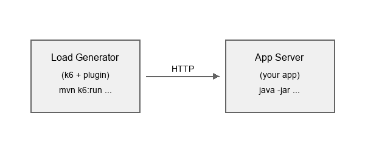

= [since:com.vaadin:vaadin@V25.2]#Load Testing#

:commercial-feature: TestBench
include::{articles}/_commercial-banner.adoc[opts=optional]

Vaadin provides a Maven plugin that converts <<{articles}/flow/testing/end-to-end#,TestBench end-to-end tests>> or <<{articles}/flow/testing/playwright#,Playwright tests>> into https://grafana.com/docs/k6/latest/[k6] load tests. This allows you to reuse your existing E2E tests as realistic user scenarios for performance testing, without writing separate load test scripts.

The plugin records browser traffic from TestBench tests, converts it into k6 scripts, and handles Vaadin-specific details such as session management, <<{articles}/flow/security/advanced-topics/vulnerabilities#cross-site-request-forgery-csrf,CSRF (Cross-Site Request Forgery)>> tokens, and push communication. The generated scripts can then be run with k6 against any server.

== How It Works

The load testing workflow has three stages:

. *Record* -- A TestBench test runs through a recording proxy that captures all HTTP traffic as a https://en.wikipedia.org/wiki/HAR_(file_format)[HAR (HTTP Archive)] file, a standard JSON format for recording browser network activity.
. *Convert* -- The HAR file is converted into a k6 script, with Vaadin-specific refactoring applied: dynamic session ID extraction, CSRF token handling, UI and Push ID management, and configurable target server. Form input values are extracted into a CSV data file for per-user variation.
. *Run* -- The k6 script is executed with a configurable number of virtual users and duration against a target server.

The plugin uses pure Java utilities. No Node.js is required.

[IMPORTANT]
====
For results that reflect real-world behavior, run the actual load test against your production server -- or a staging environment configured as closely as possible to it (same JVM, memory, CPU, database, network topology, and TLS termination).
Recording can be done against a local development build, but the measured run should target the environment whose performance you care about.
Running it against `localhost` or a developer laptop produces numbers that do not generalize to production, but can be used to validate the script.
====

== Prerequisites

The following tools are needed:

- *Java 21+*
- *Maven 3.9+*
- *k6* -- Install from https://grafana.com/docs/k6/latest/get-started/installation/[Grafana k6 documentation]. On macOS: `brew install k6`.
- *Chrome* -- Latest version, with ChromeDriver.
- *TestBench* -- Existing <<{articles}/flow/testing/end-to-end#, end-to-end tests>>.
- *Application* -- Production mode built application.

[[setup]]
== Setting Up Your Project

Add the plugin to your Maven project:

[source,xml]
----
<plugin>
    <groupId>com.vaadin</groupId>
    <artifactId>testbench-converter-plugin</artifactId>
</plugin>
----

If the platform pom is not defined add the testbench version `<version>${testbench.version}</version>`

Add the load test support library as a dependency:

[source,xml]
----
<dependency>
    <groupId>com.vaadin</groupId>
    <artifactId>testbench-loadtest-support</artifactId>
</dependency>
----

This library provides [classname]`LoadTestItHelper` for <<proxy-configuration,proxy driver configuration>> in your tests, the `@Destructive` annotation for <<destructive,excluding tests from recording>>, and automatic WebDriver cleanup during recording.
It also includes runtime features such as <<error-handler,error propagation>> and <<metrics,server metrics>> for load testing.

The JUnit 5 extension auto-detects when the recording proxy is active and skips tests annotated with `@Destructive`.
It auto-registers via ServiceLoader -- no code changes are needed.

[[writing-tests]]
== Adapting Tests for Load Testing

Standard TestBench integration tests define user workflows, and the same tests you use for functional verification can serve as load test scenarios. If you update your application or tests, the load tests are automatically updated on next recording.

For an introduction to writing TestBench tests -- element queries, page objects, assertions, and so on -- see <<{articles}/flow/testing/end-to-end#, End-to-End Testing>> and <<{articles}/flow/testing/end-to-end/creating-tests#, Creating Tests>>.
The remainder of this section covers only the parts that differ when a TestBench test is used as a load test scenario.

In practice, you may want to select certain scenarios from your existing E2E test suite, or create dedicated scenarios that reuse your page object classes.

[NOTE]
====
Be aware that load test scenarios run many times concurrently across multiple virtual users. If a scenario modifies shared state -- such as editing and saving a record in a database -- subsequent runs may encounter different application state than the original E2E test expected. For example, a scenario that clicks a button to save a form may work the first time, but on the next run the button could be disabled (because the record was already modified), causing the test to fail or log a warning when the framework blocks the interaction.

Design load test scenarios to be *repeatable*: prefer read-only workflows, use scenarios that create new data rather than editing existing records, or ensure the application state resets between runs. For test methods that modify shared state in ways that cannot be safely replayed, use the <<destructive,`@Destructive`>> annotation to exclude them from recording.
====

[[proxy-configuration]]
=== Proxy Configuration

To make a TestBench test recordable, call one of the helper methods on [classname]`LoadTestItHelper` from your `@BeforeEach`:

[source,java]
----
@BeforeEach
public void open() {
    setDriver(LoadTestItHelper.openWithProxy(
            getDriver(), LoadTestItHelper.getRootURL() + "/"));
}
----

That is the whole setup -- no proxy ports, certificates, or driver flags to manage.
Use [methodname]`setupProxy(getDriver())` instead of [methodname]`openWithProxy()` if you need to configure the driver before navigating.

When the recording proxy is active (signaled by the `k6.proxy.host` system property set by the Maven plugin), the helper swaps in a driver that routes traffic through it.
When it is not -- for example, during normal IDE runs -- the helper is a no-op and the test runs as a plain TestBench test.

The test body itself is just a regular TestBench test -- see <<{articles}/flow/testing/end-to-end/creating-tests#, Creating Tests>> for the element query and interaction APIs.

[NOTE]
At the moment the recording proxy does not support WebSockets. Thus you need to configure the application under test to use LONG_POLLING when being tested. 

[[destructive]]
=== Excluding Destructive Tests

Some test methods modify shared state in ways that cannot be safely replayed by multiple virtual users (for example, deleting a specific entity). Annotate these methods with `@Destructive` to skip them during recording:

[source,java]
----
@BrowserTest
@Destructive
public void deletePatient() {
    // Skipped during k6 recording, runs normally in regular test execution.
}
----

== Recording and Running Tests

The `loadtest:record` and `loadtest:run` goals require the application server to be running.
The plugin provides `loadtest:start-server` and `loadtest:stop-server` goals to manage the server lifecycle automatically -- see <<utilities#server-lifecycle,Load Testing Utilities>>.

[[recording]]
=== Recording Tests

The `loadtest:record` goal runs one or more TestBench test classes through a recording proxy, captures the HTTP traffic, and converts it into k6 scripts:

[.example]
--
[source,xml]
----
<source-info group="Maven"></source-info>
<phase>integration-test</phase>
<goals>
    <goal>record</goal>
</goals>
<configuration>
    <testClass>HelloWorldIT</testClass>
</configuration>
----

[source,bash]
----
<source-info group="Command Line"></source-info>
mvn loadtest:record -Dk6.testClass=HelloWorldIT
----
--

To record multiple tests:

[.example]
--
[source,xml]
----
<source-info group="Maven"></source-info>
<phase>integration-test</phase>
<goals>
    <goal>record</goal>
</goals>
<configuration>
    <testClasses>
        <testClass>HelloWorldIT</testClass>
        <testClass>CrudExampleIT</testClass>
    </testClasses>
</configuration>
----

[source,bash]
----
<source-info group="Command Line"></source-info>
mvn loadtest:record -Dk6.testClasses=HelloWorldIT,CrudExampleIT
----
--

The plugin uses hash-based caching: if the test source code has not changed since the last recording, the test is skipped. Use `-Dk6.forceRecord=true` to force re-recording.

The test class name determines the scenario name used in generated k6 scripts and report output.
The plugin strips the `IT` suffix and converts the remainder to camelCase: `HelloWorldIT` becomes `helloWorld`, `CrudExampleIT` becomes `crudExample`.

These derived names are what you reference when configuring <<running,combined scenarios>> and `scenarioWeights` (for example, `helloWorld:70,crudExample:30`).

=== Recording Parameters

`testClass`::
TestBench test class to record. Required unless `testClasses` is specified.

`testClasses`::
List of test classes to record.

`proxyPort`::
Port for the recording proxy. Defaults to `6000`.

`appPort`::
Port where the application is running. Defaults to `8080`.

`testWorkDir`::
Working directory for Maven test execution. Defaults to `${project.basedir}`.

`outputDir`::
Output directory for generated k6 scripts. Defaults to `${project.build.directory}/k6/tests`.

`testTimeout`::
Timeout for test execution, in seconds. Defaults to `300`.

`forceRecord`::
Force re-recording even if test sources are unchanged. Defaults to `false`.

[NOTE]
For CLI the parameters need to be given as `k6.[parameterName]`

[[running]]
=== Running Load Tests

The `loadtest:run` goal executes k6 scripts with configurable virtual users and duration:

[.example]
--
[source,xml]
----
<source-info group="Maven"></source-info>
<phase>integration-test</phase>
<goals>
    <goal>run</goal>
</goals>
<configuration>
    <testFile>${project.build.directory}/k6/tests/hello-world.js</testFile>
    <virtualUsers>50</virtualUsers>
    <duration>1m</duration>
</configuration>
----

[source,bash]
----
<source-info group="Command Line"></source-info>
mvn loadtest:run -Dk6.testFile=target/k6/tests/hello-world.js -Dk6.vus=50 -Dk6.duration=1m
----
--

To run all scripts in the default output directory (`${project.build.directory}/k6/tests`):

[.example]
--
[source,xml]
----
<source-info group="Maven"></source-info>
<configuration>
    <virtualUsers>50</virtualUsers>
    <duration>1m</duration>
</configuration>
----

[source,bash]
----
<source-info group="Command Line"></source-info>
mvn loadtest:run -Dk6.vus=50 -Dk6.duration=1m
----
--

Set `testDir` (CLI: `-Dk6.testDir=...`) to point at a different directory.

To run against a remote server:

[.example]
--
[source,xml]
----
<source-info group="Maven"></source-info>
<configuration>
    <testFile>${project.build.directory}/k6/tests/hello-world.js</testFile>
    <appIp>staging.example.com</appIp>
    <virtualUsers>100</virtualUsers>
    <duration>5m</duration>
</configuration>
----

[source,bash]
----
<source-info group="Command Line"></source-info>
mvn loadtest:run -Dk6.testFile=target/k6/tests/hello-world.js \
    -Dk6.appIp=staging.example.com \
    -Dk6.vus=100 -Dk6.duration=5m
----
--

=== Run Parameters

`testFile`::
Single k6 test file to run.

`testFiles`::
List of k6 test files to run.

`testDir`::
Directory containing k6 test files. All `.js` files in the directory are executed. Defaults to `${project.build.directory}/k6/tests`.

`virtualUsers` (CLI: `k6.vus`)::
Number of virtual users. Defaults to `10`.

`duration`::
Test duration (for example, `30s`, `1m`, `5m`). Defaults to `30s`.

`appIp`::
Target application IP address or hostname. Defaults to `localhost`.

`appPort`::
Target application port. Defaults to `8080`.

`managementPort`::
Spring Boot Actuator management port for server metrics. Defaults to `8082`.

`collectVaadinMetrics`::
Enable Vaadin-specific server metrics collection via Actuator. Defaults to `false`.

`metricsInterval`::
Interval for server metrics collection, in seconds. Defaults to `10`.

`failOnThreshold`::
Fail the Maven build if k6 thresholds are breached. Defaults to `true`.

`warmup`::
Run a single 1-VU, 1-iteration warmup pass before each load test to prime the target application.
The warmup runs with `--no-summary --no-thresholds`, so its metrics never appear in reports and threshold violations during warmup never fail the build.
Defaults to `false`. See <<warmup>>.

`combineScenarios`::
Combine multiple test files into parallel scenarios with weighted virtual user distribution. Defaults to `false`.

`scenarioWeights`::
Weights for combined scenarios (for example, `helloWorld:70,crudExample:30`).

[NOTE]
For CLI the parameters need to be given as `k6.[parameterName]`

=== Combined Scenarios

When running multiple test files, you can combine them into parallel k6 scenarios with weighted virtual user distribution. This simulates realistic traffic where different user workflows happen concurrently:

[.example]
--
[source,xml]
----
<source-info group="Maven"></source-info>
<configuration>
    <virtualUsers>100</virtualUsers>
    <duration>5m</duration>
    <combineScenarios>true</combineScenarios>
    <scenarioWeights>helloWorld:70,crudExample:30</scenarioWeights>
</configuration>
----

[source,bash]
----
<source-info group="Command Line"></source-info>
mvn loadtest:run \
    -Dk6.vus=100 -Dk6.duration=5m \
    -Dk6.combineScenarios=true \
    -Dk6.scenarioWeights=helloWorld:70,crudExample:30
----
--

In this example, 70 virtual users execute the `helloWorld` scenario while 30 execute the `crudExample` scenario simultaneously.

[[warmup]]
=== Warmup

The `warmup` parameter runs a single 1-VU, 1-iteration pass of the recorded scenarios against the target application before the actual load test begins.
The warmup is suppressed with `--no-summary --no-thresholds`, so its requests do not show up in the report and any slow first-request thresholds it would breach do not fail the build.

[.example]
--
[source,xml]
----
<source-info group="Maven"></source-info>
<configuration>
    <virtualUsers>50</virtualUsers>
    <duration>1m</duration>
    <warmup>true</warmup>
</configuration>
----

[source,bash]
----
<source-info group="Command Line"></source-info>
mvn loadtest:run \
    -Dk6.vus=50 -Dk6.duration=1m \
    -Dk6.warmup=true
----
--

A freshly started application server is not in a steady state.
The first requests trigger one-time work that subsequent requests never see again: JIT compilation of hot methods, class loading, JPA metamodel initialization, connection pool ramp-up, framework-level lazy initialization, and population of caches at every layer (HTTP, ORM, application, OS page cache).
If the load test starts hitting the server during this period, the early iterations record response times that reflect cold-start cost rather than the steady-state behavior you want to measure.
Worst case, those early outliers dominate the maximum, p(95), and p(99) figures and make a healthy server look broken.

Enabling `warmup` issues one full pass of every recorded scenario before the measured run starts, so JIT, caches, and class loaders are primed when the virtual users ramp up.
The numbers in the report then describe the application under sustained load — which is what a load test is meant to measure.

== Results and Tool Output

=== Understanding k6 Output

After a run, k6 reports metrics:

----
     scenarios: (100.00%) 1 scenario, 50 max VUs, 1m30s max duration

     ✓ page load status equals 200
     ✓ vaadin init status equals 200
     ✓ valid init response
     ✓ UIDL request succeeded
     ✓ no server error
     ✓ no exception
     ✓ security key valid
     ✓ valid UIDL response

     http_req_duration..............: avg=45.23ms  min=12.34ms  max=234.56ms
     http_req_failed................: 0.00%  ✓ 0   ✗ 1234
     http_reqs......................: 1234   41.13/s
----

Key metrics:

- *http_req_duration* -- Response time (average, minimum, maximum).
- *http_req_failed* -- Percentage of failed requests.
- *http_reqs* -- Total requests and throughput (requests per second).

[[html-report]]
=== HTML Report

After each run, the plugin writes a JSON summary and a self-contained HTML report to a `report/` directory next to the k6 test files:

----
target/k6/tests/
├── hello-world.js
└── report/
    ├── hello-world-summary.json
    └── hello-world-summary.html
----

The HTML file embeds all data inline, so you can open it directly in a browser or share it without any additional files. It includes:

- *Overview cards* -- Duration, max VUs, iterations, HTTP request count and rate, failure rate, and checks pass rate.
- *Virtual Users timeline* -- VU count over the run, derived from k6's per-second samples.
- *Response times over time* -- Average and maximum response time (lines) alongside stacked pass/fail request counts per second (bars), with hover tooltips.
- *Thresholds* -- Pass/fail status for every configured threshold.
- *Response Times (all requests)* -- Aggregate avg, min, median, max, p(95), and p(99).
- *Per-Request Response Times* -- Per-endpoint breakdown grouped by scenario, sortable by any column.
- *Checks* -- Pass and fail counts for each Vaadin response check.

The timeline data comes from k6's CSV output, which the plugin captures during the run and merges into the summary JSON. When running <<running,combined scenarios>>, a single report is generated for the combined run with per-scenario sections in the per-request table.

[[think-time]]
== Realistic User Simulation

By default, the generated k6 scripts include think time delays to simulate actual user behavior. Without think times, virtual users send requests as fast as possible, which does not represent realistic traffic patterns.

- *Page read delay* -- 2 to 5 seconds after a page loads, simulating a user reading the page.
- *Interaction delay* -- 0.5 to 2 seconds between user actions, simulating thinking time.

The plugin analyzes HAR content to identify user actions (clicks, text input) and page loads, and inserts appropriate delays.

=== Configuring Think Times

Configure think times in the plugin configuration:

[.example]
--
[source,xml]
----
<source-info group="Maven"></source-info>
<configuration>
    <!-- Base delay after page load in seconds.
         Actual delay: baseDelay + random(0, baseDelay * 1.5) -->
    <pageReadDelay>3.0</pageReadDelay>

    <!-- Base delay after user interaction in seconds.
         Actual delay: baseDelay + random(0, baseDelay * 3) -->
    <interactionDelay>1.0</interactionDelay>
</configuration>
----

[source,bash]
----
<source-info group="Command Line"></source-info>
# Disable think times for maximum throughput testing
mvn loadtest:record -Dk6.thinkTime.enabled=false

# Custom delays
mvn loadtest:record -Dk6.thinkTime.pageReadDelay=3.0 -Dk6.thinkTime.interactionDelay=1.0
----
--

Disable think times when you want to stress test the server at maximum request rate.

[[csv-data]]
=== Randomized Form Input Data

When a recorded test interacts with form fields (text fields, text areas, and similar input components), the plugin extracts the submitted values and generates a CSV data file alongside the k6 script. For example, recording `CrudExampleIT` produces:

----
target/k6/tests/
├── crud-example-generated.js
└── crud-example-data.csv
----

The CSV file contains a header row with numbered input columns and one data row with the originally recorded values:

[source,csv]
----
input_1,input_2,input_3
Test User,test@example.com,Some text
----

The generated k6 script automatically loads this file using k6's `SharedArray` and picks a random row on each iteration.

With only the single recorded row, every virtual user submits identical form data. To simulate realistic traffic with varied input, add more rows to the CSV file:

[source,csv]
----
input_1,input_2,input_3
Test User,test@example.com,Some text
Jane Smith,jane@example.com,Another message
Bob Johnson,bob@example.com,Different input
----

Each virtual user iteration selects a random row, reducing the impact of duplicate data on server-side caches and application state.

[NOTE]
When using <<running,combined scenarios>>, each scenario's CSV data is loaded with a unique namespace, so input columns from different scripts do not collide.

[[load-test-helper]]
== Load Test Helper

The `testbench-loadtest-support` library enhances your Vaadin application for load testing. In addition to test-time features (proxy configuration, `@Destructive` annotation), it provides two runtime features: error propagation (so k6 can detect server-side failures) and Vaadin-specific metrics (exposed via Spring Boot Actuator). It auto-registers via ServiceLoader -- no code changes are needed.

The <<setup,project setup>> section configures `testbench-loadtest-support`, which makes it available both in test code and at runtime. Only include this dependency in builds used for load testing, as it changes error handling behavior.

The `testbench-loadtest-support` library includes a JUnit 5 extension that is registered via `ServiceLoader`. For it to be detected automatically, your project must enable extension auto-detection by adding the following property to `src/test/resources/junit-platform.properties`:

[source,properties]
----
junit.jupiter.extensions.autodetection.enabled=true
----

This is only required when using JUnit 5. If your project uses a newer version of JUnit or runs with Spring Boot (which registers extensions differently), no additional configuration is needed.

[[error-handler]]
=== Error Visibility

The generated k6 scripts include built-in validation checks that verify each server response:

- *init request succeeded* -- The initial page load returned HTTP 200.
- *valid init response* -- The init response contains a UI ID and security key.
- *session is valid* -- The response does not indicate an expired session.
- *security key valid* -- The CSRF security key was accepted.
- *UIDL request succeeded* -- Subsequent UIDL requests returned HTTP 200.
- *valid UIDL response* -- The UIDL response contains a valid sync ID.
- *no server error* -- The response does not contain an `appError` meta field.
- *no exception* -- The response body does not contain an exception.

If any check fails, k6 reports it in the test results.

By default, Vaadin catches server-side exceptions during request processing and shows a notification in the browser. The HTTP response remains a 200 with valid UIDL, which makes certain failures invisible to the checks above. The load test helper replaces the default error handler with one that re-throws exceptions, causing Vaadin to return an error meta response (for example, `{"meta":{"appError":...}}`) that the *no server error* and *no exception* checks can detect.

[[metrics]]
=== Server Metrics with Spring Boot Actuator

The load test helper tracks active Vaadin UIs and view instances, and exposes them as Micrometer gauges via Spring Boot Actuator. This allows you to monitor server-side state during load tests alongside k6 client-side metrics.

The following metrics are registered:

- `vaadin.view.count` -- Total number of active Vaadin UI instances.
- `vaadin.view.count` (tagged with `view`) -- Number of active instances per view class (for example, `view=MainView`).

If Micrometer is not on the classpath, the helper still tracks UIs internally but does not expose metrics.

==== Enabling Actuator

To expose metrics, your application needs Spring Boot Actuator configured. Add the dependency if not already present:

[source,xml]
----
<dependency>
    <groupId>org.springframework.boot</groupId>
    <artifactId>spring-boot-starter-actuator</artifactId>
</dependency>
----

Configure Actuator to expose the metrics endpoint on a separate management port. This keeps metrics accessible to the load test plugin without exposing them on the application port:

[source,properties]
----
management.server.port=8082
management.endpoints.web.exposure.include=health,metrics
----

==== Collecting Metrics During Load Tests

The `loadtest:run` goal can collect server metrics from Actuator during the load test. It fetches CPU usage, memory, heap, active sessions, and Vaadin view counts at regular intervals and displays a summary after the test.

Enable metrics collection via the plugin configuration:

[.example]
--
[source,xml]
----
<source-info group="Maven"></source-info>
<configuration>
    <collectVaadinMetrics>true</collectVaadinMetrics>
</configuration>
----

[source,bash]
----
<source-info group="Command Line"></source-info>
mvn loadtest:run -Dk6.collectVaadinMetrics=true
----
--

The plugin collects a baseline before the load test starts, then samples metrics at the configured interval. After the test, it reports a time-series table with system metrics (CPU, heap, sessions) and per-view counts, along with summary statistics such as heap delta, session delta, and average/peak CPU usage.

[[converting]]
== Converting HAR Files

If you already have a HAR file (for example, recorded with browser developer tools), you can convert it directly into a k6 script without running a TestBench test:

[.example]
--
[source,xml]
----
<source-info group="Maven"></source-info>
<configuration>
    <harFile>recording.har</harFile>
</configuration>
----

[source,bash]
----
<source-info group="Command Line"></source-info>
mvn loadtest:convert -Dk6.harFile=recording.har
----
--

The conversion pipeline:

. Filters out requests to external domains (analytics, CDN).
. Generates a k6 script from the HAR entries.
. Applies Vaadin-specific refactoring (session handling, configurable server address).

=== Conversion Parameters

`harFile`::
Path to the HAR file to convert. Required.

`outputDir`::
Output directory for the k6 script. Defaults to `${project.build.directory}/k6/tests`.

`outputName`::
Output file base name. Defaults to a name derived from the HAR file.

`skipFilter`::
Skip filtering external domain requests. Defaults to `false`.

`skipRefactor`::
Skip Vaadin-specific session handling refactoring. Defaults to `false`.

[NOTE]
For CLI the parameters need to be given as `k6.[parameterName]`

[[full-example]]
== Full Maven Configuration Example

Below is a complete example that starts the application server, records two TestBench scenarios, runs them as a combined load test, and stops the server:

[source,xml]
----
<properties>
    <serverPort>8081</serverPort>
    <applicationJar>my-app.jar</applicationJar>
    <managementPort>8082</managementPort>
</properties>

<build>
    <plugins>
        <plugin>
            <groupId>com.vaadin</groupId>
            <artifactId>testbench-converter-plugin</artifactId>
            <version>${vaadin.version}</version>
            <executions>
                <!-- Start the application server -->
                <execution>
                    <id>start-server</id>
                    <goals>
                        <goal>start-server</goal>
                    </goals>
                    <configuration>
                        <serverJar>${project.build.directory}/${applicationJar}</serverJar>
                        <serverPort>${serverPort}</serverPort>
                        <managementPort>${managementPort}</managementPort>
                    </configuration>
                </execution>

                <!-- Record TestBench scenarios -->
                <execution>
                    <id>record-scenarios</id>
                    <phase>integration-test</phase>
                    <goals>
                        <goal>record</goal>
                    </goals>
                    <configuration>
                        <testClasses>
                            <testClass>HelloWorldIT</testClass>
                            <testClass>CrudExampleIT</testClass>
                        </testClasses>
                        <appPort>${serverPort}</appPort>
                    </configuration>
                </execution>

                <!-- Run k6 load tests -->
                <execution>
                    <id>run-load-tests</id>
                    <phase>integration-test</phase>
                    <goals>
                        <goal>run</goal>
                    </goals>
                    <configuration>
                        <virtualUsers>100</virtualUsers>
                        <duration>2m</duration>
                        <appPort>${serverPort}</appPort>
                        <collectVaadinMetrics>true</collectVaadinMetrics>
                        <combineScenarios>true</combineScenarios>
                        <scenarioWeights>helloWorld:70,crudExample:30</scenarioWeights>
                    </configuration>
                </execution>

                <!-- Stop the application server -->
                <execution>
                    <id>stop-server</id>
                    <goals>
                        <goal>stop-server</goal>
                    </goals>
                </execution>
            </executions>
        </plugin>
    </plugins>
</build>
----

Running `mvn verify` with this configuration executes the full workflow: start server, record scenarios, run load tests, and stop server.

[NOTE]
Name your test classes with the `IT` suffix, not `Test`. Classes ending in `Test` are picked up during the `test` phase, before the server starts. See the Maven https://maven.apache.org/surefire/maven-failsafe-plugin/examples/inclusion-exclusion.html[Failsafe] and https://maven.apache.org/surefire/maven-surefire-plugin/examples/inclusion-exclusion.html[Surefire] inclusion-exclusion documentation for details on the default naming patterns.

[NOTE]
Command line arguments have higher priority than pom configuration, so a configuration `<virtualUsers>100</virtualUsers>` and execution with command line `-Dk6.vus=200` the tests will use `200` virtual users.

[[remote-testing]]
== Remote Load Testing

For accurate performance metrics, run the load generator on a different machine than the application server:

Record tests on a development machine, then run against the target server:

[source,bash]
----
# Step 1: Record scenarios locally
mvn loadtest:record -Dk6.testClasses=HelloWorldIT,CrudExampleIT -Dk6.appPort=8081

# Step 2: Run against remote server
mvn loadtest:run \
    -Dk6.appIp=staging.example.com -Dk6.appPort=8080 \
    -Dk6.vus=100 -Dk6.duration=5m
----

=== Best Practices

- *Use separate machines.* Running the load generator and the application on the same machine skews results because they compete for CPU and memory.
- *Scale gradually.* Start with a small number of virtual users and increase to find breaking points.
- *Use a stable network.* For cloud testing, run the load generator in the same region as the application server.
- *Pre-record tests.* Record on a development machine, then distribute the generated k6 scripts to the load generation environment.
- *Monitor the server.* Enable Actuator metrics collection (`k6.collectVaadinMetrics=true`) to correlate server health with k6 results.
