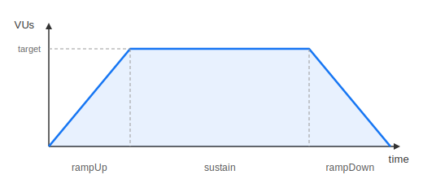
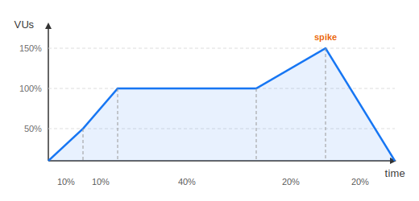
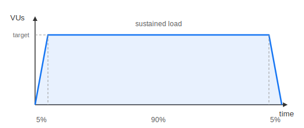
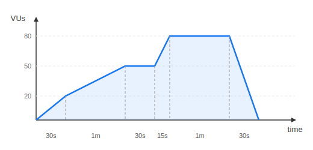

= [since:com.vaadin:vaadin@V25.2]#Load Profiles and Ramping#

== Overview

By default, the `loadtest:run` goal uses a **ramp** load pattern that gradually increases virtual users to the target count, sustains the load, then ramps back down.
This produces more realistic traffic than an instant spike and avoids overwhelming the application at startup.

Load profiles control the shape of the traffic curve -- how many virtual users (VUs) are active at each point during the test.
Three levels of configuration are available:

1. **Predefined patterns** -- convenient presets (`ramp`, `constant`, `stress`, `soak`, `custom` stages) that map to k6's `constant-vus` and `ramping-vus` https://grafana.com/docs/k6/latest/using-k6/scenarios/executors/[executors].
2. **Explicit executor selection** -- direct use of any k6 executor (`constant-arrival-rate`, `shared-iterations`, etc.) with full parameter control.
3. **Fully custom scenarios** -- raw k6 scenario JavaScript for maximum flexibility.

Configuration priority (highest to lowest): `k6.customScenario` > `k6.executor` > `k6.stages` > `k6.loadPattern`.

== Quick Start

.Default behavior (ramp up 10 s, sustain, ramp down 10 s)
[source,bash]
----
mvn loadtest:run -Dk6.vus=50 -Dk6.duration=2m
----

.Constant load (no ramping, previous default behavior)
[source,bash]
----
mvn loadtest:run -Dk6.vus=50 -Dk6.duration=2m -Dk6.loadPattern=constant
----

.Custom ramp durations
[source,bash]
----
mvn loadtest:run -Dk6.vus=50 -Dk6.duration=5m -Dk6.rampUp=30s -Dk6.rampDown=15s
----

.Fully custom stages
[source,bash]
----
mvn loadtest:run -Dk6.stages="30s:20,1m:50,30s:50,15s:80,1m:80,30s:0"
----

.Constant arrival rate (explicit executor)
[source,bash]
----
mvn loadtest:run -Dk6.executor=constant-arrival-rate -Dk6.rate=100 \
    -Dk6.duration=2m -Dk6.preAllocatedVUs=50 -Dk6.maxVUs=200
----

.Shared iterations (explicit executor)
[source,bash]
----
mvn loadtest:run -Dk6.executor=shared-iterations -Dk6.vus=50 \
    -Dk6.iterations=1000 -Dk6.duration=5m
----

== Predefined Load Patterns

[cols="1,3", options="header"]
|===
| Pattern | Description

| `ramp` (default)
| Ramp up to target VUs, sustain at full load, then ramp down to 0.
Ramp-up and ramp-down durations are configurable via `k6.rampUp` and `k6.rampDown`.
Uses k6's `ramping-vus` executor.

| `constant`
| All VUs start immediately and run for the full duration.
No ramp-up or ramp-down phase.
Uses k6's `constant-vus` executor.

| `stress`
| Gradually increases load beyond normal capacity with a spike phase.
Stages: 50% VUs -> 100% VUs -> sustain -> 150% spike -> ramp down.
Useful for finding the breaking point of the application.

| `soak`
| Quick ramp-up (5% of duration), extended sustain at target load (90%), quick ramp-down (5%).
Designed for long-duration tests to detect memory leaks and gradual degradation.

| `custom`
| User-defined stages via the `k6.stages` parameter.
Set automatically when `k6.stages` is provided.
|===

=== Ramp Pattern (Default)

The ramp pattern divides the total duration into three phases:

* **Ramp-up** -- linearly increases VUs from 0 to the target over `k6.rampUp` duration (default `10s`).
* **Sustain** -- holds at target VUs for the remaining time.
* **Ramp-down** -- linearly decreases VUs from target to 0 over `k6.rampDown` duration (default `10s`).

The sustain duration is automatically calculated: `duration - rampUp - rampDown`.
If `rampUp + rampDown` exceeds the total duration, both are scaled down proportionally.

=== Stress Pattern

The stress pattern is designed to push the application beyond its normal operating limits:

Five stages, each a percentage of total duration:

1. **10%** -- ramp to 50% of target VUs
2. **10%** -- ramp to 100% of target VUs
3. **40%** -- sustain at 100%
4. **20%** -- spike to 150% of target VUs
5. **20%** -- ramp down to 0

=== Soak Pattern

The soak pattern maximizes time at target load for long-running stability tests:

Three stages:

1. **5%** of duration -- ramp to target VUs
2. **90%** of duration -- sustain at target
3. **5%** of duration -- ramp down to 0

=== Custom Stages

For full control, define explicit stages as `duration:target` pairs.
When `k6.stages` is set, the load pattern is automatically set to `custom` and the `k6.vus` / `k6.duration` parameters are ignored.

.Stage format
----
duration:target,duration:target,...
----

* **duration** -- a k6 time string (`10s`, `1m`, `2m30s`, `1h`)
* **target** -- the VU count to ramp to by the end of this stage

Each stage linearly transitions from the _previous_ stage's ending VU count (or 0 for the first stage) to its own target over the given duration.
To hold load steady, repeat the same target in consecutive stages (e.g. `1m:50,30s:50` ramps to 50 then holds at 50 for 30 s).

.Example: gradual ramp with plateau and spike
[source,bash]
----
mvn loadtest:run -Dk6.stages="30s:20,1m:50,30s:50,15s:80,1m:80,30s:0"
----

This produces:

Reading the stages left to right:

1. `30s:20` -- ramp from 0 to 20 VUs over 30 seconds
2. `1m:50` -- ramp from 20 to 50 VUs over 1 minute
3. `30s:50` -- hold at 50 VUs for 30 seconds (same target = plateau)
4. `15s:80` -- ramp from 50 to 80 VUs over 15 seconds
5. `1m:80` -- hold at 80 VUs for 1 minute
6. `30s:0` -- ramp down from 80 to 0 over 30 seconds

== Explicit Executor Selection

When the predefined patterns are not enough, you can select any k6 executor directly via `k6.executor`.
This gives access to all seven k6 executor types and their full parameter sets.

Setting `k6.executor` overrides `k6.loadPattern`.

=== Available Executors

[cols="2,4", options="header"]
|===
| Executor | Description

| `constant-vus`
| A fixed number of VUs execute iterations for a specified duration.
Equivalent to the `constant` predefined pattern.

| `ramping-vus`
| A variable number of VUs follow configured stages (ramp up, sustain, ramp down).
Equivalent to the `ramp` predefined pattern when used with `k6.stages`.

| `per-vu-iterations`
| Each VU executes a fixed number of iterations.
The test ends when all VUs complete their iterations or `maxDuration` is reached.
Useful for ensuring each VU performs an exact workload.

| `shared-iterations`
| A fixed total number of iterations is shared among all VUs.
The test ends when all iterations complete or `maxDuration` is reached.
Useful for fixed-workload testing (e.g., "process exactly 10,000 requests").

| `constant-arrival-rate`
| A fixed number of iterations are started per time unit, regardless of how long each iteration takes.
VUs are pre-allocated and recycled as needed.
Ideal for testing at a specific request rate (e.g., 100 req/s).

| `ramping-arrival-rate`
| A variable number of iterations per time unit, following configured stages.
Useful for ramping request rates independently of VU count (e.g., ramp from 0 to 200 req/s).

| `externally-controlled`
| VU count is controlled externally via k6's REST API at runtime.
Useful for manual or programmatic load control during exploratory testing.
|===

=== Arrival-Rate vs VU-Based Executors

The predefined patterns (`ramp`, `stress`, `soak`) are VU-based: they control _how many users_ are active.
Arrival-rate executors instead control _how many requests per second_ are sent, regardless of VU count.

**When to use arrival-rate executors:**

* You need to test at a specific request rate (e.g., "the system must handle 500 req/s")
* You want the request rate to remain constant even when response times increase
* Your SLOs are defined in requests per second rather than concurrent users

**When to use VU-based executors:**

* You want to simulate a specific number of concurrent users
* Response times naturally throttle the load (slow responses = fewer requests per VU)
* Your load targets are defined as user counts

=== Examples

.Constant arrival rate: 100 iterations/second for 2 minutes
[source,bash]
----
mvn loadtest:run -Dk6.executor=constant-arrival-rate -Dk6.rate=100 \
    -Dk6.timeUnit=1s -Dk6.duration=2m \
    -Dk6.preAllocatedVUs=50 -Dk6.maxVUs=200
----

.Ramping arrival rate: ramp from 0 to 200 req/s, sustain, then ramp down
[source,bash]
----
mvn loadtest:run -Dk6.executor=ramping-arrival-rate \
    -Dk6.stages="1m:200,3m:200,1m:0" -Dk6.startRate=0 \
    -Dk6.timeUnit=1s -Dk6.preAllocatedVUs=50 -Dk6.maxVUs=300
----

.Shared iterations: distribute 10,000 requests across 50 VUs
[source,bash]
----
mvn loadtest:run -Dk6.executor=shared-iterations \
    -Dk6.vus=50 -Dk6.iterations=10000 -Dk6.duration=10m
----

.Per-VU iterations: each of 20 VUs executes 50 iterations
[source,bash]
----
mvn loadtest:run -Dk6.executor=per-vu-iterations \
    -Dk6.vus=20 -Dk6.iterations=50 -Dk6.duration=5m
----

.Externally controlled: start with 10 VUs, adjust via k6 REST API
[source,bash]
----
mvn loadtest:run -Dk6.executor=externally-controlled \
    -Dk6.vus=10 -Dk6.maxVUs=200 -Dk6.duration=30m
----

=== POM Configuration for Explicit Executors

[source,xml]
----
<plugin>
    <groupId>com.vaadin</groupId>
    <artifactId>testbench-converter-plugin</artifactId>
    <configuration>
        <testDir>${project.build.directory}/k6/tests</testDir>
        <executor>constant-arrival-rate</executor>
        <rate>100</rate>
        <timeUnit>1s</timeUnit>
        <duration>5m</duration>
        <preAllocatedVUs>50</preAllocatedVUs>
        <maxVUs>200</maxVUs>
    </configuration>
</plugin>
----

.Ramping arrival rate with stages
[source,xml]
----
<configuration>
    <testDir>${project.build.directory}/k6/tests</testDir>
    <executor>ramping-arrival-rate</executor>
    <stages>1m:100,3m:100,1m:0</stages>
    <startRate>0</startRate>
    <timeUnit>1s</timeUnit>
    <preAllocatedVUs>50</preAllocatedVUs>
    <maxVUs>200</maxVUs>
</configuration>
----

NOTE: Executors other than `constant-vus` and `ramping-vus` cannot be fully configured via k6 CLI flags.
When these executors are used, the plugin automatically generates a wrapper script with embedded scenario configuration.

== Fully Custom Scenarios

For maximum flexibility, use `k6.customScenario` to provide raw k6 scenario JavaScript.
The content is inserted directly into the k6 scenario definition block, giving full control over all scenario properties.

This overrides all other load configuration parameters.

.Command line
[source,bash]
----
mvn loadtest:run -Dk6.customScenario="executor: 'ramping-arrival-rate', \
    startRate: 0, timeUnit: '1s', preAllocatedVUs: 50, maxVUs: 100, \
    stages: [{duration: '1m', target: 100}, {duration: '2m', target: 100}, \
    {duration: '1m', target: 0}],"
----

.POM configuration (recommended for complex scenarios)
[source,xml]
----
<configuration>
    <testDir>${project.build.directory}/k6/tests</testDir>
    <customScenario>
        executor: 'ramping-arrival-rate',
        startRate: 0,
        timeUnit: '1s',
        preAllocatedVUs: 50,
        maxVUs: 100,
        stages: [
            { duration: '1m', target: 100 },
            { duration: '2m', target: 100 },
            { duration: '1m', target: 0 },
        ],
    </customScenario>
</configuration>
----

The content must be valid JavaScript object properties (k6 scenario syntax).
The plugin adds the `exec` property automatically to wire up the test function.

== Maven Configuration

=== Command Line (Predefined Patterns)

[source,bash]
----
# Ramp pattern with custom durations
mvn loadtest:run -Dk6.vus=100 -Dk6.duration=10m -Dk6.loadPattern=ramp \
    -Dk6.rampUp=1m -Dk6.rampDown=30s

# Stress test
mvn loadtest:run -Dk6.vus=100 -Dk6.duration=10m -Dk6.loadPattern=stress

# Soak test (long duration)
mvn loadtest:run -Dk6.vus=50 -Dk6.duration=1h -Dk6.loadPattern=soak

# Custom stages
mvn loadtest:run -Dk6.stages="1m:25,3m:50,1m:100,2m:100,1m:0"
----

=== POM Configuration (Predefined Patterns)

[source,xml]
----
<plugin>
    <groupId>com.vaadin</groupId>
    <artifactId>testbench-converter-plugin</artifactId>
    <configuration>
        <testDir>${project.build.directory}/k6/tests</testDir>
        <virtualUsers>50</virtualUsers>
        <duration>5m</duration>
        <loadPattern>ramp</loadPattern>
        <rampUp>30s</rampUp>
        <rampDown>15s</rampDown>
    </configuration>
</plugin>
----

.Stress test configuration
[source,xml]
----
<configuration>
    <testDir>${project.build.directory}/k6/tests</testDir>
    <virtualUsers>100</virtualUsers>
    <duration>10m</duration>
    <loadPattern>stress</loadPattern>
</configuration>
----

.Custom stages configuration
[source,xml]
----
<configuration>
    <testDir>${project.build.directory}/k6/tests</testDir>
    <stages>1m:25,3m:50,1m:100,2m:100,1m:0</stages>
</configuration>
----

== Parameter Reference

=== Predefined Pattern Parameters

[cols="2,1,1,4", options="header"]
|===
| Property | Type | Default | Description

| `k6.loadPattern`
| String
| `ramp`
| Load pattern: `constant`, `ramp`, `stress`, `soak`, or `custom`.

| `k6.rampUp`
| String
| `10s`
| Ramp-up duration for the `ramp` pattern. Ignored for other patterns.

| `k6.rampDown`
| String
| `10s`
| Ramp-down duration for the `ramp` pattern. Ignored for other patterns.

| `k6.stages`
| String
| _none_
| Custom stage definitions (`duration:target,...`). When set, overrides `k6.loadPattern` to `custom`.

| `k6.vus`
| int
| `10`
| Target number of virtual users. Used by all patterns except `custom`.

| `k6.duration`
| String
| `30s`
| Total test duration. Used by all patterns except `custom`.
|===

=== Explicit Executor Parameters

[cols="2,1,1,4", options="header"]
|===
| Property | Type | Default | Description

| `k6.executor`
| String
| _none_
| Explicit k6 executor type. Overrides `k6.loadPattern` when set.
Valid values: `constant-vus`, `ramping-vus`, `per-vu-iterations`, `shared-iterations`,
`constant-arrival-rate`, `ramping-arrival-rate`, `externally-controlled`.

| `k6.rate`
| Integer
| _none_
| Iteration rate for arrival-rate executors. Number of iterations to start per `k6.timeUnit`.

| `k6.timeUnit`
| String
| `1s`
| Time unit for arrival-rate executors (e.g., `1s`, `1m`).

| `k6.preAllocatedVUs`
| Integer
| _none_
| Pre-allocated VUs for arrival-rate executors. k6 initializes this many VUs at test start
to avoid cold-start latency. Defaults to `k6.vus` if not specified.

| `k6.maxVUs`
| Integer
| _none_
| Maximum VUs for arrival-rate and externally-controlled executors.
k6 will not create more VUs than this, even if the arrival rate demands it.

| `k6.iterations`
| Integer
| _none_
| Total iteration count for `per-vu-iterations` (per VU) and `shared-iterations` (total across all VUs).

| `k6.startRate`
| Integer
| _none_
| Starting iteration rate for `ramping-arrival-rate`. The rate ramps from this value according to the configured stages.
|===

=== Custom Scenario Parameter

[cols="2,1,1,4", options="header"]
|===
| Property | Type | Default | Description

| `k6.customScenario`
| String
| _none_
| Raw k6 scenario JavaScript. Inserted directly into the scenario definition block.
Overrides all other load configuration parameters when set.
|===

== Combined Scenarios

Load profiles work with combined scenario execution (`k6.combineScenarios=true`).
Each scenario receives its own proportional VU allocation based on weights, and all scenarios share the same load profile shape.

This applies to all configuration modes -- predefined patterns, explicit executors, and custom scenarios.

[source,bash]
----
mvn loadtest:run -Dk6.testDir=k6/tests -Dk6.combineScenarios=true \
    -Dk6.vus=100 -Dk6.duration=5m -Dk6.loadPattern=ramp -Dk6.rampUp=30s
----

With two equally-weighted scenarios, each gets 50 VUs and follows the ramp pattern independently:

----
Scenario A:  0 ──30s──> 50 VUs ──sustain──> 50 VUs ──10s──> 0
Scenario B:  0 ──30s──> 50 VUs ──sustain──> 50 VUs ──10s──> 0
----

.Combined scenarios with arrival-rate executor
[source,bash]
----
mvn loadtest:run -Dk6.testDir=k6/tests -Dk6.combineScenarios=true \
    -Dk6.executor=constant-arrival-rate -Dk6.rate=100 \
    -Dk6.duration=5m -Dk6.preAllocatedVUs=50 -Dk6.maxVUs=200
----

== Duration Format

All duration parameters accept k6 time strings:

[cols="1,1", options="header"]
|===
| Format | Example

| Seconds | `30s`
| Minutes | `5m`
| Hours | `1h`
| Combined | `2m30s`, `1h30m`, `1h30m30s`
|===

== Choosing a Configuration

[cols="1,3", options="header"]
|===
| Goal | Recommended Configuration

| Baseline performance measurement
| `ramp` pattern with short ramp durations (`5s`-`10s`)

| Capacity planning
| `ramp` pattern with gradual ramp (`1m`+) to observe behavior as load increases

| Finding breaking points
| `stress` pattern to push beyond normal capacity

| Memory leak detection
| `soak` pattern with long duration (`30m`-`1h`+)

| CI/CD smoke test
| `constant` pattern with low VUs and short duration

| Reproducing specific traffic shapes
| `custom` stages matching production patterns

| Testing at a specific request rate
| `constant-arrival-rate` executor with target rate

| Ramping request rate independently of VUs
| `ramping-arrival-rate` executor with rate stages

| Fixed workload testing (exact request count)
| `shared-iterations` executor with target iteration count

| Ensuring each user does equal work
| `per-vu-iterations` executor with per-VU iteration count

| Manual / exploratory load control
| `externally-controlled` executor with k6 REST API

| Complex multi-executor scenarios
| `k6.customScenario` with raw k6 JavaScript
|===