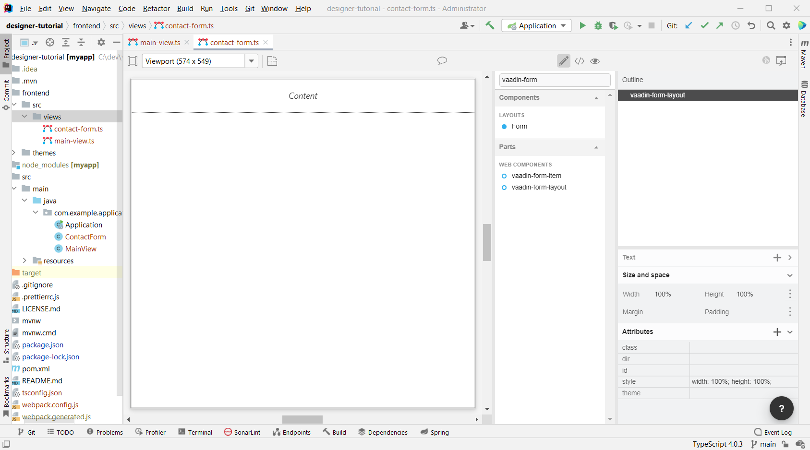
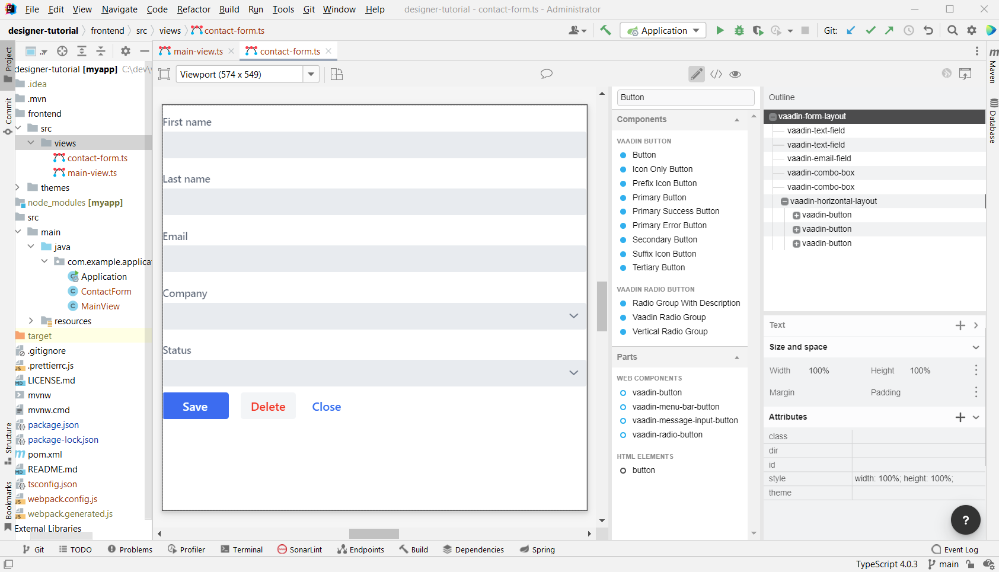
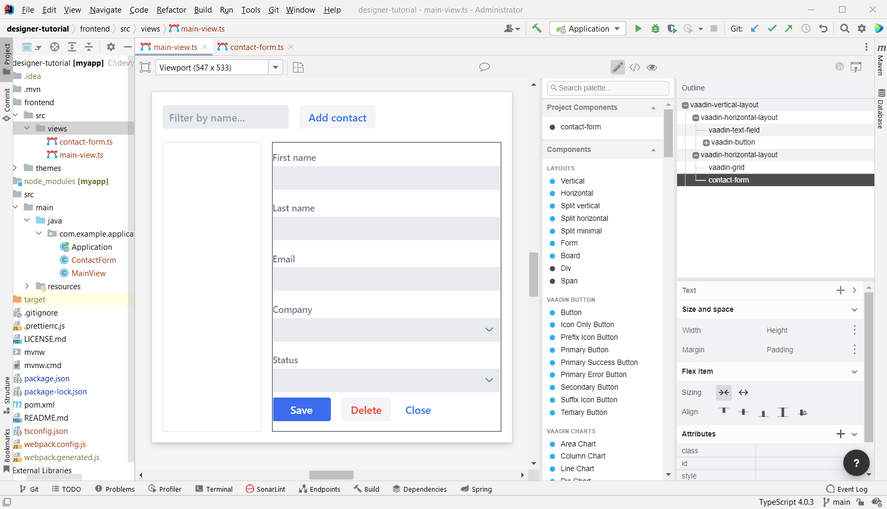
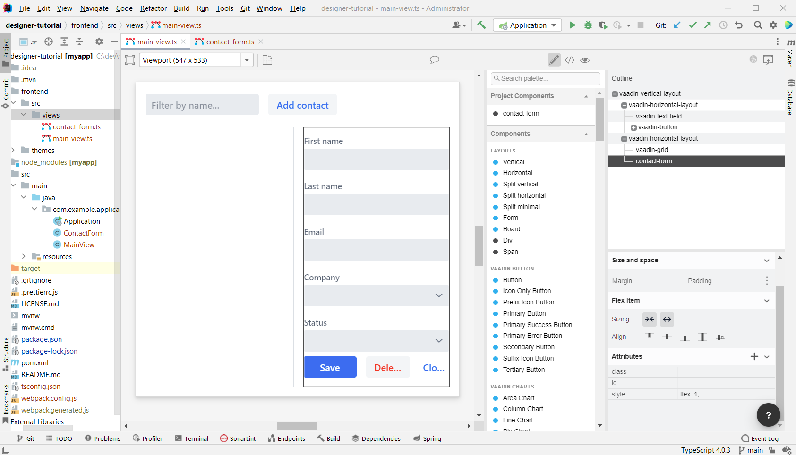

[[designer.build.contact.form]]
[#create-form]

= Build the Contact Form

It's good to keep your designs focused on one thing. When there are too many focus areas in one view, splitting them into smaller parts helps to keep things clear. You'll create the form in its own design with a Form Layout for editing the information of a single contact in it.

[#form-create-design]
== New Design for the Form

. In the Project tree, right click the `frontend/src/views` folder and select *New > Vaadin 10+ Design*.
. In the *Name* field, type `contact-form`.
. Make sure that
.. the *Create Java companion file* checkbox is checked.
.. the Java package is `com.example.application`.
. Click *OK* to generate the files.
. The design opens in the IDE.
. In the palette, search for "form" and drag `vaadin-form-layout` onto the drop section in the paper.

Your form component has two text fields for the first and last name, an email field, and two select fields: one to select the company; another to select the contact status.

[#form-add-text-fields]
== Adding Two Text Fields for Name

To add two text fields for name, first find _Vaadin Text Field_ in the palette and drag it twice onto `vaadin-form-layout`. Then select the first `vaadin-text-field` in the design.

In the properties view, go to the attributes panel. Find the label attribute and replace the text with "First name". Find the placeholder attribute and remove the value.

Next, select the second `vaadin-text-field` in the design. In the properties view, go to the attributes panel. Find the label attribute and replace the text with "Last name". Find the placeholder attribute and remove the value.

[NOTE]
If your paper is wide, the text fields line up horizontally. You can drag the left and right paper edges to make it narrower. This makes the form fields stack vertically. This behavior comes from `vaadin-form-layout` by default, which arranges its fields into one or two columns depending on the width.

[#form-add-email-field]
== Adding the Email Field

To add the email field, find in the palette `vaadin-email-field` and drag it onto the `vaadin-form-layout`. In the properties view, go to the attributes panel. Find the label attribute and type in "Email".

[#form-add-combo-boxes]
== Adding Company & Status Fields

To add company and status fields, find in the palette `vaadin-combo-box` and drag it onto the `vaadin-form-layout` twice. Then select the first `vaadin-combo-box` in the design.

In the properties view, go to the attributes panel. Find the label attribute and add the value "Company". Select the second `vaadin-combo-box` in the design. In the properties view, go to the attributes panel. Find the label attribute and add the value "Status".

[#form-add-buttons]
== Adding Buttons

You need to add save, delete and close buttons to the form. Save is the primary action and should be highlighted. Delete can be a dangerous action and should be marked as an error. Close isn't an important action and can be downplayed with a tertiary styling.

To do this, find in the palette _Horizontal_ layout and drag it onto the `vaadin-form-layout`. In the Vaadin button section of the palette, drag the following three buttons onto the horizontal layout: _Primary Button_; then _Primary Error Button_ next to it; and _Tertiary Button_ next to that.

Next, select the Primary button and change the button text to _Save_. Select the Primary Error button and change the button text to _Delete_. In the attributes panel, change the theme attribute from _primary error_ to _error_. Then select the Tertiary button and change the button text to _Close_.

Once you've done all of this, the form is done.

[#add-form-to-main-view]
== Adding the Form to Main View

You can now go back to your main view and add the contact form next to the Grid. The `main-view` design should already be opened, but if it isn't, open the `main-view.ts` file again in IntelliJ IDEA.

In the palette, you should now see a section called _Project Components_ that lists all designs you have created inside the project. By dragging items from this list, you can embed other designs into the one that's currently open.

In the palette of the `main-view` design, locate *contact-form* in _Project Components_. Drag contact-form onto the second `vaadin-horizontal-layout`.

[#size-grid-and-form]
== Sizing the Grid & Form

You'll want to give most of the space to the grid. For this, you'd use flex sizing to set a 2:1 ratio between the grid and the form.

To do this, select the `vaadin-grid`. In the properties view, find the style attribute in the attributes panel and add the value "flex: 2;" at the end.

Then select `contact-form`. In the properties view, find the style attribute in the attributes panel and set the value to "flex: 1;". After doing that, the layout is finished.

Proceed to the next page to run your application: <<get-your-application-up-and-running#,Get an Application Running>>.

[discussion-id]`DD73F930-FE7B-48FA-BCC2-F625A972D2E9`

++++

++++