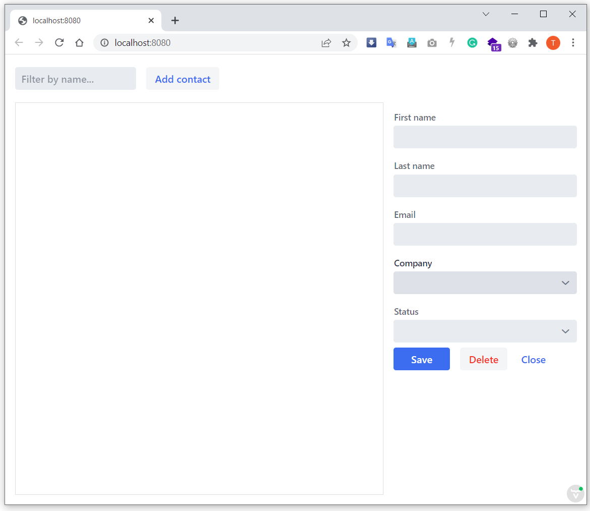

[[designer.run.application]]
= Get an Application Running

You'll need to do a few basic, essential things to get an application running: first, add the route to the main menu; then some minor steps. These are covered on this page.

[#add-route-to-main-view]
== Adding Route to Main View

On the previous page, you created a `main-view` design with a companion Java file. Now you need to make the view accessible by adding the `@Route` annotation to the companion Java file.

To do this, first expand the `src/main/java/com.example.application` package and open `MainView.java`. Then add the `@Route("")` annotation at the beginning of the `MainView` class.

Your `MainView` class should now look like this:

.`*MainView.java*`
[source,java]
----
@Tag("main-view")
@JsModule("./src/views/main-view.ts")
@Route("")
public class MainView extends LitTemplate {

    public MainView() {
    }

}
----

The `@Route` annotation maps `http://localhost:8080/` to `MainView`.

[#layout-finished-run-the-project]
== Running the Project

Next, you'll run the project to see what the new layout looks like. The easiest way to run the project for the first time is to open the `Application` Java class in `src/main/java/com/example/application/Application.java`. Then click the green play button next to the line which starts with `public class Application`.

This starts the application and automatically adds a run configuration for it in IntelliJ IDEA. Later, when you want to run or restart the application, you can build, run/restart, stop and debug the application from the toolbar:

When the build is finished and the application is running. Open `http://localhost:8080/` in your browser to see the result.

Proceed to the next page to connect your views to Java: <<connecting-your-main-view-to-java#,Connecting Main View to Java>>.

[discussion-id]`22D010A8-6773-4E15-99F2-5F5501E82988`

++++

++++