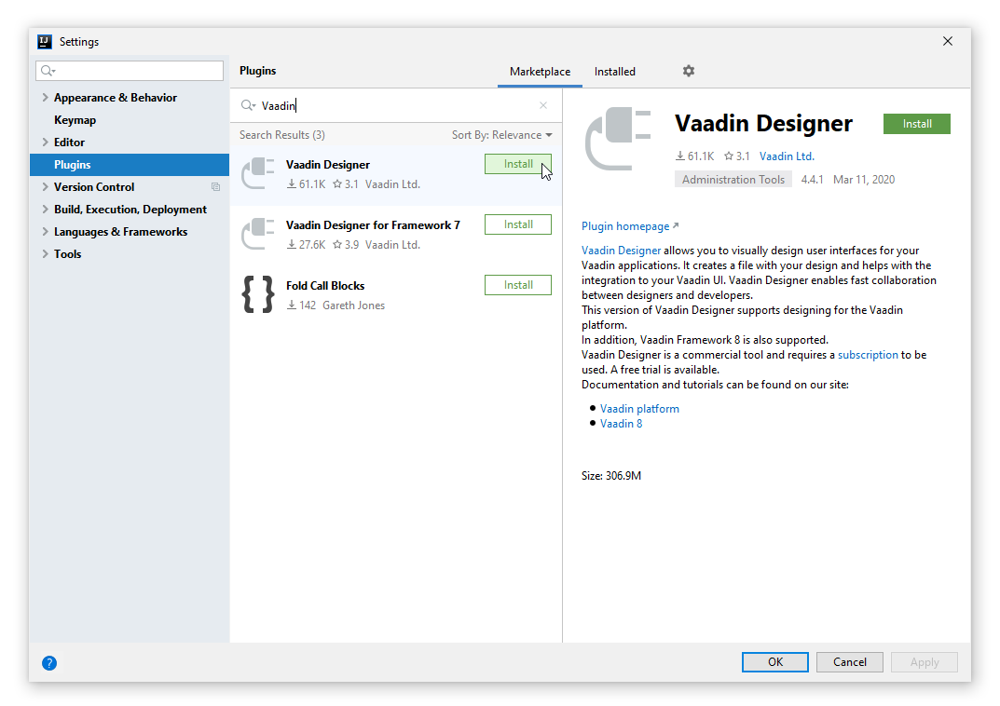

[[designer.intellij.installing]]
= Installing Designer in IntelliJ IDEA
:experimental:

Vaadin Designer is compatible with both Community and Ultimate Editions.

== Install the Plugin

. Open IntelliJ IDEA

. Go to the plugin list

.. On Windows: menu:File[Settings > Plugins]

.. On Linux:  menu:File[Settings > Plugins]

.. On macOS: Choose menu:IntelliJ IDEA[Preferences > Plugins]

. In the search field, type “Vaadin”

. Press [guibutton]*Install* on Vaadin Designer

. When the installation has finished, press the [guibutton]*Restart IDE* -button, confirm to restart and wait for the IDE to start up again

[[figure.designer.intellij.install]]

include::_trial.asciidoc[]

== Next Step

Proceed to the next step to start building the application: <<../build-your-main-view#,Build the Main View>>

[discussion-id]`E4E4A6D3-2825-4420-9EAF-FAD9BA653CC7`

++++

++++